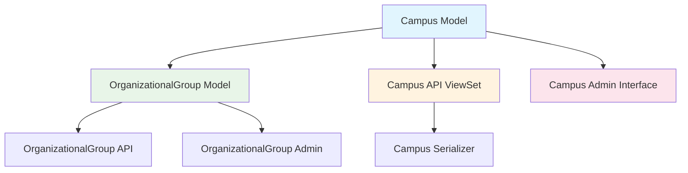

# Design Document

## Overview

This design document outlines the technical approach for converting the `campus` field in the OrganizationalGroup model from a CharField to a proper Campus model. The change will normalize campus data, enable better data management, and provide dedicated API endpoints and admin interface for campus management.

The implementation follows Django best practices and maintains consistency with the existing OneStep architecture, particularly mirroring patterns used in the organizational_group app.

## Architecture

### High-Level Architecture



### Data Flow

```mermaid
sequenceDiagram
    participant Client
    participant API
    participant Serializer
    participant Model
    participant Database
    
    Client->>API: G