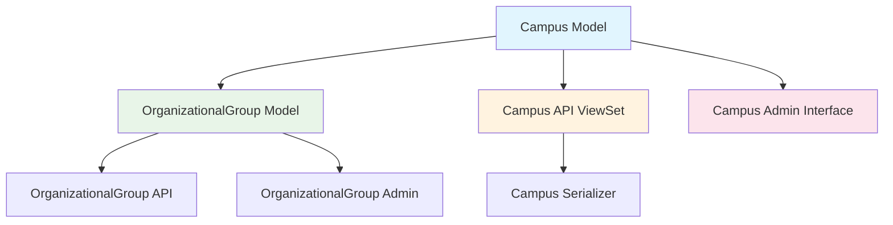
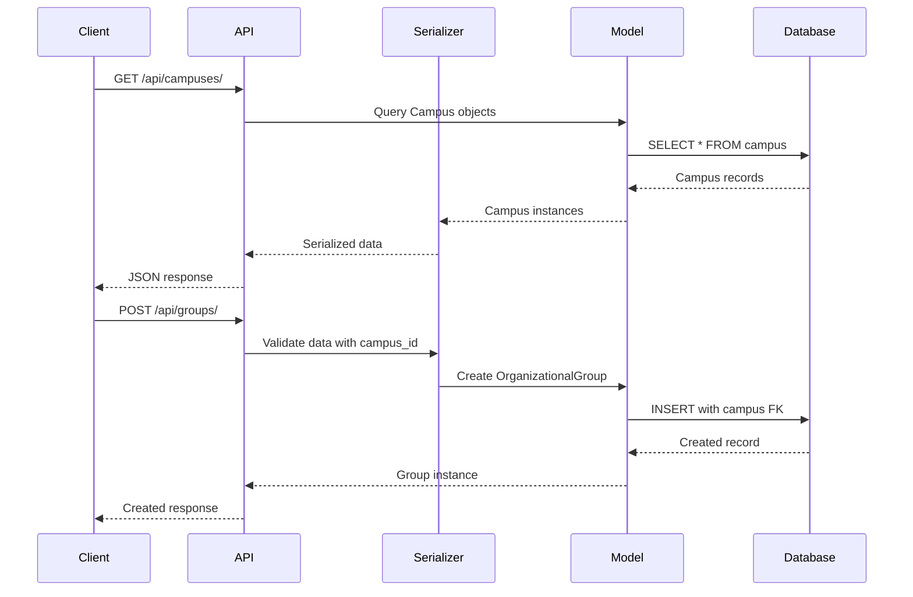
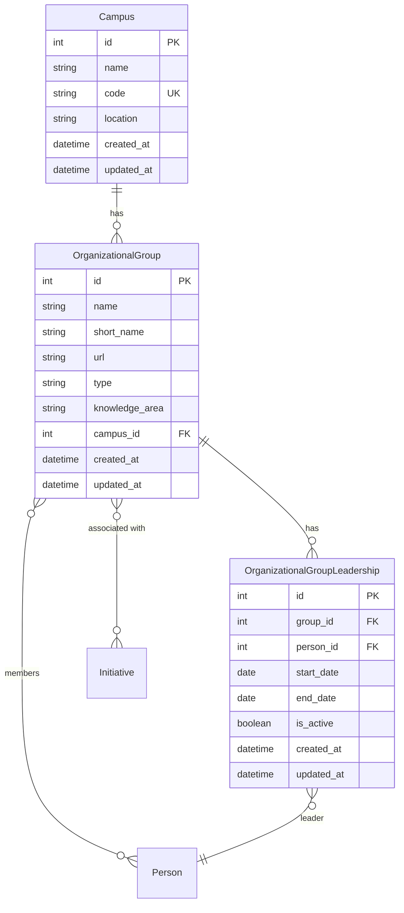

# Design Document

## Overview

This design document outlines the technical approach for converting the `campus` field in the OrganizationalGroup model from a CharField to a proper Campus model. The change will normalize campus data, enable better data management, and provide dedicated API endpoints and admin interface for campus management.

The implementation follows Django best practices and maintains consistency with the existing OneStep architecture, particularly mirroring patterns used in the organizational_group app.

## Architecture

### High-Level Architecture



### Data Flow



## Components and Interfaces

### 1. Campus Model

**Location:** `apps/organizational_group/models.py`

**Purpose:** Represent university campus entities with proper validation and relationships.

**Fields:**
- `name` (CharField, max_length=200, required) - Full campus name
- `code` (CharField, max_length=20, unique, required) - Short campus code/identifier
- `location` (CharField, max_length=300, optional) - Physical location or address
- `created_at` (DateTimeField, auto) - Timestamp of creation
- `updated_at` (DateTimeField, auto) - Timestamp of last update

**Relationships:**
- One-to-Many with OrganizationalGroup (reverse relation: `groups`)

**Methods:**
- `__str__()` - Returns campus name
- `clean()` - Validates name and code are not empty
- `group_count()` - Returns count of associated organizational groups

**Meta Options:**
- `ordering = ['name']`
- `verbose_name = 'Campus'`
- `verbose_name_plural = 'Campuses'`
- Indexes on `name` and `code` fields
- Unique constraint on `code` field

**Model Definition:**
```python
class Campus(TimestampedModel):
    """
    Represents a university campus location.
    
    Attributes:
        name (CharField): Full campus name
        code (CharField): Short campus code/identifier
        location (CharField): Physical location or address
    """
    
    name = models.CharField(
        max_length=200,
        help_text="Full campus name"
    )
    code = models.CharField(
        max_length=20,
        unique=True,
        help_text="Short campus code/identifier"
    )
    location = models.CharField(
        max_length=300,
        blank=True,
        help_text="Physical location or address"
    )
    
    class Meta:
        ordering = ['name']
        verbose_name = 'Campus'
        verbose_name_plural = 'Campuses'
        indexes = [
            models.Index(fields=['name']),
            models.Index(fields=['code']),
        ]
    
    def __str__(self):
        return self.name
    
    def clean(self):
        super().clean()
        
        if not self.name or not self.name.strip():
            raise ValidationError({'name': 'Campus name cannot be empty.'})
        
        if not self.code or not self.code.strip():
            raise ValidationError({'code': 'Campus code cannot be empty.'})
        
        if self.name:
            self.name = self.name.strip()
        
        if self.code:
            self.code = self.code.strip().upper()
    
    def group_count(self):
        return self.groups.count()
```

### 2. OrganizationalGroup Model Changes

**Changes Required:**
1. Replace `campus` CharField with ForeignKey to Campus
2. Update unique constraint from `['short_name', 'campus']` to `['short_name', 'campus_id']`
3. Update validation logic in `clean()` method
4. Update index from CharField to ForeignKey

**Modified Field:**
```python
campus = models.ForeignKey(
    'Campus',
    on_delete=models.PROTECT,
    related_name='groups',
    help_text="University campus affiliation"
)
```

**Rationale for `on_delete=models.PROTECT`:**
- Prevents accidental deletion of campuses that have associated groups
- Requires explicit cleanup of groups before campus deletion
- Maintains data integrity

### 3. Campus Serializer

**Location:** `apps/organizational_group/serializers.py`

**Purpose:** Serialize Campus model for API responses and handle validation.

**Serializer Definition:**
```python
class CampusSerializer(serializers.ModelSerializer):
    """
    Serializer for Campus model.
    
    Provides serialization for Campus CRUD operations with proper validation
    and additional computed fields for API responses.
    """
    
    group_count = serializers.SerializerMethodField(
        help_text="Number of organizational groups on this campus"
    )
    
    class Meta:
        model = Campus
        fields = [
            'id',
            'name',
            'code',
            'location',
            'group_count',
            'created_at',
            'updated_at'
        ]
        read_only_fields = [
            'id',
            'created_at',
            'updated_at',
            'group_count'
        ]
    
    def get_group_count(self, obj):
        return obj.group_count()
    
    def validate_name(self, value):
        if not value or not value.strip():
            raise serializers.ValidationError("Campus name cannot be empty.")
        return value.strip()
    
    def validate_code(self, value):
        if not value or not value.strip():
            raise serializers.ValidationError("Campus code cannot be empty.")
        return value.strip().upper()
```

### 4. OrganizationalGroup Serializer Changes

**Changes Required:**
1. Add nested Campus serializer for read operations
2. Add `campus_id` write-only field for create/update operations
3. Update validation logic

**Modified Serializer:**
```python
class OrganizationalGroupSerializer(serializers.ModelSerializer):
    # ... existing fields ...
    
    # Nested campus data for read operations
    campus = CampusSerializer(read_only=True)
    
    # Write-only field for create/update operations
    campus_id = serializers.IntegerField(write_only=True)
    
    class Meta:
        model = OrganizationalGroup
        fields = [
            'id',
            'name',
            'short_name',
            'url',
            'type',
            'type_display',
            'knowledge_area',
            'campus',  # Nested read
            'campus_id',  # Write-only
            # ... other fields ...
        ]
```

### 5. Campus ViewSet

**Location:** `apps/organizational_group/views.py`

**Purpose:** Provide REST API endpoints for Campus CRUD operations.

**Endpoints:**
- `GET /api/campuses/` - List all campuses
- `POST /api/campuses/` - Create new campus
- `GET /api/campuses/{id}/` - Retrieve campus details
- `PUT /api/campuses/{id}/` - Update campus (full)
- `PATCH /api/campuses/{id}/` - Update campus (partial)
- `DELETE /api/campuses/{id}/` - Delete campus

**ViewSet Definition:**
```python
class CampusViewSet(viewsets.ModelViewSet):
    """
    ViewSet for managing Campus entities through REST API.
    
    Provides CRUD operations for Campus management with proper
    authentication, filtering, searching, and pagination.
    """
    
    queryset = Campus.objects.all()
    serializer_class = CampusSerializer
    permission_classes = [IsAuthenticated]
    filter_backends = [DjangoFilterBackend, SearchFilter, OrderingFilter]
    filterset_fields = ['name', 'code']
    search_fields = ['name', 'code', 'location']
    ordering_fields = ['name', 'code', 'created_at', 'updated_at']
    ordering = ['name']
    pagination_class = StandardResultsSetPagination
    
    def get_queryset(self):
        queryset = Campus.objects.annotate(
            annotated_group_count=Count('groups', distinct=True)
        )
        return queryset
```

### 6. Campus Admin Interface

**Location:** `apps/organizational_group/admin.py`

**Purpose:** Provide Django admin interface for Campus management.

**Admin Configuration:**
```python
@admin.register(Campus)
class CampusAdmin(admin.ModelAdmin):
    """
    Django Admin configuration for Campus model.
    """
    
    list_display = [
        'name',
        'code',
        'location',
        'group_count_display',
        'created_at'
    ]
    
    list_display_links = ['name']
    
    list_filter = [
        'created_at',
        'updated_at'
    ]
    
    search_fields = [
        'name',
        'code',
        'location'
    ]
    
    readonly_fields = [
        'id',
        'created_at',
        'updated_at',
        'group_count_display'
    ]
    
    fieldsets = (
        ('Basic Information', {
            'fields': ('name', 'code', 'location')
        }),
        ('Statistics', {
            'fields': ('group_count_display',),
            'classes': ('collapse',)
        }),
        ('System Information', {
            'fields': ('id', 'created_at', 'updated_at'),
            'classes': ('collapse',)
        })
    )
    
    def group_count_display(self, obj):
        count = obj.group_count()
        if count > 0:
            return format_html(
                '<strong>{}</strong> group{}',
                count,
                's' if count != 1 else ''
            )
        else:
            return format_html('<span style="color: #999;">No groups</span>')
    group_count_display.short_description = 'Groups'
```

### 7. OrganizationalGroup Admin Changes

**Changes Required:**
1. Update `list_display` to show campus name
2. Update `list_filter` to use campus foreign key
3. Add `autocomplete_fields` for campus selection
4. Update form help text

**Modified Admin:**
```python
@admin.register(OrganizationalGroup)
class OrganizationalGroupAdmin(admin.ModelAdmin):
    # ... existing configuration ...
    
    list_filter = [
        'type',
        'campus',  # Now uses foreign key lookup
        'knowledge_area',
        'created_at',
        'updated_at'
    ]
    
    autocomplete_fields = ['campus']  # Enable autocomplete for campus
    
    def get_queryset(self, request):
        queryset = super().get_queryset(request)
        queryset = queryset.select_related('campus')  # Optimize query
        # ... rest of optimization ...
        return queryset
```

## Data Models

### Entity Relationship Diagram



### Database Schema Changes

**New Table: `organizational_group_campus`**
```sql
CREATE TABLE organizational_group_campus (
    id SERIAL PRIMARY KEY,
    name VARCHAR(200) NOT NULL,
    code VARCHAR(20) NOT NULL UNIQUE,
    location VARCHAR(300),
    created_at TIMESTAMP NOT NULL,
    updated_at TIMESTAMP NOT NULL
);

CREATE INDEX idx_campus_name ON organizational_group_campus(name);
CREATE INDEX idx_campus_code ON organizational_group_campus(code);
```

**Modified Table: `organizational_group_organizationalgroup`**
```sql
-- Drop old constraint
ALTER TABLE organizational_group_organizationalgroup 
DROP CONSTRAINT unique_short_name_campus;

-- Drop old index
DROP INDEX organizational_group_organizationalgroup_campus_idx;

-- Add new foreign key column
ALTER TABLE organizational_group_organizationalgroup 
ADD COLUMN campus_id INTEGER REFERENCES organizational_group_campus(id) ON DELETE PROTECT;

-- Create new index
CREATE INDEX idx_organizationalgroup_campus_id 
ON organizational_group_organizationalgroup(campus_id);

-- Add new constraint
ALTER TABLE organizational_group_organizationalgroup 
ADD CONSTRAINT unique_short_name_campus_id 
UNIQUE (short_name, campus_id);

-- Remove old campus column (after data migration)
ALTER TABLE organizational_group_organizationalgroup 
DROP COLUMN campus;
```

## Migration Strategy

### Migration Sequence

**Migration 1: Add Campus Model**
- Create Campus model
- Create database table
- Add indexes and constraints

**Migration 2: Add campus_id Field**
- Add `campus_id` field to OrganizationalGroup (nullable temporarily)
- Keep existing `campus` CharField

**Migration 3: Data Migration**
- Extract unique campus values from OrganizationalGroup
- Create Campus records with generated codes
- Map OrganizationalGroup records to Campus foreign keys
- Handle edge cases (empty, null, duplicate names)

**Migration 4: Finalize Schema**
- Make `campus_id` non-nullable
- Drop old `campus` CharField
- Update unique constraint
- Update indexes

### Data Migration Logic

```python
def migrate_campus_data(apps, schema_editor):
    """
    Migrate existing campus CharField data to Campus model.
    """
    OrganizationalGroup = apps.get_model('organizational_group', 'OrganizationalGroup')
    Campus = apps.get_model('organizational_group', 'Campus')
    
    # Get unique campus values
    campus_values = OrganizationalGroup.objects.values_list('campus', flat=True).distinct()
    
    # Create Campus records
    campus_map = {}
    for campus_name in campus_values:
        if campus_name and campus_name.strip():
            # Generate code from name
            code = generate_campus_code(campus_name)
            
            # Create or get campus
            campus, created = Campus.objects.get_or_create(
                code=code,
                defaults={
                    'name': campus_name.strip(),
                    'location': ''
                }
            )
            campus_map[campus_name] = campus
    
    # Update OrganizationalGroup records
    for group in OrganizationalGroup.objects.all():
        if group.campus in campus_map:
            group.campus_id = campus_map[group.campus].id
            group.save(update_fields=['campus_id'])

def generate_campus_code(name):
    """
    Generate a unique campus code from name.
    """
    # Take first letters of words, max 20 chars
    words = name.strip().upper().split()
    if len(words) == 1:
        code = words[0][:20]
    else:
        code = ''.join(word[0] for word in words)[:20]
    
    # Ensure uniqueness by appending number if needed
    base_code = code
    counter = 1
    while Campus.objects.filter(code=code).exists():
        code = f"{base_code}{counter}"
        counter += 1
    
    return code
```

## Error Handling

### Validation Errors

**Campus Model:**
- Empty name → `ValidationError: "Campus name cannot be empty."`
- Empty code → `ValidationError: "Campus code cannot be empty."`
- Duplicate code → `IntegrityError: "Campus with this code already exists."`

**OrganizationalGroup Model:**
- Invalid campus_id → `ValidationError: "Campus does not exist."`
- Duplicate short_name + campus → `ValidationError: "A group with this short name already exists on this campus."`

**API Errors:**
- Missing campus_id → `400 Bad Request: "campus_id is required"`
- Campus not found → `404 Not Found: "Campus not found"`
- Campus deletion with groups → `400 Bad Request: "Cannot delete campus with associated groups"`

### Error Response Format

```json
{
  "error": {
    "code": "VALIDATION_ERROR",
    "message": "Validation failed",
    "details": {
      "campus_id": ["Campus does not exist."]
    }
  }
}
```

## Testing Strategy

### Unit Tests

**Campus Model Tests** (`tests/test_campus_models.py`):
- Test campus creation with valid data
- Test campus string representation
- Test campus validation (empty name, empty code)
- Test campus code uniqueness
- Test group_count() method
- Test campus code auto-uppercase

**OrganizationalGroup Model Tests** (update `tests/test_models.py`):
- Test group creation with campus foreign key
- Test unique constraint with campus_id
- Test cascade behavior (PROTECT)
- Test validation with invalid campus_id

### Serializer Tests

**Campus Serializer Tests** (`tests/test_campus_serializers.py`):
- Test campus serialization
- Test campus deserialization
- Test validation errors
- Test group_count field
- Test code auto-uppercase

**OrganizationalGroup Serializer Tests** (update `tests/test_serializers.py`):
- Test nested campus serialization
- Test campus_id write operation
- Test validation with invalid campus_id

### API Tests

**Campus API Tests** (`tests/test_campus_api.py`):
- Test list campuses endpoint
- Test create campus endpoint
- Test retrieve campus endpoint
- Test update campus endpoint
- Test delete campus endpoint
- Test filtering by name and code
- Test search functionality
- Test pagination

**OrganizationalGroup API Tests** (update `tests/test_api.py`):
- Test creating group with campus_id
- Test updating group campus_id
- Test filtering by campus_id
- Test nested campus data in responses

### Admin Tests

**Campus Admin Tests** (`tests/test_campus_admin.py`):
- Test campus list view
- Test campus create form
- Test campus edit form
- Test campus delete
- Test search functionality
- Test filtering

**OrganizationalGroup Admin Tests** (update `tests/test_admin.py`):
- Test campus autocomplete
- Test campus display in list view
- Test campus filtering

### Migration Tests

**Data Migration Tests** (`tests/test_migrations.py`):
- Test migration creates Campus records
- Test migration maps OrganizationalGroup to Campus
- Test migration handles empty campus values
- Test migration handles duplicate campus names
- Test reverse migration

## Performance Considerations

### Database Optimization

1. **Indexes:**
   - Index on `campus.name` for filtering
   - Index on `campus.code` for lookups
   - Index on `organizationalgroup.campus_id` for joins

2. **Query Optimization:**
   - Use `select_related('campus')` when querying OrganizationalGroup
   - Use `prefetch_related('groups')` when querying Campus with groups
   - Annotate group counts instead of calling `group_count()` in loops

3. **API Performance:**
   - Implement pagination for campus list endpoint
   - Use `annotate()` for computed fields in list views
   - Cache campus data if frequently accessed

### Example Optimized Queries

```python
# Optimized OrganizationalGroup query with campus
groups = OrganizationalGroup.objects.select_related('campus').all()

# Optimized Campus query with group count
campuses = Campus.objects.annotate(
    group_count=Count('groups')
).all()

# Optimized nested query
groups = OrganizationalGroup.objects.select_related(
    'campus'
).prefetch_related(
    'members',
    'initiatives'
).all()
```

## API Documentation Updates

### New Campus Endpoints

**Base URL:** `/api/campuses/`

**Endpoints:**
- `GET /api/campuses/` - List all campuses
- `POST /api/campuses/` - Create new campus
- `GET /api/campuses/{id}/` - Retrieve campus details
- `PUT /api/campuses/{id}/` - Update campus (full)
- `PATCH /api/campuses/{id}/` - Update campus (partial)
- `DELETE /api/campuses/{id}/` - Delete campus

**Query Parameters:**
- `name` - Filter by campus name
- `code` - Filter by campus code
- `search` - Search across name, code, and location
- `ordering` - Order by field (name, code, created_at, updated_at)

### Updated OrganizationalGroup Endpoints

**Changes to Request/Response:**

**Create/Update Request:**
```json
{
  "name": "AI Research Lab",
  "short_name": "AI-LAB",
  "campus_id": 1,
  "type": "research",
  "knowledge_area": "Computer Science"
}
```

**Response:**
```json
{
  "id": 1,
  "name": "AI Research Lab",
  "short_name": "AI-LAB",
  "campus": {
    "id": 1,
    "name": "Main Campus",
    "code": "MAIN",
    "location": "123 University Ave",
    "group_count": 5
  },
  "type": "research",
  "knowledge_area": "Computer Science"
}
```

## URL Configuration

**Update:** `apps/organizational_group/urls.py`

```python
from django.urls import path, include
from rest_framework.routers import DefaultRouter
from .views import OrganizationalGroupViewSet, CampusViewSet

router = DefaultRouter()
router.register(r'groups', OrganizationalGroupViewSet, basename='organizationalgroup')
router.register(r'campuses', CampusViewSet, basename='campus')

urlpatterns = [
    path('', include(router.urls)),
]
```

## Documentation Updates

### Files to Update

1. **apps/organizational_group/README.md**
   - Add Campus model documentation
   - Update OrganizationalGroup model documentation
   - Add Campus API usage examples
   - Update database schema diagram

2. **apps/organizational_group/API_DOCUMENTATION.md**
   - Add Campus API endpoints documentation
   - Update OrganizationalGroup API documentation
   - Add request/response examples with campus_id

3. **product.md** (steering rule)
   - Update data model diagram to include Campus
   - Update core concept description

## Rollback Strategy

If issues arise during deployment:

1. **Before Data Migration:**
   - Simply revert migrations
   - No data loss

2. **After Data Migration:**
   - Keep Campus table and data
   - Revert OrganizationalGroup changes
   - Re-populate campus CharField from Campus foreign key
   - Remove Campus model in later cleanup

3. **Rollback Migration:**
```python
def reverse_migrate_campus_data(apps, schema_editor):
    """
    Reverse migration: populate campus CharField from Campus FK.
    """
    OrganizationalGroup = apps.get_model('organizational_group', 'OrganizationalGroup')
    
    for group in OrganizationalGroup.objects.select_related('campus').all():
        if group.campus_id:
            group.campus = group.campus.name
            group.save(update_fields=['campus'])
```

## Security Considerations

1. **Authentication:** All Campus API endpoints require JWT authentication
2. **Authorization:** Use Django permissions for admin access
3. **Validation:** Strict validation on campus code uniqueness
4. **SQL Injection:** Use Django ORM (parameterized queries)
5. **Data Integrity:** Use `on_delete=PROTECT` to prevent orphaned groups

## Future Enhancements

1. **Campus Hierarchy:** Support for campus branches or sub-campuses
2. **Campus Metadata:** Add fields like timezone, country, contact info
3. **Campus Analytics:** Dashboard showing campus statistics
4. **Bulk Operations:** Import/export campus data
5. **Campus Images:** Add logo or photo field
6. **Geolocation:** Add latitude/longitude for mapping
