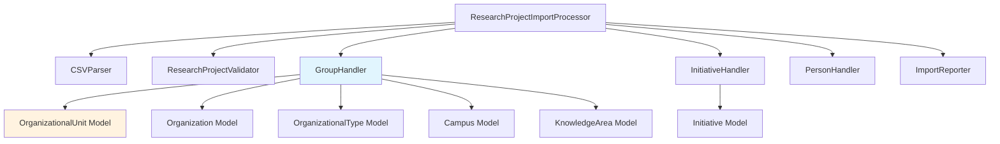
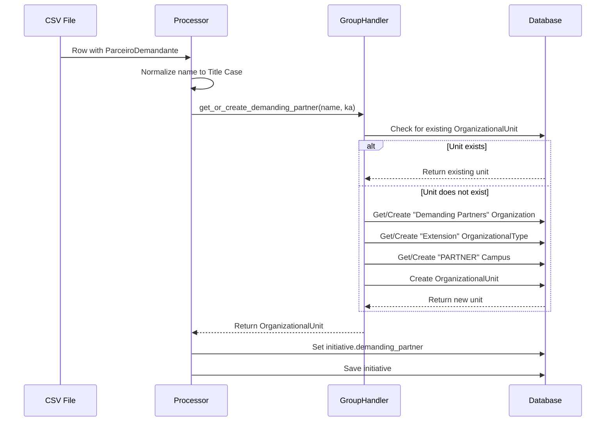

# Design Document: CSV Import Demanding Partner Feature

## Overview

This feature extends the research project CSV import system to properly handle the `ParceiroDemandante` (Demanding Partner) column. When importing research projects, the system will create or retrieve organizational entities representing demanding partners and link them to initiatives.

**Key Design Decision**: The current implementation uses `OrganizationalUnit` to represent demanding partners rather than creating a separate top-level `Organization` entity. This design choice maintains consistency with the existing data model where all organizational entities (research groups, extension partners, demanding partners) are represented as `OrganizationalUnit` instances within parent `Organization` containers.

## Architecture

### Component Overview



### Data Flow



## Components and Interfaces

### 1. GroupHandler

**Responsibility**: Manages creation and retrieval of organizational entities including demanding partners.

**Key Method**: `get_or_create_demanding_partner(name: str, knowledge_area: Optional[KnowledgeArea]) -> Optional[OrganizationalUnit]`

**Interface**:
```python
class GroupHandler:
    def get_or_create_demanding_partner(
        self, 
        name: str, 
        knowledge_area: Optional[KnowledgeArea] = None
    ) -> Optional[OrganizationalUnit]:
        """
        Get or create a demanding partner organizational unit.
        
        Args:
            name: Demanding partner name (will be normalized to Title Case)
            knowledge_area: Optional knowledge area to associate
            
        Returns:
            OrganizationalUnit instance or None if name is empty
            
        Behavior:
            - Returns None if name is empty or whitespace
            - Normalizes name to Title Case
            - Searches case-insensitively by name or short_name
            - If exists, returns existing unit
            - If not exists, creates new unit with:
                - Organization: "Demanding Partners"
                - Type: "Extension" (code: 'extension')
                - Campus: "Partner Organizations" (code: 'PARTNER')
                - Short name: Generated acronym or truncated name
        """
```

**Design Rationale**: 
- Uses `OrganizationalUnit` model to maintain consistency with existing organizational entity patterns
- Groups all demanding partners under a single "Demanding Partners" organization for easy management
- Uses "Extension" type since demanding partners are typically external service/extension clients
- Assigns to "PARTNER" campus to distinguish from internal campus-based units
- Handles race conditions with IntegrityError catching

### 2. ResearchProjectImportProcessor

**Responsibility**: Orchestrates the CSV import workflow including demanding partner processing.

**Key Changes**:
- Processes `ParceiroDemandante` column after other fields
- Calls `GroupHandler.get_or_create_demanding_partner()`
- Sets `initiative.demanding_partner` field
- Uses `super().save()` to bypass validation that might conflict with schema

**Processing Logic**:
```python
# In process_row method
if row.get('ParceiroDemandante'):
    ka = knowledge_area if row.get('AreaConhecimento') else None
    demanding_partner = self.group_handler.get_or_create_demanding_partner(
        name=row['ParceiroDemandante'],
        knowledge_area=ka
    )
    if demanding_partner:
        initiative.demanding_partner = demanding_partner
        super(type(initiative), initiative).save()
```

**Design Rationale**:
- Processes demanding partner after initiative creation to ensure initiative exists
- Reuses knowledge area from initiative if available
- Uses `super().save()` to avoid potential validation conflicts
- Continues processing even if demanding partner creation fails

### 3. Initiative Model

**Current Schema**:
```python
class Initiative(TimestampedModel):
    demanding_partner = models.ForeignKey(
        'organizational_group.OrganizationalUnit',
        null=True,
        blank=True,
        on_delete=models.SET_NULL,
        related_name='demanded_initiatives',
        help_text="Organization that demands/requests this initiative"
    )
```

**Design Rationale**:
- Uses `OrganizationalUnit` instead of top-level `Organization` to maintain consistency
- `SET_NULL` on delete preserves initiative records when organizational units are removed
- `null=True, blank=True` makes the field optional
- Reverse relationship `demanded_initiatives` allows querying all initiatives for a partner

## Data Models

### Entity Relationship Diagram

```mermaid
classDiagram
    class Initiative {
        +String name
        +TextField description
        +ForeignKey type
        +Date start_date
        +Date end_date
        +ForeignKey coordinator
        +ManyToMany team_members
        +ManyToMany students
        +ManyToMany knowledge_areas
        +ForeignKey demanding_partner
    }
    
    class OrganizationalUnit {
        +String name
        +String short_name
        +URLField url
        +ForeignKey type
        +ForeignKey organization
        +ForeignKey campus
        +ForeignKey knowledge_area
        +ManyToMany knowledge_areas
        +ManyToMany leaders
        +ManyToMany members
        +ManyToMany initiatives
    }
    
    class Organization {
        +String name
        +TextField description
        +unit_count()
    }
    
    class OrganizationalType {
        +String name
        +String code
        +TextField description
    }
    
    class Campus {
        +String name
        +String code
        +String location
    }
    
    class KnowledgeArea {
        +String name
        +TextField description
    }
    
    Initiative ||--o| OrganizationalUnit : demanding_partner
    OrganizationalUnit }o--|| Organization : organization
    OrganizationalUnit }o--|| OrganizationalType : type
    OrganizationalUnit }o--|| Campus : campus
    OrganizationalUnit }o--o| KnowledgeArea : knowledge_area
    OrganizationalUnit }o--o{ KnowledgeArea : knowledge_areas
```

### Demanding Partner Data Structure

**Container Organization**:
- Name: "Demanding Partners"
- Description: "Organizations that demand or request initiatives"
- Purpose: Groups all demanding partner units together

**Organizational Type**:
- Name: "Extension"
- Code: "extension"
- Description: "Extension and service organizations"
- Rationale: Demanding partners are typically external clients of extension/service activities

**Campus**:
- Name: "Partner Organizations"
- Code: "PARTNER"
- Location: "External partner organizations"
- Rationale: Distinguishes partner organizations from internal campus-based units

**OrganizationalUnit (Demanding Partner)**:
- Name: Normalized partner name (Title Case)
- Short Name: Generated acronym or truncated name
- Type: Extension
- Organization: "Demanding Partners"
- Campus: "Partner Organizations"
- Knowledge Area: Optional, inherited from initiative if available

## Error Handling

### Validation Strategy

**Input Validation**:
- Empty or whitespace-only names are skipped (returns None)
- Names are normalized to Title Case before processing
- Case-insensitive duplicate detection prevents redundant entries

**Database Error Handling**:
```python
try:
    unit = OrganizationalUnit(...)
    super(OrganizationalUnit, unit).save()
    return unit
except IntegrityError:
    # Race condition - another process created it
    return OrganizationalUnit.objects.filter(
        models.Q(name__iexact=normalized_name) | 
        models.Q(short_name__iexact=normalized_name)
    ).first()
```

**Design Rationale**:
- Uses `super().save()` to bypass model validation that might conflict with schema
- Catches `IntegrityError` to handle race conditions in concurrent imports
- Returns existing unit if race condition occurs

### Transaction Management

**Row-Level Transactions**:
```python
@transaction.atomic
def process_row(self, row: dict, row_number: int):
    try:
        # Process row including demanding partner
        ...
    except ValidationError as e:
        self.reporter.add_error(row_number, error_msg, row)
        # Transaction rolls back automatically
    except IntegrityError as e:
        self.reporter.add_error(row_number, error_msg, row)
        # Transaction rolls back automatically
```

**Design Rationale**:
- Each row is processed in its own transaction
- Errors in one row don't affect other rows
- Automatic rollback on exceptions ensures data consistency
- Import continues even if individual rows fail

### Error Reporting

**Import Reporter Integration**:
- Success: Counts demanding partner creation as part of initiative success
- Error: Logs demanding partner creation failures with row number and details
- Skip: Not applicable for demanding partners (empty values are silently skipped)

**Error Message Format**:
```
Row 42: Database integrity error: duplicate key value violates unique constraint
Row 43: Validation error: demanding_partner: Invalid organizational unit
```

## Testing Strategy

### Unit Tests

**GroupHandler Tests** (`test_group_handler.py`):
```python
class TestGroupHandler:
    def test_get_or_create_demanding_partner_creates_new():
        """Test creating a new demanding partner"""
        
    def test_get_or_create_demanding_partner_returns_existing():
        """Test returning existing demanding partner"""
        
    def test_get_or_create_demanding_partner_case_insensitive():
        """Test case-insensitive matching"""
        
    def test_get_or_create_demanding_partner_empty_name():
        """Test handling empty name"""
        
    def test_get_or_create_demanding_partner_with_knowledge_area():
        """Test associating knowledge area"""
        
    def test_get_or_create_demanding_partner_race_condition():
        """Test handling concurrent creation"""
```

**Initiative Model Tests** (`test_initiative_model.py`):
```python
class TestInitiativeDemandingPartner:
    def test_demanding_partner_field_optional():
        """Test demanding_partner field is optional"""
        
    def test_demanding_partner_set_null_on_delete():
        """Test SET_NULL behavior when unit is deleted"""
        
    def test_demanding_partner_reverse_relationship():
        """Test demanded_initiatives reverse relationship"""
```

### Integration Tests

**CSV Import Tests** (`test_csv_import_demanding_partner.py`):
```python
class TestCSVImportDemandingPartner:
    def test_import_with_demanding_partner():
        """Test importing row with demanding partner"""
        
    def test_import_without_demanding_partner():
        """Test importing row without demanding partner"""
        
    def test_import_duplicate_demanding_partner():
        """Test multiple rows with same demanding partner"""
        
    def test_import_demanding_partner_with_knowledge_area():
        """Test demanding partner inherits knowledge area"""
        
    def test_import_demanding_partner_error_handling():
        """Test error handling for demanding partner creation"""
```

### Test Data

**Sample CSV Rows**:
```csv
Titulo,Coordenador,EmailCoordenador,Inicio,Fim,ParceiroDemandante,AreaConhecimento
"Project Alpha","John Doe","john@example.com","2024-01-01","2024-12-31","Acme Corporation","Computer Science"
"Project Beta","Jane Smith","jane@example.com","2024-02-01","2024-11-30","","Engineering"
"Project Gamma","Bob Johnson","bob@example.com","2024-03-01","2024-10-31","ACME CORPORATION","Computer Science"
```

**Expected Behavior**:
- Row 1: Creates "Acme Corporation" demanding partner, links to Project Alpha
- Row 2: No demanding partner (empty field)
- Row 3: Reuses existing "Acme Corporation" (case-insensitive match)

## Implementation Notes

### Current Implementation Status

The feature is **already implemented** in the codebase:

1. **Model Field**: `Initiative.demanding_partner` field exists and references `OrganizationalUnit`
2. **Handler Method**: `GroupHandler.get_or_create_demanding_partner()` is implemented
3. **Processor Integration**: `ResearchProjectImportProcessor.process_row()` calls the handler
4. **Error Handling**: Transaction management and error reporting are in place

### Requirements vs Implementation Gap

**Requirements Document States**:
- Use top-level `Organization` model for demanding partners
- Create `Organization` records directly

**Current Implementation**:
- Uses `OrganizationalUnit` model for demanding partners
- Creates units within "Demanding Partners" organization container

**Design Decision Rationale**:

The implementation uses `OrganizationalUnit` instead of `Organization` for several reasons:

1. **Consistency**: All organizational entities (research groups, extension partners, external groups) use `OrganizationalUnit`
2. **Rich Metadata**: `OrganizationalUnit` provides type, campus, knowledge area associations
3. **Relationship Support**: Can associate leaders, members, and initiatives
4. **Existing Pattern**: Follows established pattern for external organizations
5. **Flexibility**: Can be categorized by type (Extension) and grouped by organization

This design provides more flexibility and consistency than using bare `Organization` records, while still meeting the functional requirements of tracking demanding partners.

### Migration Considerations

**No Migration Required**: The `demanding_partner` field already exists in the Initiative model with the correct schema.

**Data Consistency**: The implementation ensures:
- All demanding partners are grouped under "Demanding Partners" organization
- All demanding partners use "Extension" type
- All demanding partners are assigned to "PARTNER" campus
- Case-insensitive duplicate detection prevents redundant entries

### Performance Considerations

**Database Queries**:
- Case-insensitive lookup: Uses indexed fields (name, short_name)
- Get-or-create pattern: Minimizes database round trips
- Race condition handling: Catches IntegrityError and retries lookup

**Optimization Opportunities**:
- Cache "Demanding Partners" organization, "Extension" type, and "PARTNER" campus
- Batch process multiple demanding partners if needed
- Use select_related/prefetch_related for related queries

**Current Performance**:
- Per-row transaction overhead is acceptable for CSV import use case
- Case-insensitive queries use database indexes
- Get-or-create pattern is efficient for typical import sizes

## API and Admin Interface

### Django Admin Integration

**Initiative Admin**:
- Demanding partner displayed in list view (if configured)
- Demanding partner editable in change form
- Filter by demanding partner available
- Search by demanding partner name

**OrganizationalUnit Admin**:
- Filter by organization to view "Demanding Partners"
- Filter by type to view "Extension" units
- Filter by campus to view "PARTNER" units
- Reverse relationship shows demanded initiatives

### REST API

**Initiative Serializer**:
```python
class InitiativeSerializer(serializers.ModelSerializer):
    demanding_partner = OrganizationalUnitSerializer(read_only=True)
    demanding_partner_id = serializers.PrimaryKeyRelatedField(
        queryset=OrganizationalUnit.objects.all(),
        source='demanding_partner',
        write_only=True,
        required=False
    )
```

**API Endpoints**:
- `GET /api/initiatives/` - List initiatives with demanding partner
- `GET /api/initiatives/{id}/` - Retrieve initiative with demanding partner details
- `POST /api/initiatives/` - Create initiative with demanding_partner_id
- `PUT /api/initiatives/{id}/` - Update demanding partner
- `GET /api/organizational-units/?organization__name=Demanding Partners` - List demanding partners

## Security and Permissions

**Access Control**:
- CSV import requires admin/staff permissions
- Demanding partner creation follows existing organizational unit permissions
- API access controlled by DRF permission classes

**Data Validation**:
- Name normalization prevents injection attacks
- Case-insensitive matching prevents duplicate entries
- Transaction rollback ensures data consistency

## Monitoring and Logging

**Import Reporting**:
```python
# Success
self.reporter.add_success(row_number, row['Titulo'])

# Error
self.reporter.add_error(
    row_number,
    f"Database integrity error: {str(e)}",
    row
)
```

**Log Output**:
```
Processing row 1: Project Alpha
Created demanding partner: Acme Corporation
Success: Project Alpha

Processing row 3: Project Gamma
Found existing demanding partner: Acme Corporation
Success: Project Gamma
```

**Metrics**:
- Total rows processed
- Demanding partners created
- Demanding partners reused
- Errors encountered
- Processing time

## Future Enhancements

### Potential Improvements

1. **Bulk Import Optimization**: Batch create demanding partners before processing initiatives
2. **Demanding Partner Validation**: Add specific validation rules for partner names
3. **Partner Metadata**: Extend with contact information, address, industry sector
4. **Partner Dashboard**: Admin view showing all initiatives by demanding partner
5. **Partner Reports**: Analytics on partner engagement and initiative distribution
6. **API Filtering**: Enhanced filtering by demanding partner in initiative API
7. **Partner Deduplication**: Tool to merge duplicate demanding partners
8. **Partner History**: Track changes to demanding partner associations over time

### Extensibility Points

- Custom demanding partner types beyond "Extension"
- Multiple demanding partners per initiative (many-to-many)
- Demanding partner hierarchy (parent-child relationships)
- Demanding partner roles (primary, secondary, sponsor)
- Integration with external CRM systems
