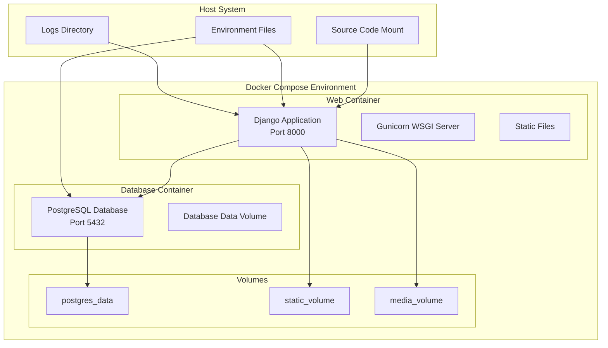

# Design Document

## Overview

This design outlines the containerization of the OneStep Django REST API application using Docker Compose with PostgreSQL as the database backend. The solution provides a multi-container setup that includes the Django application, PostgreSQL database, and supporting infrastructure for development and production environments.

## Architecture

### Container Architecture



### Network Architecture

- **Internal Network**: Docker Compose creates an internal network for service communication
- **External Access**: Only the Django application port (8000) is exposed to the host
- **Database Security**: PostgreSQL is not exposed externally, accessible only within the Docker network

## Components and Interfaces

### 1. Dockerfile for Django Application

**Purpose**: Defines the container image for the Django application
**Key Features**:
- Multi-stage build for optimization
- Python 3.11 base image
- Non-root user for security
- Health check endpoint
- Static file collection

**Interface**:
```dockerfile
# Build stage for dependencies
FROM python:3.11-slim as builder
# Production stage with minimal footprint
FROM python:3.11-slim as production
```

### 2. Docker Compose Configuration

**Purpose**: Orchestrates multi-container application setup
**Services**:

#### Web Service (Django Application)
- **Image**: Custom built from Dockerfile
- **Ports**: 8000:8000 (host:container)
- **Volumes**: 
  - Source code mount for development
  - Static files volume
  - Media files volume
- **Environment**: Database connection parameters
- **Dependencies**: Waits for database service

#### Database Service (PostgreSQL)
- **Image**: postgres:15-alpine
- **Volumes**: Named volume for data persistence
- **Environment**: Database credentials and configuration
- **Health Check**: pg_isready command

### 3. Environment Configuration

**Development Environment** (.env.dev):
```
DEBUG=1
SECRET_KEY=dev-secret-key
DATABASE_URL=postgresql://postgres:postgres@db:5432/onestep_dev
POSTGRES_DB=onestep_dev
POSTGRES_USER=postgres
POSTGRES_PASSWORD=postgres
```

**Production Environment** (.env.prod):
```
DEBUG=0
SECRET_KEY=${SECRET_KEY}
DATABASE_URL=postgresql://${POSTGRES_USER}:${POSTGRES_PASSWORD}@db:5432/${POSTGRES_DB}
POSTGRES_DB=${POSTGRES_DB}
POSTGRES_USER=${POSTGRES_USER}
POSTGRES_PASSWORD=${POSTGRES_PASSWORD}
```

### 4. Makefile Commands

**Purpose**: Provides convenient commands for Docker operations
**Commands**:
- `make up`: Start all services
- `make down`: Stop all services
- `make build`: Build/rebuild containers
- `make logs`: View service logs
- `make shell`: Access Django container shell
- `make migrate`: Run database migrations
- `make createsuperuser`: Create Django superuser
- `make test`: Run test suite

## Data Models

### Database Configuration

**Connection Parameters**:
- **Host**: `db` (Docker Compose service name)
- **Port**: `5432` (internal PostgreSQL port)
- **Database**: Configurable via environment variables
- **Authentication**: Username/password via environment variables

**Volume Management**:
- **postgres_data**: Named volume for PostgreSQL data persistence
- **static_volume**: Volume for Django static files
- **media_volume**: Volume for user-uploaded media files

### Django Settings Adaptation

**Database Configuration**:
```python
DATABASES = {
    'default': {
        'ENGINE': 'django.db.backends.postgresql',
        'NAME': os.getenv('POSTGRES_DB', 'onestep'),
        'USER': os.getenv('POSTGRES_USER', 'postgres'),
        'PASSWORD': os.getenv('POSTGRES_PASSWORD', 'postgres'),
        'HOST': os.getenv('DB_HOST', 'db'),
        'PORT': os.getenv('DB_PORT', '5432'),
    }
}
```

**Static Files Configuration**:
```python
STATIC_URL = '/static/'
STATIC_ROOT = '/app/staticfiles'
MEDIA_URL = '/media/'
MEDIA_ROOT = '/app/media'
```

## Error Handling

### Container Startup Issues

**Database Connection Failures**:
- Implement retry logic with exponential backoff
- Use Django's database connection health checks
- Provide clear error messages for connection issues

**Service Dependencies**:
- Use `depends_on` with health checks in Docker Compose
- Implement wait scripts for database readiness
- Graceful degradation for missing services

### Data Persistence Issues

**Volume Mount Failures**:
- Validate volume permissions on startup
- Provide fallback for read-only scenarios
- Clear error messages for permission issues

**Database Migration Failures**:
- Automatic retry for transient failures
- Rollback mechanisms for failed migrations
- Backup strategies for production deployments

## Testing Strategy

### Container Testing

**Build Testing**:
- Verify Docker image builds successfully
- Test container startup and health checks
- Validate environment variable handling

**Integration Testing**:
- Test Django-PostgreSQL connectivity
- Verify API endpoints work in containerized environment
- Test admin interface functionality

**Performance Testing**:
- Container resource usage monitoring
- Database connection pooling validation
- Static file serving performance

### Development Workflow Testing

**Hot Reload Testing**:
- Verify code changes reflect without container restart
- Test static file changes
- Validate database schema changes

**Command Testing**:
- Test all Makefile commands
- Verify database operations (migrate, createsuperuser)
- Test container shell access

### Production Readiness Testing

**Security Testing**:
- Verify no sensitive data in images
- Test container isolation
- Validate network security

**Scalability Testing**:
- Test horizontal scaling capabilities
- Database connection limits
- Resource constraint handling

## Security Considerations

### Container Security

**Image Security**:
- Use official, minimal base images
- Regular security updates
- Non-root user execution
- Multi-stage builds to reduce attack surface

**Network Security**:
- Internal-only database access
- Minimal port exposure
- Network isolation between environments

### Data Security

**Environment Variables**:
- Sensitive data via environment variables only
- No hardcoded credentials
- Separate development and production configurations

**Volume Security**:
- Appropriate file permissions
- Encrypted volumes for production
- Regular backup strategies

## Deployment Considerations

### Development Deployment

**Local Development**:
- Hot reload for code changes
- Debug mode enabled
- Development database with sample data
- Exposed ports for debugging

### Production Deployment

**Production Optimizations**:
- Multi-stage Docker builds
- Production WSGI server (Gunicorn)
- Static file optimization
- Database connection pooling
- Health checks and monitoring

**Scaling Considerations**:
- Horizontal scaling support
- Load balancer integration
- Database connection management
- Shared volume strategies