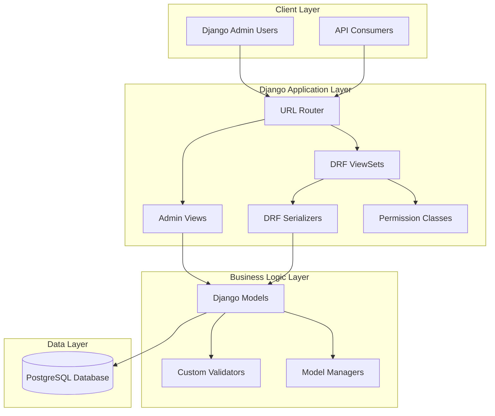
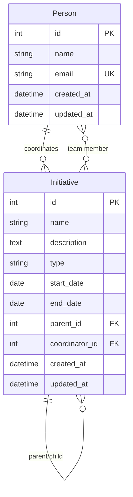

# Design Document

## Overview

This design implements a Django-based REST API and admin interface for managing Initiative and Person entities in the OneStep organizational management system. The architecture follows Django best practices with domain-driven design, separating concerns into focused applications while providing comprehensive CRUD functionality through both programmatic API access and administrative web interface.

## Architecture

### System Architecture



### Project Structure

```
onestep/
├── manage.py
├── requirements.txt
├── onestep/
│   ├── __init__.py
│   ├── settings.py
│   ├── urls.py
│   └── wsgi.py
├── apps/
│   ├── __init__.py
│   ├── core/
│   │   ├── __init__.py
│   │   ├── models.py          # Abstract base models
│   │   ├── permissions.py     # Shared permission classes
│   │   ├── serializers.py     # Base serializer classes
│   │   └── validators.py      # Custom validation functions
│   ├── initiatives/
│   │   ├── __init__.py
│   │   ├── models.py          # Initiative model
│   │   ├── admin.py           # Initiative admin configuration
│   │   ├── serializers.py     # Initiative API serializers
│   │   ├── views.py           # Initiative API views
│   │   ├── urls.py            # Initiative URL patterns
│   │   ├── permissions.py     # Initiative-specific permissions
│   │   ├── filters.py         # Initiative filtering
│   │   └── migrations/
│   └── people/
│       ├── __init__.py
│       ├── models.py          # Person model
│       ├── admin.py           # Person admin configuration
│       ├── serializers.py     # Person API serializers
│       ├── views.py           # Person API views
│       ├── urls.py            # Person URL patterns
│       ├── permissions.py     # Person-specific permissions
│       ├── filters.py         # Person filtering
│       └── migrations/
```

## Components and Interfaces

### Data Models

#### Core Models (apps/core/models.py)

```python
class TimestampedModel(models.Model):
    """Abstract base model with timestamp fields."""
    created_at = models.DateTimeField(auto_now_add=True)
    updated_at = models.DateTimeField(auto_now=True)
    
    class Meta:
        abstract = True
```

#### Initiative Model (apps/initiatives/models.py)

```python
class InitiativeType(models.TextChoices):
    PROGRAM = 'program', 'Program'
    PROJECT = 'project', 'Project'
    EVENT = 'event', 'Event'

class Initiative(TimestampedModel):
    name = models.CharField(max_length=200)
    description = models.TextField(blank=True)
    type = models.CharField(max_length=20, choices=InitiativeType.choices)
    start_date = models.DateField()
    end_date = models.DateField(null=True, blank=True)
    parent = models.ForeignKey('self', null=True, blank=True, on_delete=models.CASCADE, related_name='children')
    coordinator = models.ForeignKey('people.Person', on_delete=models.PROTECT, related_name='coordinated_initiatives')
    team_members = models.ManyToManyField('people.Person', blank=True, related_name='team_initiatives')
    
    class Meta:
        ordering = ['name']
        constraints = [
            models.CheckConstraint(
                check=models.Q(end_date__gte=models.F('start_date')),
                name='end_date_after_start_date'
            )
        ]
```

#### Person Model (apps/people/models.py)

```python
class Person(TimestampedModel):
    name = models.CharField(max_length=200)
    email = models.EmailField(unique=True)
    
    class Meta:
        ordering = ['name']
        verbose_name_plural = 'People'
    
    def __str__(self):
        return self.name
    
    @property
    def full_name(self):
        return self.name
```

### API Layer

#### DRF Serializers

**Initiative Serializer (apps/initiatives/serializers.py)**

```python
class InitiativeSerializer(serializers.ModelSerializer):
    coordinator_name = serializers.CharField(source='coordinator.full_name', read_only=True)
    team_count = serializers.IntegerField(source='team_members.count', read_only=True)
    children_count = serializers.IntegerField(source='children.count', read_only=True)
    
    class Meta:
        model = Initiative
        fields = '__all__'
        
    def validate(self, data):
        if data.get('end_date') and data.get('start_date'):
            if data['end_date'] < data['start_date']:
                raise serializers.ValidationError("End date must be after start date")
        return data

class InitiativeDetailSerializer(InitiativeSerializer):
    team_members = PersonSerializer(many=True, read_only=True)
    children = InitiativeSerializer(many=True, read_only=True)
    parent = InitiativeSerializer(read_only=True)
```

**Person Serializer (apps/people/serializers.py)**

```python
class PersonSerializer(serializers.ModelSerializer):
    full_name = serializers.CharField(read_only=True)
    coordinated_count = serializers.IntegerField(source='coordinated_initiatives.count', read_only=True)
    team_count = serializers.IntegerField(source='team_initiatives.count', read_only=True)
    
    class Meta:
        model = Person
        fields = '__all__'
        
    def validate_email(self, value):
        if Person.objects.filter(email=value).exclude(pk=self.instance.pk if self.instance else None).exists():
            raise serializers.ValidationError("A person with this email already exists.")
        return value
```

#### API ViewSets

**Initiative ViewSet (apps/initiatives/views.py)**

```python
class InitiativeViewSet(viewsets.ModelViewSet):
    queryset = Initiative.objects.select_related('coordinator', 'parent').prefetch_related('team_members', 'children')
    permission_classes = [IsAuthenticated]
    filter_backends = [DjangoFilterBackend, SearchFilter, OrderingFilter]
    filterset_fields = ['type', 'coordinator', 'parent']
    search_fields = ['name', 'description']
    ordering_fields = ['name', 'start_date', 'end_date', 'created_at']
    ordering = ['name']
    
    def get_serializer_class(self):
        if self.action == 'retrieve':
            return InitiativeDetailSerializer
        return InitiativeSerializer
```

**Person ViewSet (apps/people/views.py)**

```python
class PersonViewSet(viewsets.ModelViewSet):
    queryset = Person.objects.prefetch_related('coordinated_initiatives', 'team_initiatives')
    serializer_class = PersonSerializer
    permission_classes = [IsAuthenticated]
    filter_backends = [SearchFilter, OrderingFilter]
    search_fields = ['name', 'email']
    ordering_fields = ['name', 'email', 'created_at']
    ordering = ['name']
```

### Django Admin Interface

#### Initiative Admin (apps/initiatives/admin.py)

```python
class TeamMemberInline(admin.TabularInline):
    model = Initiative.team_members.through
    extra = 1
    verbose_name = "Team Member"
    verbose_name_plural = "Team Members"

@admin.register(Initiative)
class InitiativeAdmin(admin.ModelAdmin):
    list_display = ['name', 'type', 'coordinator', 'start_date', 'end_date', 'team_count', 'children_count']
    list_filter = ['type', 'start_date', 'coordinator']
    search_fields = ['name', 'description', 'coordinator__name']
    readonly_fields = ['created_at', 'updated_at', 'team_count', 'children_count']
    inlines = [TeamMemberInline]
    
    fieldsets = (
        ('Basic Information', {
            'fields': ('name', 'description', 'type')
        }),
        ('Timeline', {
            'fields': ('start_date', 'end_date')
        }),
        ('Relationships', {
            'fields': ('parent', 'coordinator')
        }),
        ('Metadata', {
            'fields': ('created_at', 'updated_at', 'team_count', 'children_count'),
            'classes': ('collapse',)
        })
    )
    
    def team_count(self, obj):
        return obj.team_members.count()
    team_count.short_description = 'Team Size'
    
    def children_count(self, obj):
        return obj.children.count()
    children_count.short_description = 'Sub-Initiatives'
```

#### Person Admin (apps/people/admin.py)

```python
class InitiativeInline(admin.TabularInline):
    model = Initiative.team_members.through
    extra = 0
    verbose_name = "Team Initiative"
    verbose_name_plural = "Team Initiatives"

@admin.register(Person)
class PersonAdmin(admin.ModelAdmin):
    list_display = ['full_name', 'email', 'coordinated_count', 'team_count']
    search_fields = ['name', 'email']
    readonly_fields = ['created_at', 'updated_at', 'coordinated_count', 'team_count']
    inlines = [InitiativeInline]
    
    fieldsets = (
        ('Personal Information', {
            'fields': ('name', 'email')
        }),
        ('Statistics', {
            'fields': ('coordinated_count', 'team_count'),
            'classes': ('collapse',)
        }),
        ('Metadata', {
            'fields': ('created_at', 'updated_at'),
            'classes': ('collapse',)
        })
    )
    
    def coordinated_count(self, obj):
        return obj.coordinated_initiatives.count()
    coordinated_count.short_description = 'Coordinated Initiatives'
    
    def team_count(self, obj):
        return obj.team_initiatives.count()
    team_count.short_description = 'Team Memberships'
```

## Data Models

### Entity Relationship Diagram



### Database Constraints

- **Person.email**: Unique constraint to prevent duplicate email addresses
- **Initiative.end_date**: Check constraint ensuring end_date >= start_date
- **Initiative.coordinator**: Foreign key with PROTECT to prevent deletion of referenced persons
- **Initiative.parent**: Self-referencing foreign key with CASCADE for hierarchical deletion

## Error Handling

### API Error Responses

```python
# Standard error response format
{
    "error": {
        "code": "VALIDATION_ERROR",
        "message": "Invalid data provided",
        "details": {
            "email": ["A person with this email already exists."],
            "end_date": ["End date must be after start date"]
        }
    }
}
```

### Error Handling Strategy

1. **Validation Errors**: Return HTTP 400 with field-specific error messages
2. **Authentication Errors**: Return HTTP 401 with authentication required message
3. **Permission Errors**: Return HTTP 403 with access denied message
4. **Not Found Errors**: Return HTTP 404 with resource not found message
5. **Server Errors**: Return HTTP 500 with generic error message (log details internally)

### Django Admin Error Handling

- Use Django's built-in form validation for consistent error display
- Implement custom clean methods for complex validation rules
- Provide helpful error messages with field-level feedback
- Handle cascade deletion warnings for related objects

## Testing Strategy

### API Testing

```python
class InitiativeAPITestCase(APITestCase):
    def setUp(self):
        self.user = User.objects.create_user('test@example.com', 'password')
        self.client.force_authenticate(user=self.user)
        self.person = Person.objects.create(
            name='John Doe', email='john@example.com'
        )
    
    def test_create_initiative(self):
        data = {
            'name': 'Test Initiative',
            'type': 'project',
            'start_date': '2024-01-01',
            'coordinator': self.person.id
        }
        response = self.client.post('/api/initiatives/', data)
        self.assertEqual(response.status_code, 201)
    
    def test_list_initiatives(self):
        response = self.client.get('/api/initiatives/')
        self.assertEqual(response.status_code, 200)
        self.assertIn('results', response.data)
```

### Admin Testing

```python
class InitiativeAdminTestCase(TestCase):
    def setUp(self):
        self.admin_user = User.objects.create_superuser('admin@example.com', 'password')
        self.client.force_login(self.admin_user)
    
    def test_initiative_admin_list_view(self):
        response = self.client.get('/admin/initiatives/initiative/')
        self.assertEqual(response.status_code, 200)
    
    def test_initiative_admin_add_view(self):
        response = self.client.get('/admin/initiatives/initiative/add/')
        self.assertEqual(response.status_code, 200)
```

### Model Testing

```python
class InitiativeModelTestCase(TestCase):
    def test_initiative_str_representation(self):
        initiative = Initiative(name='Test Initiative')
        self.assertEqual(str(initiative), 'Test Initiative')
    
    def test_date_validation(self):
        with self.assertRaises(ValidationError):
            initiative = Initiative(
                name='Test',
                start_date='2024-01-01',
                end_date='2023-12-31'
            )
            initiative.full_clean()
```

### Performance Testing

- Load testing for API endpoints with large datasets
- Query optimization testing using Django Debug Toolbar
- Database performance monitoring for complex queries
- Pagination performance testing for large result sets