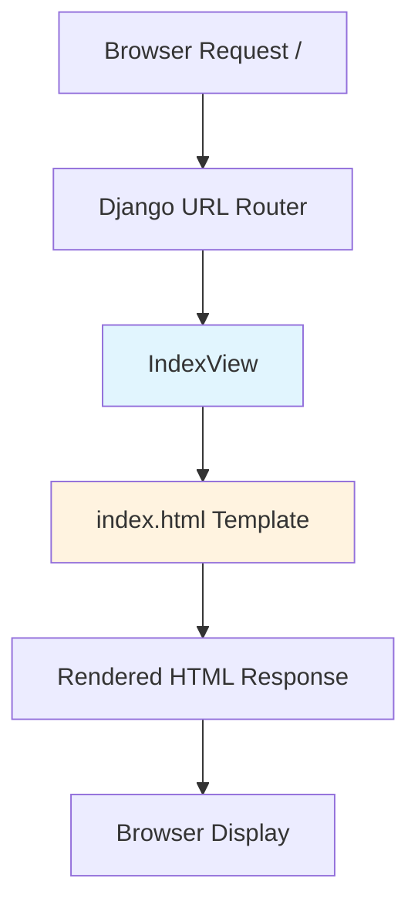

# Design Document: Index Landing Page

## Overview

The index landing page provides a simple, informative entry point for the OneStep application. It follows Django's template-based approach with minimal styling, focusing on providing quick access to the admin interface and API documentation. The design prioritizes simplicity, performance, and maintainability while staying aligned with the project's backend-focused architecture.

## Architecture

### High-Level Architecture



### Component Flow

1. User navigates to root URL (/)
2. Django URL router matches the path to IndexView
3. IndexView prepares context data (API info, endpoints, version)
4. Django template engine renders index.html with context
5. Response returned to browser with rendered HTML

## Components and Interfaces

### 1. URL Configuration

**File**: `onestep/urls.py`

Add root URL pattern to existing urlpatterns:

```python
from apps.core.views import IndexView

urlpatterns = [
    path('', IndexView.as_view(), name='index'),
    # ... existing patterns
]
```

### 2. View Component

**File**: `apps/core/views.py`

```python
from django.views.generic import TemplateView
from django.conf import settings

class IndexView(TemplateView):
    """
    Landing page view for OneStep application.
    
    Provides information about the application, links to admin
    and API, and displays available endpoints.
    """
    template_name = 'core/index.html'
    
    def get_context_data(self, **kwargs):
        context = super().get_context_data(**kwargs)
        context.update({
            'app_name': 'OneStep',
            'app_description': 'Organizational Initiative Management System',
            'api_version': 'v1',
            'admin_url': settings.ADMIN_URL,
            'api_endpoints': [
                {
                    'name': 'People',
                    'url': '/api/v1/people/',
                    'description': 'Manage people and team members'
                },
                {
                    'name': 'Initiatives',
                    'url': '/api/v1/initiatives/',
                    'description': 'Manage programs, projects, and events'
                },
            ],
            'auth_methods': ['JWT Token', 'Session Authentication', 'Basic Authentication'],
            'api_features': [
                'Search across multiple fields',
                'Field-based filtering',
                'Ordering and sorting',
                'Page-based pagination'
            ]
        })
        return context
```

### 3. Template Component

**File**: `templates/core/index.html`

```html
<!DOCTYPE html>
<html lang="en">
<head>
    <meta charset="UTF-8">
    <meta name="viewport" content="width=device-width, initial-scale=1.0">
    <title>{{ app_name }} - {{ app_description }}</title>
    <style>
        * {
            margin: 0;
            padding: 0;
            box-sizing: border-box;
        }
        
        body {
            font-family: -apple-system, BlinkMacSystemFont, 'Segoe UI', Roboto, Oxygen, Ubuntu, Cantarell, sans-serif;
            line-height: 1.6;
            color: #333;
            background: linear-gradient(135deg, #667eea 0%, #764ba2 100%);
            min-height: 100vh;
            display: flex;
            align-items: center;
            justify-content: center;
            padding: 20px;
        }
        
        .container {
            background: white;
            border-radius: 12px;
            box-shadow: 0 20px 60px rgba(0,0,0,0.3);
            max-width: 800px;
            width: 100%;
            padding: 40px;
        }
        
        h1 {
            color: #667eea;
            margin-bottom: 10px;
            font-size: 2.5em;
        }
        
        .subtitle {
            color: #666;
            margin-bottom: 30px;
            font-size: 1.2em;
        }
        
        .section {
            margin-bottom: 30px;
        }
        
        .section h2 {
            color: #444;
            margin-bottom: 15px;
            font-size: 1.5em;
            border-bottom: 2px solid #667eea;
            padding-bottom: 5px;
        }
        
        .buttons {
            display: flex;
            gap: 15px;
            flex-wrap: wrap;
            margin-bottom: 30px;
        }
        
        .btn {
            display: inline-block;
            padding: 12px 24px;
            text-decoration: none;
            border-radius: 6px;
            font-weight: 600;
            transition: all 0.3s ease;
        }
        
        .btn-primary {
            background: #667eea;
            color: white;
        }
        
        .btn-primary:hover {
            background: #5568d3;
            transform: translateY(-2px);
            box-shadow: 0 4px 12px rgba(102, 126, 234, 0.4);
        }
        
        .btn-secondary {
            background: #764ba2;
            color: white;
        }
        
        .btn-secondary:hover {
            background: #63408a;
            transform: translateY(-2px);
            box-shadow: 0 4px 12px rgba(118, 75, 162, 0.4);
        }
        
        .endpoint-list, .feature-list, .auth-list {
            list-style: none;
        }
        
        .endpoint-item {
            background: #f8f9fa;
            padding: 15px;
            margin-bottom: 10px;
            border-radius: 6px;
            border-left: 4px solid #667eea;
        }
        
        .endpoint-item h3 {
            color: #667eea;
            margin-bottom: 5px;
            font-size: 1.1em;
        }
        
        .endpoint-item a {
            color: #764ba2;
            text-decoration: none;
            font-family: monospace;
            font-size: 0.9em;
        }
        
        .endpoint-item a:hover {
            text-decoration: underline;
        }
        
        .endpoint-item p {
            color: #666;
            margin-top: 5px;
            font-size: 0.95em;
        }
        
        .feature-list li, .auth-list li {
            padding: 8px 0;
            padding-left: 25px;
            position: relative;
        }
        
        .feature-list li:before, .auth-list li:before {
            content: "✓";
            position: absolute;
            left: 0;
            color: #667eea;
            font-weight: bold;
        }
        
        .badge {
            display: inline-block;
            background: #667eea;
            color: white;
            padding: 4px 12px;
            border-radius: 12px;
            font-size: 0.85em;
            font-weight: 600;
        }
        
        @media (max-width: 600px) {
            .container {
                padding: 20px;
            }
            
            h1 {
                font-size: 2em;
            }
            
            .buttons {
                flex-direction: column;
            }
            
            .btn {
                text-align: center;
            }
        }
    </style>
</head>
<body>
    <div class="container">
        <h1>{{ app_name }}</h1>
        <p class="subtitle">{{ app_description }}</p>
        
        <div class="buttons">
            <a href="/{{ admin_url }}" class="btn btn-primary">Admin Interface</a>
            <a href="/api/v1/" class="btn btn-secondary">API Documentation</a>
        </div>
        
        <div class="section">
            <h2>API Endpoints <span class="badge">{{ api_version }}</span></h2>
            <ul class="endpoint-list">
                
                <li class="endpoint-item">
                    <h3>{{ endpoint.name }}</h3>
                    <a href="{{ endpoint.url }}">{{ endpoint.url }}</a>
                    <p>{{ endpoint.description }}</p>
                </li>
                
            </ul>
        </div>
        
        <div class="section">
            <h2>Authentication</h2>
            <ul class="auth-list">
                
                <li>{{ method }}</li>
                
            </ul>
        </div>
        
        <div class="section">
            <h2>API Features</h2>
            <ul class="feature-list">
                
                <li>{{ feature }}</li>
                
            </ul>
        </div>
    </div>
</body>
</html>
```

### 4. Directory Structure

```
apps/core/
├── views.py              # IndexView class
├── templates/
│   └── core/
│       └── index.html    # Landing page template
└── tests/
    └── test_views.py     # Tests for IndexView
```

## Data Models

No new data models required. This feature uses existing Django settings and static configuration data.

## Error Handling

### Error Scenarios

1. **Template Not Found**
   - Django will raise TemplateDoesNotExist
   - Ensure template exists in correct location
   - Verify TEMPLATES setting includes app directories

2. **Missing Context Variables**
   - Template will render with empty values
   - Use Django template filters with defaults: `{{ var|default:"N/A" }}`

3. **Invalid URLs in Context**
   - Validate URL patterns in view's get_context_data
   - Use Django's reverse() for internal URLs where possible

### Error Response

If view fails, Django's default error handling will:
- Return 500 Internal Server Error in production
- Show detailed error page in DEBUG mode
- Log error to configured logging handlers

## Testing Strategy

### Unit Tests

**File**: `apps/core/tests/test_views.py`

```python
from django.test import TestCase, Client
from django.urls import reverse

class IndexViewTests(TestCase):
    """Test suite for index landing page view."""
    
    def setUp(self):
        self.client = Client()
        self.url = reverse('index')
    
    def test_index_page_loads(self):
        """Test that index page returns 200 status."""
        response = self.client.get(self.url)
        self.assertEqual(response.status_code, 200)
    
    def test_index_uses_correct_template(self):
        """Test that index page uses correct template."""
        response = self.client.get(self.url)
        self.assertTemplateUsed(response, 'core/index.html')
    
    def test_index_contains_app_name(self):
        """Test that index page displays application name."""
        response = self.client.get(self.url)
        self.assertContains(response, 'OneStep')
    
    def test_index_contains_admin_link(self):
        """Test that index page includes admin link."""
        response = self.client.get(self.url)
        self.assertContains(response, 'Admin Interface')
    
    def test_index_contains_api_link(self):
        """Test that index page includes API link."""
        response = self.client.get(self.url)
        self.assertContains(response, 'API Documentation')
    
    def test_index_displays_api_endpoints(self):
        """Test that index page lists API endpoints."""
        response = self.client.get(self.url)
        self.assertContains(response, 'People')
        self.assertContains(response, 'Initiatives')
    
    def test_index_displays_auth_methods(self):
        """Test that index page lists authentication methods."""
        response = self.client.get(self.url)
        self.assertContains(response, 'JWT Token')
    
    def test_index_response_time(self):
        """Test that index page loads within performance requirements."""
        import time
        start = time.time()
        response = self.client.get(self.url)
        duration = (time.time() - start) * 1000  # Convert to ms
        self.assertEqual(response.status_code, 200)
        self.assertLess(duration, 100, "Page load exceeded 100ms requirement")
```

### Integration Tests

Test that the index page integrates correctly with:
- URL routing
- Template rendering
- Static file serving (if CSS extracted to separate file)

### Manual Testing Checklist

- [ ] Page loads at root URL (/)
- [ ] Admin link navigates to admin interface
- [ ] API link navigates to API root
- [ ] Page displays correctly on desktop browsers
- [ ] Page displays correctly on mobile devices
- [ ] All endpoint links are clickable and functional
- [ ] Page loads within 100ms

## Performance Considerations

1. **Template Caching**: Django automatically caches compiled templates in production
2. **Minimal Assets**: Single HTML file with inline CSS reduces HTTP requests
3. **No JavaScript**: Eliminates script parsing and execution time
4. **Static Context**: View context data is static, no database queries required
5. **CDN-Ready**: If needed, CSS can be extracted to static file for CDN serving

## Security Considerations

1. **No User Input**: Page doesn't accept or process user input
2. **CSRF Protection**: Not needed as page has no forms
3. **XSS Prevention**: Django template auto-escaping enabled by default
4. **Content Security Policy**: Consider adding CSP headers in production
5. **HTTPS**: Ensure HTTPS in production for secure admin/API links

## Design Decisions

### Why Template-Based Instead of SPA?

- Aligns with project's backend-focused architecture
- No need for complex frontend build process
- Faster initial load time
- Better SEO (though not critical for this use case)
- Simpler maintenance

### Why Inline CSS?

- Single HTTP request
- No static file management complexity
- Sufficient for simple landing page
- Can be extracted later if needed

### Why Class-Based View?

- Consistent with Django best practices
- Easy to extend if needed
- Built-in template rendering
- Testable with Django test client

## Future Enhancements

Potential improvements (not in current scope):

1. Add API documentation link (Swagger/ReDoc)
2. Display system status/health check
3. Add quick start guide or tutorial links
4. Include API usage examples
5. Add dark mode toggle
6. Extract CSS to separate static file for caching
