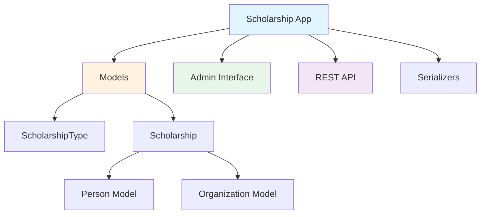

# Design Document: Scholarship Management System

## Overview

This document describes the design for a scholarship management system that tracks academic scholarships, including their types, financial details, duration, and relationships with students, supervisors, and sponsor organizations.

## Architecture

### Component Overview



## Data Models

### Entity Relationship Diagram

```mermaid
classDiagram
    class ScholarshipType {
        +String name
        +String code
        +TextField description
        +Boolean is_active
        +DateTime created_at
        +DateTime updated_at
        +scholarship_count()
    }
    
    class Scholarship {
        +String title
        +ForeignKey type
        +ForeignKey campus
        +Date start_date
        +Date end_date
        +ForeignKey supervisor
        +ForeignKey student
        +Decimal value
        +ForeignKey sponsor
        +ForeignKey initiative
        +DateTime created_at
        +DateTime updated_at
        +duration_months()
        +is_active()
        +clean()
    }
    
    class Person {
        +String name
        +String email
        +supervised_scholarships
        +received_scholarships
    }
    
    class Organization {
        +String name
        +String description
        +sponsored_scholarships
    }
    
    class Campus {
        +String name
        +String code
        +scholarships
    }
    
    class Initiative {
        +String name
        +String description
        +scholarships
    }
    
    Scholarship }o--|| ScholarshipType : type
    Scholarship }o--|| Campus : campus
    Scholarship }o--|| Person : supervisor
    Scholarship }o--|| Person : student
    Scholarship }o--o| Organization : sponsor
    Scholarship }o--o| Initiative : initiative
```

## Components and Interfaces

### 1. Models

#### ScholarshipType Model

```python
class ScholarshipType(TimestampedModel):
    """
    Represents a type/category of scholarship.
    
    Attributes:
        name: Display name (e.g., "Research Scholarship")
        code: Unique code (e.g., "research")
        description: Detailed description
        is_active: Whether this type is currently active
    """
    name = CharField(max_length=100, unique=True)
    code = CharField(max_length=50, unique=True)
    description = TextField(blank=True)
    is_active = BooleanField(default=True)
    
    class Meta:
        ordering = ['name']
        indexes = [
            Index(fields=['code']),
            Index(fields=['is_active']),
        ]
```

#### Scholarship Model

```python
class Scholarship(TimestampedModel):
    """
    Represents a scholarship award.
    
    Attributes:
        title: Descriptive name for the scholarship
        type: Type of scholarship
        campus: Campus where scholarship is executed
        start_date: Scholarship start date
        end_date: Scholarship end date (optional)
        supervisor: Person supervising the scholarship
        student: Person receiving the scholarship
        value: Monthly scholarship value in BRL
        sponsor: Organization sponsoring the scholarship (optional)
        initiative: Related initiative/project (optional)
    """
    title = CharField(max_length=300)
    type = ForeignKey(ScholarshipType, on_delete=PROTECT)
    campus = ForeignKey(Campus, on_delete=PROTECT, related_name='scholarships')
    start_date = DateField()
    end_date = DateField(null=True, blank=True)
    supervisor = ForeignKey(Person, on_delete=PROTECT, related_name='supervised_scholarships')
    student = ForeignKey(Person, on_delete=PROTECT, related_name='received_scholarships')
    value = DecimalField(max_digits=10, decimal_places=2)
    sponsor = ForeignKey(Organization, on_delete=SET_NULL, null=True, blank=True, related_name='sponsored_scholarships')
    initiative = ForeignKey(Initiative, on_delete=SET_NULL, null=True, blank=True, related_name='scholarships')
    
    class Meta:
        ordering = ['-start_date']
        indexes = [
            Index(fields=['title']),
            Index(fields=['campus']),
            Index(fields=['start_date']),
            Index(fields=['end_date']),
            Index(fields=['student']),
            Index(fields=['supervisor']),
            Index(fields=['type']),
            Index(fields=['initiative']),
        ]
        constraints = [
            CheckConstraint(
                check=Q(end_date__gte=F('start_date')),
                name='end_date_after_start_date'
            ),
            CheckConstraint(
                check=Q(value__gt=0),
                name='value_positive'
            ),
        ]
```

### 2. Admin Interface

#### ScholarshipType Admin

**Features:**
- List display: name, code, is_active, scholarship_count, created_at
- Filters: is_active, created_at
- Search: name, code, description
- Actions: activate/deactivate types

#### Scholarship Admin

**Features:**
- List display: student, supervisor, type, value, start_date, end_date, duration, status, sponsor
- Filters: type, supervisor, student, sponsor, start_date, end_date, is_active
- Search: student name, supervisor name, sponsor name
- Inlines: None (simple model)
- Custom displays:
  - Color-coded status (active/completed/upcoming)
  - Formatted currency value
  - Duration in months
  - Links to related objects

### 3. REST API

#### Endpoints

```
GET    /api/scholarships/              List scholarships
POST   /api/scholarships/              Create scholarship
GET    /api/scholarships/{id}/         Retrieve scholarship
PUT    /api/scholarships/{id}/         Update scholarship
PATCH  /api/scholarships/{id}/         Partial update
DELETE /api/scholarships/{id}/         Delete scholarship

GET    /api/scholarship-types/         List scholarship types
POST   /api/scholarship-types/         Create type
GET    /api/scholarship-types/{id}/    Retrieve type
PUT    /api/scholarship-types/{id}/    Update type
DELETE /api/scholarship-types/{id}/    Delete type
```

#### Serializers

**ScholarshipTypeSerializer:**
- All fields
- Computed: scholarship_count

**ScholarshipSerializer:**
- All fields
- Nested: type (basic info), student (basic info), supervisor (basic info), sponsor (basic info)
- Computed: duration_months, is_active

**ScholarshipDetailSerializer:**
- Extends ScholarshipSerializer
- Full nested objects for type, student, supervisor, sponsor

**ScholarshipCreateUpdateSerializer:**
- Write operations
- Fields: type_id, start_date, end_date, supervisor_id, student_id, value, sponsor_id

## Validation Rules

### Scholarship Validation

1. **Value Validation:**
   - Must be greater than 0
   - Maximum 10 digits with 2 decimal places
   - Stored in BRL (Brazilian Real)

2. **Date Validation:**
   - start_date is required
   - end_date must be >= start_date (if provided)
   - start_date cannot be more than 10 years in the future
   - end_date cannot be more than 10 years after start_date

3. **Relationship Validation:**
   - supervisor and student must be different people
   - student cannot have overlapping scholarships (same student, overlapping dates)

4. **Type Validation:**
   - type must be active when creating new scholarship
   - type cannot be deleted if scholarships exist

## Business Logic

### Duration Calculation

```python
def duration_months(self):
    """Calculate scholarship duration in months."""
    if not self.end_date:
        # Ongoing scholarship - calculate from start to today
        end = timezone.now().date()
    else:
        end = self.end_date
    
    delta = relativedelta(end, self.start_date)
    return delta.years * 12 + delta.months
```

### Active Status

```python
def is_active(self):
    """Check if scholarship is currently active."""
    today = timezone.now().date()
    
    if self.start_date > today:
        return False  # Not started yet
    
    if self.end_date and self.end_date < today:
        return False  # Already ended
    
    return True  # Active
```

### Total Value Calculation

```python
def total_value(self):
    """Calculate total scholarship value (value * duration)."""
    months = self.duration_months()
    return self.value * months
```

## Admin Interface Design

### List View Features

1. **Color-coded Status:**
   - Green: Active scholarships
   - Orange: Upcoming scholarships
   - Gray: Completed scholarships

2. **Formatted Display:**
   - Currency: R$ 1.500,00
   - Dates: DD/MM/YYYY
   - Duration: "12 months" or "Ongoing"

3. **Quick Filters:**
   - Active scholarships
   - By scholarship type
   - By supervisor
   - By sponsor
   - Date range

4. **Bulk Actions:**
   - Export to CSV
   - Generate report

### Detail View Features

1. **Fieldsets:**
   - Basic Information (type, value)
   - Duration (start_date, end_date, duration)
   - People (supervisor, student)
   - Funding (sponsor)
   - Statistics (total_value, is_active)
   - Metadata (created_at, updated_at)

2. **Readonly Fields:**
   - duration_months
   - is_active
   - total_value
   - created_at
   - updated_at

## API Design

### Filtering

Support filtering by:
- `type`: Scholarship type ID
- `supervisor`: Supervisor person ID
- `student`: Student person ID
- `sponsor`: Sponsor organization ID
- `is_active`: Boolean (active scholarships)
- `start_date_after`: Date
- `start_date_before`: Date
- `end_date_after`: Date
- `end_date_before`: Date
- `value_min`: Decimal
- `value_max`: Decimal

### Ordering

Support ordering by:
- `start_date` (default: descending)
- `end_date`
- `value`
- `student__name`
- `supervisor__name`
- `created_at`

### Response Format

```json
{
  "id": 1,
  "type": {
    "id": 1,
    "name": "Research Scholarship",
    "code": "research"
  },
  "start_date": "2024-01-01",
  "end_date": "2024-12-31",
  "supervisor": {
    "id": 5,
    "name": "Dr. João Silva",
    "email": "joao@example.com"
  },
  "student": {
    "id": 10,
    "name": "Maria Santos",
    "email": "maria@example.com"
  },
  "value": "1500.00",
  "sponsor": {
    "id": 2,
    "name": "FAPES"
  },
  "duration_months": 12,
  "is_active": true,
  "total_value": "18000.00",
  "created_at": "2023-12-01T10:00:00Z",
  "updated_at": "2023-12-01T10:00:00Z"
}
```

## Database Indexes

### ScholarshipType
- `code` (unique)
- `is_active`

### Scholarship
- `start_date`
- `end_date`
- `student`
- `supervisor`
- `type`
- `sponsor`
- Composite: `(student, start_date, end_date)` for overlap detection

## Security Considerations

1. **Access Control:**
   - Only authenticated users can access scholarship data
   - Supervisors can view their own scholarships
   - Students can view their own scholarships
   - Admin users can view and modify all scholarships

2. **Data Privacy:**
   - Scholarship values are sensitive financial data
   - Student information should be protected
   - API should respect user permissions

3. **Validation:**
   - Server-side validation for all inputs
   - Prevent SQL injection via ORM
   - Sanitize all user inputs

## Performance Considerations

1. **Database Queries:**
   - Use select_related for type, supervisor, student, sponsor
   - Use prefetch_related for reverse relationships
   - Add indexes on frequently filtered fields

2. **API Optimization:**
   - Pagination (25 items per page)
   - Field selection (allow clients to request specific fields)
   - Caching for scholarship types

3. **Admin Optimization:**
   - Limit queryset size
   - Use annotations for counts
   - Lazy load related objects

## Testing Strategy

### Unit Tests
- Model validation
- Business logic (duration, is_active, total_value)
- Constraint enforcement

### Integration Tests
- API endpoints
- Admin interface
- Filtering and searching

### Test Data
- Various scholarship types
- Active, completed, and upcoming scholarships
- Scholarships with and without sponsors
- Edge cases (same-day scholarships, long-duration scholarships)

## Future Enhancements

1. **Scholarship Renewals:**
   - Track scholarship renewals
   - Link renewed scholarships

2. **Payment Tracking:**
   - Track monthly payments
   - Payment status and history

3. **Reports:**
   - Scholarship distribution by type
   - Spending by sponsor
   - Supervisor workload

4. **Notifications:**
   - Scholarship expiration alerts
   - Payment reminders

5. **Documents:**
   - Attach scholarship agreements
   - Store payment receipts
