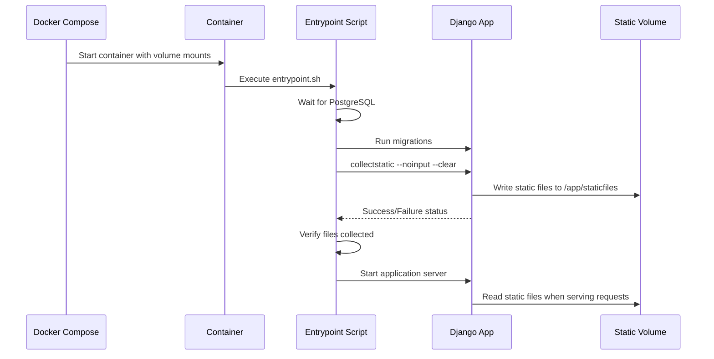

# Design Document: Static Files Docker Setup

## Overview

This design outlines the configuration changes needed to ensure Django static files (Django Admin and Swagger UI assets) are properly collected, persisted, and served in the Docker containerized environment. The solution focuses on proper volume mounting, entrypoint script execution, and Django settings configuration.

## Architecture

### Current State
- Docker Compose defines `static_volume` but it's mounted at `/app/staticfiles`
- Entrypoint script already runs `collectstatic --noinput --clear`
- Django settings define `STATIC_ROOT` as `BASE_DIR / 'staticfiles'`
- Web service uses `runserver` command which serves static files in DEBUG mode

### Target State
- Static files volume properly mounted and aligned with Django STATIC_ROOT
- Entrypoint script successfully collects all static files including Django Admin and drf-spectacular assets
- Static files persist across container restarts
- Clear logging and error handling for static file collection

## Components and Interfaces

### 1. Docker Compose Configuration (`docker-compose.yml`)

**Changes Required:**
- Verify static_volume mount path matches Django STATIC_ROOT
- Ensure volume permissions allow the appuser to write static files
- Add environment variable for STATIC_ROOT if needed for flexibility

**Volume Configuration:**
```yaml
volumes:
  - static_volume:/app/staticfiles  # Already configured correctly
```

### 2. Entrypoint Script (`entrypoint.sh`)

**Current Implementation:**
The script already includes a `collect_static()` function that runs:
```bash
python manage.py collectstatic --noinput --clear
```

**Enhancement Required:**
- Add error handling to catch collectstatic failures
- Verify static files were actually collected (check directory exists and has files)
- Improve logging output for debugging

**Updated Function:**
```bash
collect_static() {
    echo -e "${YELLOW}Collecting static files...${NC}"
    
    # Collect static files without user input
    if python manage.py collectstatic --noinput --clear; then
        echo -e "${GREEN}Static files collected successfully!${NC}"
        
        # Verify static files exist
        if [ -d "$STATIC_ROOT" ] && [ "$(ls -A $STATIC_ROOT)" ]; then
            echo -e "${GREEN}Static files verified in $STATIC_ROOT${NC}"
        else
            echo -e "${RED}Warning: Static files directory is empty${NC}"
        fi
    else
        echo -e "${RED}Error: Failed to collect static files${NC}"
        exit 1
    fi
}
```

### 3. Django Settings (`onestep/settings.py`)

**Current Configuration:**
```python
STATIC_URL = '/static/'
STATIC_ROOT = os.getenv('STATIC_ROOT', str(BASE_DIR / 'staticfiles'))
```

**Verification Needed:**
- Ensure all installed apps with static files are in INSTALLED_APPS (already includes django.contrib.admin and drf_spectacular)
- Verify STATIC_ROOT path is consistent with docker-compose volume mount
- Confirm STATIC_URL is properly configured

**No changes required** - current configuration is correct.

### 4. Dockerfile

**Current Configuration:**
- Creates `/app/staticfiles` directory with proper permissions
- Sets ownership to appuser:appuser
- Runs as non-root user

**Verification:**
```dockerfile
RUN mkdir -p /app/staticfiles /app/media /app/logs && \
    chown -R appuser:appuser /app/staticfiles /app/media /app/logs && \
    chmod 755 /app/staticfiles /app/media
```

**No changes required** - permissions are correctly configured.

## Data Models

No database models are affected by this change. This is purely an infrastructure and configuration update.

## Configuration Flow



## Error Handling

### Static File Collection Failures

**Potential Issues:**
1. **Permission Denied**: Volume mount has incorrect permissions
   - Solution: Ensure volume is writable by appuser (UID 1000)
   
2. **Missing Dependencies**: Static files from third-party packages not found
   - Solution: Verify all packages in INSTALLED_APPS are in requirements.txt
   
3. **Disk Space**: Insufficient space in volume
   - Solution: Check Docker volume space, clean old volumes

**Error Handling Strategy:**
- Entrypoint script exits with non-zero code if collectstatic fails
- Docker healthcheck will detect failed container
- Clear error messages logged to stdout for debugging

### Runtime Static File Serving

**Development Mode (DEBUG=True):**
- Django runserver automatically serves static files from STATIC_ROOT
- No additional configuration needed

**Production Mode (DEBUG=False):**
- Static files should be served by reverse proxy (nginx) or whitenoise
- Current setup uses runserver which won't serve static files in production
- Future enhancement: Add nginx service or whitenoise middleware

## Testing Strategy

### Manual Testing Steps

1. **Build and Start Containers:**
   ```bash
   docker-compose build
   docker-compose up
   ```

2. **Verify Static Files Collection:**
   ```bash
   docker-compose exec web ls -la /app/staticfiles
   # Should show admin/, rest_framework/, drf_spectacular/ directories
   ```

3. **Test Django Admin:**
   - Navigate to http://localhost:8000/admin/
   - Verify CSS and JavaScript load without 404 errors
   - Check browser console for missing assets

4. **Test Swagger UI:**
   - Navigate to http://localhost:8000/api/schema/swagger-ui/
   - Verify Swagger UI renders correctly with styling
   - Check browser console for missing assets

5. **Test Volume Persistence:**
   ```bash
   docker-compose down
   docker-compose up
   # Static files should still exist without re-collection
   ```

### Automated Testing

**Container Health Check:**
- Existing healthcheck verifies admin endpoint is accessible
- Implicitly validates static files are available

**Integration Test Script:**
```bash
#!/bin/bash
# test-static-files.sh

# Start containers
docker-compose up -d

# Wait for container to be healthy
timeout 60 bash -c 'until docker-compose ps | grep -q "healthy"; do sleep 2; done'

# Check static files exist
docker-compose exec -T web test -d /app/staticfiles/admin || exit 1
docker-compose exec -T web test -d /app/staticfiles/rest_framework || exit 1
docker-compose exec -T web test -d /app/staticfiles/drf_spectacular || exit 1

# Test admin endpoint returns 200
curl -f http://localhost:8000/admin/ || exit 1

# Test swagger endpoint returns 200
curl -f http://localhost:8000/api/schema/swagger-ui/ || exit 1

echo "All static file tests passed!"
```

## Implementation Notes

### Key Considerations

1. **Volume Permissions**: The static_volume is created by Docker with root ownership, but the container runs as appuser (UID 1000). The entrypoint script runs as appuser and must have write permissions.

2. **First Run vs Restart**: On first run, collectstatic populates the volume. On restart, the volume persists, so collectstatic may be faster (only updates changed files).

3. **Development vs Production**: Current setup uses `runserver` which serves static files in DEBUG mode. For production, consider adding nginx or whitenoise.

4. **Static Files Sources**:
   - Django Admin: `django/contrib/admin/static/admin/`
   - DRF: `rest_framework/static/rest_framework/`
   - DRF Spectacular: `drf_spectacular/static/drf_spectacular/`

### Environment Variables

Current environment variables affecting static files:
- `STATIC_ROOT`: Path where static files are collected (default: `/app/staticfiles`)
- `DEBUG`: Affects whether runserver serves static files (default: `1` for development)

### Future Enhancements

1. **Add Nginx Service**: Serve static files through nginx reverse proxy for production
2. **Add Whitenoise**: Django middleware to serve static files efficiently without nginx
3. **CDN Integration**: Upload static files to CDN for better performance
4. **Static File Versioning**: Add cache-busting hashes to static file URLs

## Deployment Considerations

### Development Environment
- Current configuration is optimized for development
- `runserver` with DEBUG=True serves static files automatically
- Volume mount allows hot-reload of code changes

### Production Environment
- Should not use `runserver` (already configured to use gunicorn in Dockerfile CMD)
- Should add nginx service or whitenoise for static file serving
- Should set DEBUG=False and use proper ALLOWED_HOSTS

## Summary

The current Docker setup already has most components in place for proper static file handling:
- Volume is defined and mounted correctly
- Entrypoint script runs collectstatic
- Django settings are properly configured
- Dockerfile creates directories with correct permissions

**Primary Enhancement**: Improve error handling and verification in the entrypoint script to ensure static files are successfully collected and provide clear feedback.

**Secondary Consideration**: For production deployment, add proper static file serving mechanism (nginx or whitenoise) since gunicorn doesn't serve static files.
