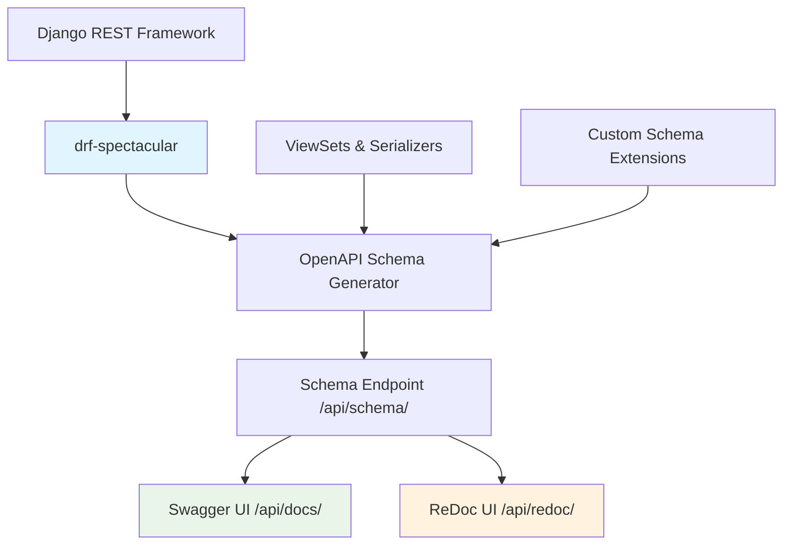
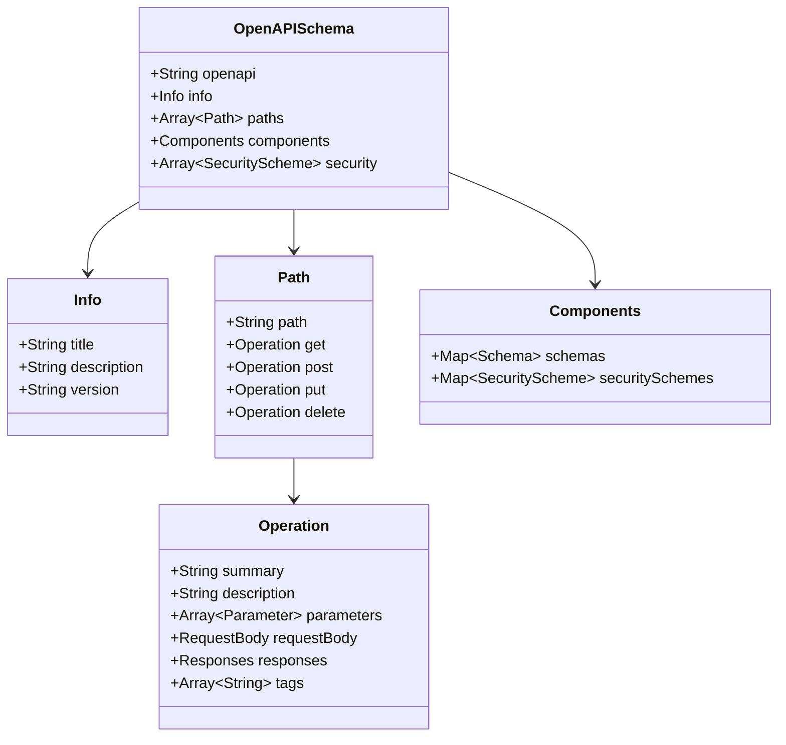
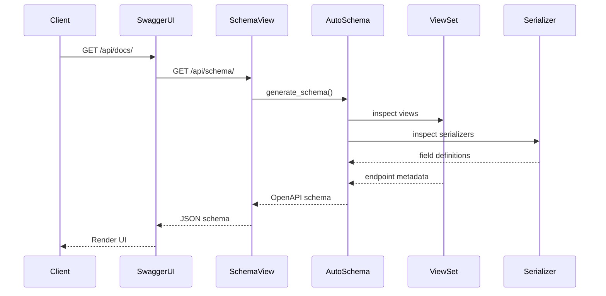

# Design Document

## Overview

This design implements Swagger/OpenAPI documentation for the OneStep Django REST API using `drf-spectacular`, a modern OpenAPI 3.0 schema generation library for Django REST Framework. The solution provides automatic schema generation from existing DRF views and serializers, an interactive Swagger UI interface, and comprehensive API documentation without requiring manual specification files.

## Architecture

### Component Overview



### Technology Choice: drf-spectacular

**Selected Library:** `drf-spectacular`

**Rationale:**
- Modern OpenAPI 3.0 support (vs OpenAPI 2.0 in older libraries)
- Active maintenance and Django 4.x compatibility
- Automatic schema generation from DRF components
- Excellent support for ViewSets, serializers, and custom actions
- Built-in Swagger UI and ReDoc interfaces
- Minimal configuration required
- Better performance than alternatives like drf-yasg

**Alternatives Considered:**
- `drf-yasg`: Older, uses OpenAPI 2.0 (Swagger 2.0), less actively maintained
- `coreapi`: Deprecated, limited functionality
- Manual OpenAPI specification: Too much maintenance overhead

## Components and Interfaces

### 1. Schema Generation Component

**Purpose:** Automatically generate OpenAPI schema from DRF views and serializers

**Implementation:**
- Use `drf-spectacular`'s `AutoSchema` class
- Configure schema generation in Django settings
- Extend schema with custom metadata and descriptions

**Configuration:**
```python
SPECTACULAR_SETTINGS = {
    'TITLE': 'OneStep API',
    'DESCRIPTION': 'REST API for managing organizational initiatives',
    'VERSION': '1.0.0',
    'SERVE_INCLUDE_SCHEMA': False,
    'SCHEMA_PATH_PREFIX': '/api/',
    'COMPONENT_SPLIT_REQUEST': True,
    'SWAGGER_UI_SETTINGS': {
        'deepLinking': True,
        'persistAuthorization': True,
        'displayOperationId': True,
    },
}
```

### 2. Documentation UI Component

**Purpose:** Provide interactive web interfaces for API exploration

**Interfaces:**
- **Swagger UI:** `/api/docs/` - Interactive API testing interface
- **ReDoc:** `/api/redoc/` - Clean, responsive documentation
- **Schema Endpoint:** `/api/schema/` - Raw OpenAPI JSON/YAML

**Features:**
- Try-it-out functionality for all endpoints
- JWT authentication support in UI
- Request/response examples
- Model schema visualization

### 3. Schema Enhancement Component

**Purpose:** Enrich auto-generated schema with additional metadata

**Implementation:**
- Use `@extend_schema` decorator for custom endpoint documentation
- Use `@extend_schema_view` for ViewSet-level documentation
- Add operation IDs, tags, and descriptions
- Document custom actions and filters

**Example Enhancement:**
```python
from drf_spectacular.utils import extend_schema, OpenApiParameter

@extend_schema(
    summary="List all initiatives",
    description="Retrieve a paginated list of initiatives with filtering and search",
    parameters=[
        OpenApiParameter(name='type', description='Filter by initiative type'),
        OpenApiParameter(name='search', description='Search in name and description'),
    ],
    tags=['initiatives']
)
def list(self, request):
    ...
```

### 4. Authentication Documentation Component

**Purpose:** Document JWT authentication requirements

**Implementation:**
- Configure JWT security scheme in spectacular settings
- Automatically apply to protected endpoints
- Provide authentication examples in UI

## Data Models

### OpenAPI Schema Structure



### Schema Generation Flow



## Error Handling

### Schema Generation Errors

**Issue:** ViewSet or serializer cannot be introspected
**Solution:** 
- Add explicit `@extend_schema` decorators
- Provide manual schema definitions for complex cases
- Log warnings for missing documentation

**Issue:** Custom actions not documented properly
**Solution:**
- Use `@extend_schema` on custom action methods
- Specify request/response serializers explicitly
- Document parameters with `OpenApiParameter`

### Runtime Errors

**Issue:** Schema endpoint returns 500 error
**Solution:**
- Validate all ViewSets have proper serializer_class
- Check for circular imports in serializers
- Use `SERVE_INCLUDE_SCHEMA=False` to prevent schema in schema

**Issue:** Authentication fails in Swagger UI
**Solution:**
- Configure JWT security scheme properly
- Add "Authorize" button support
- Document token format (Bearer {token})

## Testing Strategy

### Schema Validation Tests

**Purpose:** Ensure generated schema is valid OpenAPI 3.0

**Approach:**
```python
def test_schema_generation():
    """Test that OpenAPI schema generates without errors"""
    response = client.get('/api/schema/')
    assert response.status_code == 200
    schema = response.json()
    assert schema['openapi'] == '3.0.3'
    assert 'paths' in schema
    assert 'components' in schema
```

### Documentation Coverage Tests

**Purpose:** Verify all endpoints are documented

**Approach:**
```python
def test_all_endpoints_documented():
    """Test that all API endpoints appear in schema"""
    response = client.get('/api/schema/')
    schema = response.json()
    paths = schema['paths']
    
    # Check critical endpoints exist
    assert '/api/initiatives/' in paths
    assert '/api/people/' in paths
    assert '/api/initiatives/{id}/' in paths
```

### UI Accessibility Tests

**Purpose:** Ensure documentation UIs are accessible

**Approach:**
```python
def test_swagger_ui_accessible():
    """Test that Swagger UI loads successfully"""
    response = client.get('/api/docs/')
    assert response.status_code == 200
    assert b'swagger-ui' in response.content

def test_redoc_ui_accessible():
    """Test that ReDoc UI loads successfully"""
    response = client.get('/api/redoc/')
    assert response.status_code == 200
    assert b'redoc' in response.content
```

### Authentication Documentation Tests

**Purpose:** Verify JWT authentication is properly documented

**Approach:**
```python
def test_jwt_security_scheme():
    """Test that JWT security scheme is in schema"""
    response = client.get('/api/schema/')
    schema = response.json()
    security_schemes = schema['components']['securitySchemes']
    
    assert 'jwtAuth' in security_schemes
    assert security_schemes['jwtAuth']['type'] == 'http'
    assert security_schemes['jwtAuth']['scheme'] == 'bearer'
```

## Implementation Details

### URL Configuration

```python
# onestep/urls.py
from drf_spectacular.views import (
    SpectacularAPIView,
    SpectacularSwaggerView,
    SpectacularRedocView
)

urlpatterns = [
    # ... existing patterns ...
    path('api/schema/', SpectacularAPIView.as_view(), name='schema'),
    path('api/docs/', SpectacularSwaggerView.as_view(url_name='schema'), name='swagger-ui'),
    path('api/redoc/', SpectacularRedocView.as_view(url_name='schema'), name='redoc'),
]
```

### Settings Configuration

```python
# onestep/settings.py
INSTALLED_APPS = [
    # ... existing apps ...
    'drf_spectacular',
]

REST_FRAMEWORK = {
    # ... existing settings ...
    'DEFAULT_SCHEMA_CLASS': 'drf_spectacular.openapi.AutoSchema',
}

SPECTACULAR_SETTINGS = {
    'TITLE': 'OneStep API',
    'DESCRIPTION': 'REST API for managing organizational initiatives including programs, projects, and events',
    'VERSION': '1.0.0',
    'SERVE_INCLUDE_SCHEMA': False,
    'SCHEMA_PATH_PREFIX': '/api/',
    'COMPONENT_SPLIT_REQUEST': True,
    'SWAGGER_UI_SETTINGS': {
        'deepLinking': True,
        'persistAuthorization': True,
        'displayOperationId': True,
        'filter': True,
    },
    'SERVERS': [
        {'url': 'http://localhost:8000', 'description': 'Development server'},
    ],
}
```

### ViewSet Enhancement Pattern

```python
from drf_spectacular.utils import extend_schema, extend_schema_view, OpenApiParameter
from drf_spectacular.types import OpenApiTypes

@extend_schema_view(
    list=extend_schema(
        summary="List initiatives",
        description="Retrieve a paginated list of all initiatives",
        tags=['initiatives']
    ),
    retrieve=extend_schema(
        summary="Get initiative details",
        description="Retrieve detailed information about a specific initiative",
        tags=['initiatives']
    ),
    create=extend_schema(
        summary="Create initiative",
        description="Create a new initiative",
        tags=['initiatives']
    ),
    update=extend_schema(
        summary="Update initiative",
        description="Update an existing initiative (full update)",
        tags=['initiatives']
    ),
    partial_update=extend_schema(
        summary="Partial update initiative",
        description="Partially update an existing initiative",
        tags=['initiatives']
    ),
    destroy=extend_schema(
        summary="Delete initiative",
        description="Delete an initiative and its children",
        tags=['initiatives']
    ),
)
class InitiativeViewSet(viewsets.ModelViewSet):
    ...
```

## Performance Considerations

### Schema Caching

- Schema generation is performed once per request
- Consider caching schema response in production
- Use `SERVE_INCLUDE_SCHEMA=False` to prevent recursive schema generation

### UI Loading

- Swagger UI and ReDoc load static assets from CDN
- No impact on API performance
- Documentation endpoints can be disabled in production if needed

## Security Considerations

### Documentation Access Control

- Documentation endpoints should be accessible without authentication (public API docs)
- Sensitive endpoints still require authentication to execute
- Consider adding basic auth to documentation in production if needed

### Information Disclosure

- Schema reveals API structure and endpoints
- Does not expose sensitive data or credentials
- Custom actions and internal endpoints are documented
- Review schema for any sensitive information before production deployment

## Deployment Considerations

### Development Environment

- All documentation endpoints enabled
- Debug mode shows detailed error messages
- Local server URL in schema

### Production Environment

- Documentation endpoints enabled (recommended for API consumers)
- Consider adding authentication to docs if API is private
- Use production server URL in schema
- Enable HTTPS in schema servers configuration

```python
# Production settings
SPECTACULAR_SETTINGS = {
    # ... other settings ...
    'SERVERS': [
        {'url': 'https://api.onestep.example.com', 'description': 'Production server'},
    ],
}
```
