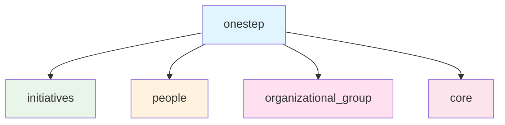

# Product Overview

OneStep is a Django REST API for managing organizational initiatives including programs, projects, and events.

## Core Concept
An **Initiative** is the central entity that can represent:
- Programs (high-level strategic initiatives)
- Projects (specific deliverable-focused work)
- Events (time-bound activities)

## Key Features
- **Hierarchical Structure**: Initiatives can be composed of other initiatives (parent-child relationships)
- **Team Management**: Each initiative has a coordinator (person) and team (multiple people)
- **Lifecycle Tracking**: Initiatives have start dates, end dates, and status tracking
- **Type Classification**: Initiatives are categorized by type (program, project, event)

## Core Data Model

```mermaid
classDiagram
    class Initiative {
        +String name
        +String description
        +Date start_date
        +Date end_date
        +String type
        +DateTime created_at
        +DateTime updated_at
        +get_children()
        +get_team_members()
        +add_team_member()
        +remove_team_member()
    }
    
    class Person {
        +String first_name
        +String last_name
        +String email
        +String phone
        +DateTime created_at
        +DateTime updated_at
        +get_coordinated_initiatives()
        +get_team_initiatives()
    }
    
    class Campus {
        +String name
        +String code
        +String location
        +DateTime created_at
        +DateTime updated_at
        +group_count()
    }
    
    class OrganizationalGroup {
        +String name
        +String short_name
        +String url
        +String type
        +String knowledge_area
        +DateTime created_at
        +DateTime updated_at
        +get_current_leaders()
        +add_leader()
        +remove_leader()
    }
    
    class InitiativeType {
        <<enumeration>>
        PROGRAM
        PROJECT
        EVENT
    }
    
    Initiative ||--o{ Initiative : "parent/child"
    Initiative }o--|| Person : "coordinator"
    Initiative }o--o{ Person : "team_members"
    Initiative ||--|| InitiativeType : "type"
    Initiative }o--o{ OrganizationalGroup : "associated_groups"
    Campus ||--o{ OrganizationalGroup : "has_groups"
    OrganizationalGroup }o--o{ Person : "leaders"
    OrganizationalGroup }o--o{ Person : "members"
```

### Model Details
- **Initiative**: Core entity representing programs, projects, or events
- **Person**: Users who can coordinate or participate in initiatives and organizational groups
- **Campus**: University campus locations where organizational groups operate
- **OrganizationalGroup**: Research or extension groups affiliated with a campus
- **Hierarchical Structure**: Initiatives can contain sub-initiatives
- **Team Management**: Many-to-many relationships between initiatives/groups and people
- **Type Classification**: Enumerated types for initiative categorization
- **Campus Affiliation**: Groups are associated with specific campus locations

## Package Structure



### Domain Organization
- **initiatives**: Core business logic for managing initiatives (programs, projects, events)
- **people**: User and team management functionality
- **organizational_group**: Campus and organizational group management
- **core**: Shared utilities, base classes, and common functionality

## Target Users
- **Organization Managers**: Create and oversee high-level programs
- **Project Coordinators**: Manage specific projects and their teams
- **Group Leaders**: Lead research or extension groups on campus
- **Team Members**: Participate in initiatives and organizational groups
- **Campus Administrators**: Manage campus locations and affiliated groups
- **System Administrators**: System configuration and user management

## Core Objectives
- Provide clear visibility into organizational initiatives hierarchy
- Enable efficient team and resource management across campuses
- Track initiative progress and timelines
- Manage organizational groups and their campus affiliations
- Facilitate coordination between related initiatives and groups
- Maintain campus location data and group associations