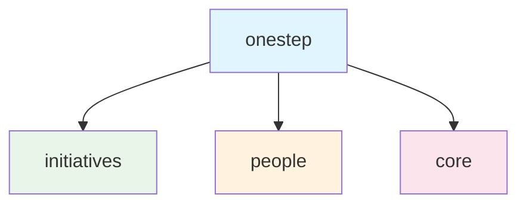

# Product Overview

OneStep is a Django REST API for managing organizational initiatives including programs, projects, and events.

## Core Concept
An **Initiative** is the central entity that can represent:
- Programs (high-level strategic initiatives)
- Projects (specific deliverable-focused work)
- Events (time-bound activities)

## Key Features
- **Hierarchical Structure**: Initiatives can be composed of other initiatives (parent-child relationships)
- **Team Management**: Each initiative has a coordinator (person) and team (multiple people)
- **Lifecycle Tracking**: Initiatives have start dates, end dates, and status tracking
- **Type Classification**: Initiatives are categorized by type (program, project, event)

## Core Data Model

```mermaid
classDiagram
    class Initiative {
        +String name
        +String description
        +Date start_date
        +Date end_date
        +String type
        +DateTime created_at
        +DateTime updated_at
        +get_children()
        +get_team_members()
        +add_team_member()
        +remove_team_member()
    }
    
    class Person {
        +String first_name
        +String last_name
        +String email
        +String phone
        +DateTime created_at
        +DateTime updated_at
        +get_coordinated_initiatives()
        +get_team_initiatives()
    }
    
    class InitiativeType {
        <<enumeration>>
        PROGRAM
        PROJECT
        EVENT
    }
    
    Initiative ||--o{ Initiative : "parent/child"
    Initiative }o--|| Person : "coordinator"
    Initiative }o--o{ Person : "team_members"
    Initiative ||--|| InitiativeType : "type"
```

### Model Details
- **Initiative**: Core entity representing programs, projects, or events
- **Person**: Users who can coordinate or participate in initiatives
- **Hierarchical Structure**: Initiatives can contain sub-initiatives
- **Team Management**: Many-to-many relationship between initiatives and people
- **Type Classification**: Enumerated types for initiative categorization

## Package Structure



### Domain Organization
- **initiatives**: Core business logic for managing initiatives
- **people**: User and team management functionality  
- **core**: Shared utilities, base classes, and common functionality

## Target Users
- **Organization Managers**: Create and oversee high-level programs
- **Project Coordinators**: Manage specific projects and their teams
- **Team Members**: Participate in initiatives and track progress
- **Administrators**: System configuration and user management

## Core Objectives
- Provide clear visibility into organizational initiatives hierarchy
- Enable efficient team and resource management
- Track initiative progress and timelines
- Facilitate coordination between related initiatives