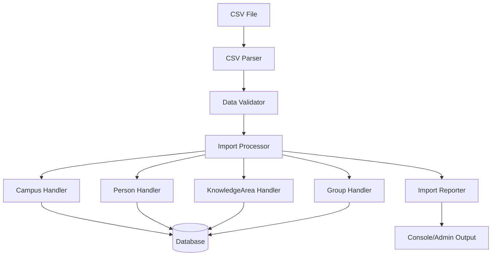
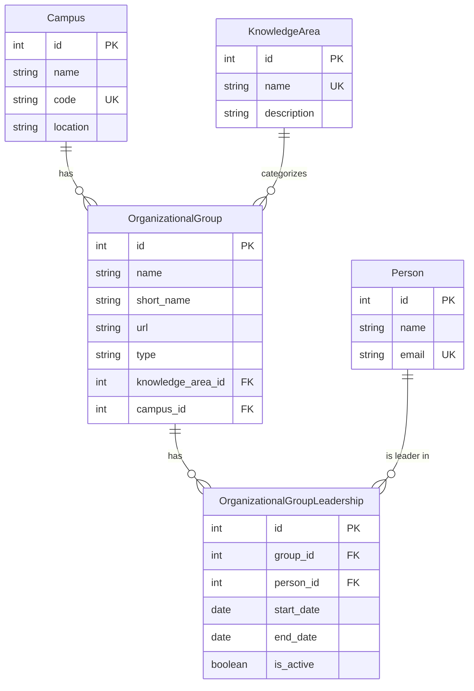

# Design Document: CSV Import for Research Groups

## Overview

This feature enables bulk import of research group data from CSV files into the OneStep system. The import process creates Campus, Person, and OrganizationalGroup records with proper relationships, implementing deduplication logic to avoid duplicate entries and comprehensive validation to ensure data integrity.

The solution provides two interfaces:
1. **Django Management Command** - For command-line batch imports
2. **Django Admin Interface** - For web-based file uploads

### Design Rationale

The dual-interface approach serves different user needs:
- Management commands enable automated imports, scripting, and CI/CD integration
- Admin interface provides accessibility for non-technical administrators

The design prioritizes data integrity through validation and deduplication while maintaining fault tolerance through per-row transaction handling.

## Architecture

### Component Overview



### Data Flow

1. **Input Stage**: CSV file is read and parsed into rows
2. **Validation Stage**: Each row is validated for required fields and format
3. **Processing Stage**: Records are created or retrieved with deduplication
4. **Relationship Stage**: Leadership relationships are established
5. **Reporting Stage**: Summary statistics and errors are reported

## Components and Interfaces

### 1. CSV Parser Component

**Responsibility**: Read and parse CSV files with proper encoding handling

**Interface**:
```python
class CSVParser:
    def parse_file(self, file_path: str) -> Iterator[Dict[str, str]]:
        """
        Parse CSV file and yield rows as dictionaries.
        
        Args:
            file_path: Path to CSV file
            
        Yields:
            Dictionary mapping column names to values
            
        Raises:
            CSVParseError: If file cannot be parsed
        """
```

**Design Decisions**:
- Use Python's `csv.DictReader` for automatic header mapping
- Support UTF-8 encoding with BOM handling for Excel compatibility
- Yield rows iteratively to handle large files efficiently
- Strip whitespace from all values during parsing

### 2. Data Validator Component

**Responsibility**: Validate row data before processing

**Interface**:
```python
class DataValidator:
    def validate_row(self, row: Dict[str, str], row_number: int) -> ValidationResult:
        """
        Validate a single CSV row.
        
        Args:
            row: Dictionary of column values
            row_number: Row number for error reporting
            
        Returns:
            ValidationResult with is_valid flag and error messages
        """
    
    def validate_email(self, email: str) -> bool:
        """Validate email format"""
    
    def validate_url(self, url: str) -> bool:
        """Validate URL format"""
```

**Validation Rules**:
- **Required Fields**: Nome (name), Unidade (campus), AreaConhecimento (knowledge area)
- **Email Format**: Use Django's EmailValidator
- **URL Format**: Use Django's URLValidator, allow empty values
- **Campus Name**: Non-empty after stripping whitespace
- **Knowledge Area**: Non-empty after stripping whitespace
- **Leader Format**: Parse "Name (email)" pattern with regex

**Design Rationale**: Separate validation from processing enables early error detection and clearer error messages with specific row numbers.

### 3. Campus Handler Component

**Responsibility**: Create or retrieve Campus records with deduplication

**Interface**:
```python
class CampusHandler:
    def get_or_create_campus(self, campus_name: str) -> Campus:
        """
        Get existing campus or create new one.
        
        Args:
            campus_name: Campus name from CSV
            
        Returns:
            Campus instance
            
        Raises:
            ValidationError: If campus data is invalid
        """
    
    def generate_campus_code(self, campus_name: str) -> str:
        """Generate unique campus code from name"""
```

**Deduplication Strategy**:
- Lookup by case-insensitive name match
- Generate code from name (uppercase, remove spaces, truncate to 20 chars)
- Handle code collisions by appending numeric suffix

**Design Rationale**: Campus records are created on-demand during import rather than requiring pre-existing campuses, reducing setup complexity.

### 4. Person Handler Component

**Responsibility**: Create or retrieve Person records with email-based deduplication

**Interface**:
```python
class PersonHandler:
    def parse_leaders(self, leaders_str: str) -> List[Tuple[str, str]]:
        """
        Parse leader string into list of (name, email) tuples.
        
        Args:
            leaders_str: Comma-separated leader entries
            
        Returns:
            List of (name, email) tuples
            
        Example:
            "John Doe (john@example.com), Jane Smith (jane@example.com)"
            -> [("John Doe", "john@example.com"), ("Jane Smith", "jane@example.com")]
        """
    
    def get_or_create_person(self, name: str, email: str) -> Person:
        """
        Get existing person or create new one.
        
        Args:
            name: Person's full name
            email: Person's email address
            
        Returns:
            Person instance
        """
```

**Parsing Logic**:
- Split on commas to handle multiple leaders
- Extract name and email using regex: `(.+?)\s*\(([^)]+)\)`
- Normalize email to lowercase
- Strip whitespace from names

**Deduplication Strategy**:
- Lookup by case-insensitive email match
- Update name if person exists but name differs (keep most recent)

**Design Rationale**: Email is the unique identifier for people, as names can be duplicated. The parser handles various formatting inconsistencies in the CSV data.

### 5. KnowledgeArea Handler Component

**Responsibility**: Create or retrieve KnowledgeArea records with deduplication

**Interface**:
```python
class KnowledgeAreaHandler:
    def get_or_create_knowledge_area(self, knowledge_area_name: str) -> KnowledgeArea:
        """
        Get existing knowledge area or create new one.
        
        Args:
            knowledge_area_name: Knowledge area name from CSV
            
        Returns:
            KnowledgeArea instance
            
        Raises:
            ValidationError: If knowledge area data is invalid
        """
```

**Deduplication Strategy**:
- Lookup by case-insensitive name match using `name__iexact`
- Strip whitespace from name before lookup or creation
- Reuse existing KnowledgeArea if found, otherwise create new one

**Design Rationale**: KnowledgeArea records are created on-demand during import, similar to Campus handling. Case-insensitive lookup ensures "Computer Science" and "computer science" are treated as the same knowledge area, preventing duplicates and maintaining data consistency.

### 6. OrganizationalGroup Handler Component

**Responsibility**: Create OrganizationalGroup records with relationships

**Interface**:
```python
class GroupHandler:
    def create_or_skip_group(
        self,
        short_name: str,
        name: str,
        campus: Campus,
        knowledge_area: KnowledgeArea,
        repository_url: str = "",
        site_url: str = ""
    ) -> Tuple[OrganizationalGroup, bool]:
        """
        Create group or skip if duplicate exists.
        
        Args:
            short_name: Group abbreviation (Sigla)
            name: Full group name
            campus: Campus instance
            knowledge_area: KnowledgeArea instance
            repository_url: Optional repository URL
            site_url: Optional website URL
            
        Returns:
            Tuple of (group_instance, created_flag)
        """
    
    def assign_leaders(
        self,
        group: OrganizationalGroup,
        leaders: List[Person]
    ) -> None:
        """
        Assign leaders to group through OrganizationalGroupLeadership.
        
        Args:
            group: OrganizationalGroup instance
            leaders: List of Person instances to assign as leaders
        """
```

**Field Mapping**:
- `Sigla` → `short_name` (handle empty values with generated code)
- `Nome` → `name`
- `Unidade` → `campus` (foreign key to Campus)
- `AreaConhecimento` → `knowledge_area` (foreign key to KnowledgeArea)
- `repositorio` → `url` (primary URL field)
- `Site` → ignored (secondary URL, not in model)
- `type` → hardcoded as 'research'

**Deduplication Strategy**:
- Check for existing group with same `short_name` and `campus` combination
- Skip creation if duplicate exists (log as skipped)
- Generate short_name from full name if Sigla is empty

**Leadership Assignment**:
- Create OrganizationalGroupLeadership records
- Set `start_date` to current date
- Set `is_active` to True
- Handle existing active leadership gracefully (skip if already exists)

**Design Rationale**: The unique constraint on (short_name, campus) prevents duplicates. Empty short_name values are handled by generating a code from the full name, ensuring data completeness. The knowledge_area field now references a KnowledgeArea foreign key instead of storing free text, ensuring data consistency and normalization.

### 7. Import Processor Component

**Responsibility**: Orchestrate the import process

**Interface**:
```python
class ImportProcessor:
    def __init__(self):
        self.campus_handler = CampusHandler()
        self.person_handler = PersonHandler()
        self.knowledge_area_handler = KnowledgeAreaHandler()
        self.group_handler = GroupHandler()
        self.validator = DataValidator()
    
    def process_csv(self, file_path: str) -> ImportResult:
        """
        Process entire CSV file.
        
        Args:
            file_path: Path to CSV file
            
        Returns:
            ImportResult with statistics and errors
        """
    
    def process_row(self, row: Dict[str, str], row_number: int) -> RowResult:
        """
        Process a single CSV row.
        
        Args:
            row: Dictionary of column values
            row_number: Row number for error reporting
            
        Returns:
            RowResult indicating success or failure
        """
```

**Processing Logic**:
1. Validate row data
2. Get or create Campus
3. Get or create KnowledgeArea
4. Parse and get or create Person records for leaders
5. Create or skip OrganizationalGroup
6. Assign leadership relationships
7. Catch and log any exceptions

**Transaction Handling**:
- Wrap each row in a database transaction
- Rollback on error to maintain consistency
- Continue processing remaining rows after failures

**Design Rationale**: Per-row transactions provide fault tolerance - one bad row doesn't stop the entire import. This is critical for large CSV files with potential data quality issues.

### 8. Import Reporter Component

**Responsibility**: Generate import summary and error reports

**Interface**:
```python
class ImportReporter:
    def add_success(self, row_number: int, group_name: str):
        """Record successful import"""
    
    def add_skip(self, row_number: int, group_name: str, reason: str):
        """Record skipped row"""
    
    def add_error(self, row_number: int, error_message: str):
        """Record error"""
    
    def generate_summary(self) -> str:
        """Generate summary report"""
    
    def get_errors(self) -> List[Dict]:
        """Get list of errors for detailed reporting"""
```

**Report Contents**:
- Total rows processed
- Successful imports
- Skipped duplicates
- Validation errors
- Processing errors
- Detailed error list with row numbers

## Data Models

### CSV Column Mapping

| CSV Column | Model Field | Type | Required | Notes |
|------------|-------------|------|----------|-------|
| Sigla | OrganizationalGroup.short_name | CharField | No | Generate from name if empty |
| Nome | OrganizationalGroup.name | CharField | Yes | Full group name |
| repositorio | OrganizationalGroup.url | URLField | No | Primary URL field |
| Site | - | - | No | Not mapped (secondary URL) |
| AreaConhecimento | KnowledgeArea.name | CharField | Yes | Creates or retrieves KnowledgeArea |
| Unidade | Campus.name | CharField | Yes | Campus name |
| Lideres | Person.name, Person.email | CharField, EmailField | No | Parsed into multiple Person records |

### Database Relationships



## Error Handling

### Error Categories

1. **File Errors**
   - File not found
   - Permission denied
   - Invalid encoding
   - Malformed CSV structure

2. **Validation Errors**
   - Missing required fields
   - Invalid email format
   - Invalid URL format
   - Empty campus name
   - Empty knowledge area name

3. **Processing Errors**
   - Database constraint violations
   - Unexpected data formats
   - Model validation failures

### Error Handling Strategy

**Per-Row Error Handling**:
```python
try:
    with transaction.atomic():
        # Process row
        campus = campus_handler.get_or_create_campus(row['Unidade'])
        knowledge_area = knowledge_area_handler.get_or_create_knowledge_area(row['AreaConhecimento'])
        leaders = person_handler.parse_leaders(row['Lideres'])
        # ... continue processing
except ValidationError as e:
    reporter.add_error(row_number, f"Validation error: {e}")
    continue  # Process next row
except Exception as e:
    reporter.add_error(row_number, f"Unexpected error: {e}")
    continue  # Process next row
```

**Design Rationale**: Graceful degradation ensures maximum data import even with partial failures. Detailed error logging enables administrators to fix problematic rows and re-import.

## Testing Strategy

### Unit Tests

1. **CSV Parser Tests**
   - Parse valid CSV with all fields
   - Handle missing optional fields
   - Handle various encodings (UTF-8, UTF-8 with BOM)
   - Handle malformed CSV

2. **Validator Tests**
   - Validate required fields
   - Validate email formats (valid and invalid)
   - Validate URL formats (valid, invalid, empty)
   - Validate leader parsing patterns

3. **Campus Handler Tests**
   - Create new campus
   - Retrieve existing campus (case-insensitive)
   - Generate unique campus codes
   - Handle code collisions

4. **KnowledgeArea Handler Tests**
   - Create new knowledge area
   - Retrieve existing knowledge area (case-insensitive)
   - Handle whitespace in knowledge area names
   - Deduplicate knowledge areas

4. **Person Handler Tests**
   - Parse single leader
   - Parse multiple leaders
   - Handle malformed leader strings
   - Deduplicate by email (case-insensitive)
   - Update existing person names

5. **Group Handler Tests**
   - Create new group
   - Skip duplicate groups
   - Generate short_name from name when empty
   - Assign single leader
   - Assign multiple leaders
   - Handle existing leadership relationships

6. **Import Processor Tests**
   - Process complete valid CSV
   - Handle rows with validation errors
   - Handle rows with processing errors
   - Verify transaction rollback on error
   - Verify continued processing after error

### Integration Tests

1. **End-to-End Import Test**
   - Import sample CSV file
   - Verify all records created correctly
   - Verify relationships established
   - Verify deduplication works

2. **Duplicate Handling Test**
   - Import same CSV twice
   - Verify no duplicate records created
   - Verify appropriate skip messages

3. **Error Recovery Test**
   - Import CSV with mixed valid/invalid rows
   - Verify valid rows imported
   - Verify invalid rows skipped
   - Verify error reporting

4. **Admin Interface Test**
   - Upload CSV through admin
   - Verify file processing
   - Verify result display
   - Verify error messages

## Django Management Command

### Command Interface

```bash
python manage.py import_research_groups <csv_file_path>
```

### Command Implementation

```python
class Command(BaseCommand):
    help = 'Import research groups from CSV file'
    
    def add_arguments(self, parser):
        parser.add_argument(
            'csv_file',
            type=str,
            help='Path to CSV file'
        )
    
    def handle(self, *args, **options):
        csv_file = options['csv_file']
        
        # Validate file exists
        if not os.path.exists(csv_file):
            raise CommandError(f'File not found: {csv_file}')
        
        # Process import
        processor = ImportProcessor()
        result = processor.process_csv(csv_file)
        
        # Display results
        self.stdout.write(result.summary)
        
        if result.has_errors:
            self.stdout.write(
                self.style.WARNING(
                    f'\n{result.error_count} errors occurred'
                )
            )
            for error in result.errors:
                self.stdout.write(
                    self.style.ERROR(
                        f'Row {error["row"]}: {error["message"]}'
                    )
                )
        
        if result.success_count > 0:
            self.stdout.write(
                self.style.SUCCESS(
                    f'\nSuccessfully imported {result.success_count} groups'
                )
            )
```

### Progress Display

Display progress during import:
- Show row number being processed
- Update progress every 10 rows
- Display running totals (success, skip, error)

## Django Admin Interface

### Admin Action Implementation

Add custom admin action to OrganizationalGroup admin:

```python
class OrganizationalGroupAdmin(admin.ModelAdmin):
    actions = ['import_from_csv']
    
    def import_from_csv(self, request, queryset):
        """Custom admin action for CSV import"""
        if request.method == 'POST':
            csv_file = request.FILES.get('csv_file')
            if csv_file:
                # Process file
                processor = ImportProcessor()
                result = processor.process_csv(csv_file)
                
                # Display results
                if result.success_count > 0:
                    self.message_user(
                        request,
                        f'Successfully imported {result.success_count} groups',
                        messages.SUCCESS
                    )
                
                if result.error_count > 0:
                    self.message_user(
                        request,
                        f'{result.error_count} errors occurred. See details below.',
                        messages.WARNING
                    )
                    for error in result.errors:
                        self.message_user(
                            request,
                            f'Row {error["row"]}: {error["message"]}',
                            messages.ERROR
                        )
                
                return HttpResponseRedirect(request.get_full_path())
        
        # Show upload form
        return render(
            request,
            'admin/organizational_group/import_csv.html',
            {'title': 'Import Research Groups from CSV'}
        )
    
    import_from_csv.short_description = "Import groups from CSV file"
```

### Upload Form Template

Create template at `apps/organizational_group/templates/admin/organizational_group/import_csv.html`:

```html



<h1>{{ title }}</h1>

<form method="post" enctype="multipart/form-data">
    
    <div class="form-row">
        <label for="csv_file">CSV File:</label>
        <input type="file" name="csv_file" id="csv_file" accept=".csv" required>
    </div>
    <div class="submit-row">
        <input type="submit" value="Import" class="default">
        <a href="" class="button cancel-link">Cancel</a>
    </div>
</form>

<h2>CSV Format</h2>
<p>The CSV file should have the following columns:</p>
<ul>
    <li><strong>Sigla</strong>: Group abbreviation (optional)</li>
    <li><strong>Nome</strong>: Full group name (required)</li>
    <li><strong>repositorio</strong>: Repository URL (optional)</li>
    <li><strong>Site</strong>: Website URL (optional, not imported)</li>
    <li><strong>AreaConhecimento</strong>: Knowledge area (required)</li>
    <li><strong>Unidade</strong>: Campus name (required)</li>
    <li><strong>Lideres</strong>: Leaders in format "Name (email), Name (email)" (optional)</li>
</ul>

```

## Performance Considerations

### Optimization Strategies

1. **Bulk Lookups**
   - Cache campus lookups in memory during import
   - Cache person lookups by email
   - Reduce database queries through select_related/prefetch_related

2. **Batch Processing**
   - Process rows in batches of 100
   - Commit transactions per batch instead of per row (trade-off with error isolation)

3. **Database Indexing**
   - Ensure indexes on Campus.name, Campus.code
   - Ensure indexes on Person.email
   - Ensure indexes on OrganizationalGroup (short_name, campus)

4. **Memory Management**
   - Use iterator for CSV parsing (don't load entire file)
   - Clear caches periodically for very large imports

### Expected Performance

- Small files (< 100 rows): < 5 seconds
- Medium files (100-1000 rows): < 30 seconds
- Large files (1000+ rows): ~30 rows/second

**Design Rationale**: Per-row transactions prioritize data integrity over raw speed. For production use with very large files, batch processing can be enabled as an option.

## Security Considerations

1. **File Upload Validation**
   - Validate file extension (.csv only)
   - Limit file size (e.g., 10MB max)
   - Scan for malicious content

2. **Permission Checks**
   - Require staff/superuser permissions for import
   - Log all import operations with user information

3. **SQL Injection Prevention**
   - Use Django ORM exclusively (no raw SQL)
   - Parameterized queries for all database operations

4. **Data Sanitization**
   - Strip whitespace from all inputs
   - Validate URLs and emails before storage
   - Escape special characters in error messages

## Deployment Considerations

### Configuration

Add settings for import behavior:

```python
# settings.py
CSV_IMPORT_MAX_FILE_SIZE = 10 * 1024 * 1024  # 10MB
CSV_IMPORT_BATCH_SIZE = 100
CSV_IMPORT_REQUIRE_SUPERUSER = True
```

### Logging

Configure logging for import operations:

```python
LOGGING = {
    'loggers': {
        'csv_import': {
            'handlers': ['file'],
            'level': 'INFO',
            'propagate': False,
        },
    },
}
```

### Monitoring

Track import metrics:
- Number of imports per day
- Success/failure rates
- Average processing time
- Common error types

## Future Enhancements

1. **Async Processing**
   - Use Celery for background processing
   - Provide progress updates via WebSocket
   - Email notification on completion

2. **Import Preview**
   - Show preview of data before import
   - Allow user to review and confirm

3. **Field Mapping UI**
   - Allow custom column mapping
   - Support different CSV formats

4. **Export Functionality**
   - Export groups to CSV
   - Round-trip import/export capability

5. **Incremental Updates**
   - Update existing records instead of skipping
   - Track import history and changes
