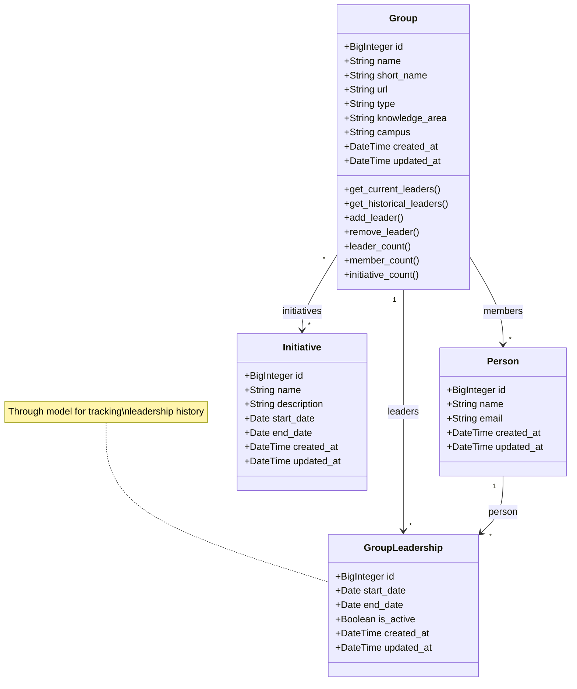
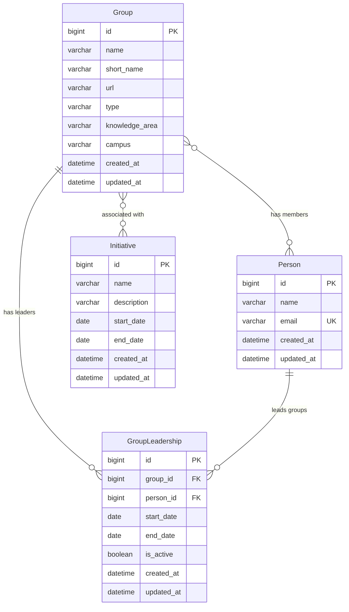

# Design Document: Group Management System

## Overview

The Group Management System extends the OneStep application to support university research and organizational groups. The system enables tracking of groups with their leaders, members, and metadata such as knowledge areas and campus affiliations. A key feature is the ability to track leadership changes over time through a historical record system.

This design follows the existing OneStep architecture patterns, using Django models with the TimestampedModel base class, Django REST Framework for API endpoints, and Django Admin for administrative interface.

## Architecture

### Application Structure

The Group Management feature will be implemented as a new Django app called `groups` following the domain-driven design pattern used in the existing codebase:

```
apps/groups/
├── __init__.py
├── models.py              # Group, GroupLeadership models
├── admin.py               # Django admin configuration
├── serializers.py         # DRF serializers
├── views.py               # API ViewSets
├── urls.py                # API URL patterns
├── apps.py                # App configuration
├── permissions.py         # API permissions
├── filters.py             # API filtering
├── migrations/            # Database migrations
└── tests/                 # Test suite
    ├── __init__.py
    ├── test_models.py
    ├── test_admin.py
    ├── test_api.py
    └── test_serializers.py
```

### Design Patterns

1. **Repository Pattern**: Django ORM provides data access abstraction
2. **Model-View-Serializer Pattern**: DRF pattern for API development
3. **Through Model Pattern**: Intermediate model for tracking leadership history
4. **Admin Inline Pattern**: Django admin inlines for related object editing

## Components and Interfaces

### Data Models

#### Group Model

The primary model representing a university group:

```python
class Group(TimestampedModel):
    """
    Represents a university research or organizational group.
    """
    TYPE_RESEARCH = 'research'
    TYPE_EXTENSION = 'extension'
    TYPE_CHOICES = [
        (TYPE_RESEARCH, 'Research'),
        (TYPE_EXTENSION, 'Extension'),
    ]
    
    name = models.CharField(max_length=200)
    short_name = models.CharField(max_length=50)
    url = models.URLField(blank=True)
    type = models.CharField(max_length=20, choices=TYPE_CHOICES)
    knowledge_area = models.CharField(max_length=200)
    campus = models.CharField(max_length=200)
    
    # Many-to-many relationships
    leaders = models.ManyToManyField(
        'people.Person',
        through='GroupLeadership',
        related_name='led_groups'
    )
    members = models.ManyToManyField(
        'people.Person',
        related_name='member_groups',
        blank=True
    )
    initiatives = models.ManyToManyField(
        'initiatives.Initiative',
        related_name='groups',
        blank=True
    )
```

**Key Design Decisions:**
- Uses `TimestampedModel` base class for consistency with existing models
- `type` field with choices: "Research" or "Extension"
- `short_name` and `campus` combination should be unique (enforced via constraint)
- `url` is optional (blank=True) as not all groups may have websites
- `knowledge_area` and `campus` are CharField to allow flexibility (can be converted to ForeignKey later if needed)
- Leaders use a through model for historical tracking
- Members use direct many-to-many (no historical tracking required per requirements)
- Initiatives use direct many-to-many relationship (related_name='groups' on Initiative model)

#### GroupLeadership Model (Through Model)

Intermediate model to track leadership history:

```python
class GroupLeadership(TimestampedModel):
    """
    Through model tracking leadership relationships with history.
    """
    group = models.ForeignKey('Group', on_delete=models.CASCADE)
    person = models.ForeignKey('people.Person', on_delete=models.CASCADE)
    start_date = models.DateField()
    end_date = models.DateField(null=True, blank=True)
    is_active = models.BooleanField(default=True)
```

**Key Design Decisions:**
- Tracks when leadership begins (`start_date`) and ends (`end_date`)
- `is_active` flag for quick queries of current leaders
- `end_date` is nullable to represent ongoing leadership
- Inherits timestamps from `TimestampedModel` for audit trail

### Database Schema



### Model Methods

#### Group Model Methods

```python
def get_current_leaders(self):
    """Returns QuerySet of current leaders (is_active=True)"""
    
def get_historical_leaders(self):
    """Returns QuerySet of all leaders including past ones"""
    
def add_leader(self, person, start_date=None):
    """Adds a person as a leader with optional start date"""
    
def remove_leader(self, person, end_date=None):
    """Removes a person as leader by setting end_date and is_active=False"""
    
def leader_count(self):
    """Returns count of current leaders"""
    
def member_count(self):
    """Returns count of members"""
    
def initiative_count(self):
    """Returns count of associated initiatives"""
    
def clean(self):
    """Validates model data including uniqueness constraints"""
```

### Django Admin Interface

#### GroupAdmin Configuration

```python
class GroupLeadershipInline(admin.TabularInline):
    """Inline for managing leaders with history"""
    model = GroupLeadership
    extra = 1
    fields = ['person', 'start_date', 'end_date', 'is_active']
    
class GroupMemberInline(admin.TabularInline):
    """Inline for managing members"""
    model = Group.members.through
    extra = 1

class GroupInitiativeInline(admin.TabularInline):
    """Inline for managing initiative associations"""
    model = Group.initiatives.through
    extra = 1

@admin.register(Group)
class GroupAdmin(admin.ModelAdmin):
    list_display = ['name', 'short_name', 'type', 'campus', 'knowledge_area', 
                    'leader_count', 'member_count', 'initiative_count', 'created_at']
    list_filter = ['type', 'campus', 'knowledge_area', 'created_at']
    search_fields = ['name', 'short_name', 'knowledge_area']
    inlines = [GroupLeadershipInline, GroupMemberInline, GroupInitiativeInline]
    fieldsets = [
        ('Basic Information', {
            'fields': ['name', 'short_name', 'url']
        }),
        ('Classification', {
            'fields': ['type', 'knowledge_area', 'campus']
        }),
    ]
```

**Admin Features:**
- List view shows key information and counts
- Filtering by campus and knowledge area
- Search by name and short name
- Inline editing for leaders (with history fields visible)
- Inline editing for members
- Organized fieldsets for better UX

### API Design

#### Endpoints

```
GET    /api/groups/              # List all groups
POST   /api/groups/              # Create new group
GET    /api/groups/{id}/         # Retrieve group details
PUT    /api/groups/{id}/         # Update group
PATCH  /api/groups/{id}/         # Partial update
DELETE /api/groups/{id}/         # Delete group

GET    /api/groups/{id}/current_leaders/    # Get current leaders
POST   /api/groups/{id}/add_leader/         # Add a leader
POST   /api/groups/{id}/remove_leader/      # Remove a leader
GET    /api/groups/{id}/leadership_history/ # Get leadership history
```

#### Serializers

```python
class GroupLeadershipSerializer(serializers.ModelSerializer):
    """Serializer for leadership relationships"""
    person_name = serializers.CharField(source='person.name', read_only=True)
    
class GroupSerializer(serializers.ModelSerializer):
    """Main serializer for Group model"""
    current_leaders = GroupLeadershipSerializer(many=True, read_only=True)
    members = PersonSerializer(many=True, read_only=True)
    initiatives = InitiativeSerializer(many=True, read_only=True)
    leader_count = serializers.IntegerField(read_only=True)
    member_count = serializers.IntegerField(read_only=True)
    initiative_count = serializers.IntegerField(read_only=True)
```

#### ViewSet

```python
class GroupViewSet(viewsets.ModelViewSet):
    """ViewSet for Group CRUD operations"""
    queryset = Group.objects.all()
    serializer_class = GroupSerializer
    permission_classes = [IsAuthenticated]
    filter_backends = [DjangoFilterBackend, SearchFilter, OrderingFilter]
    filterset_fields = ['type', 'campus', 'knowledge_area']
    search_fields = ['name', 'short_name']
    ordering_fields = ['name', 'created_at']
    
    @action(detail=True, methods=['get'])
    def current_leaders(self, request, pk=None):
        """Custom action to get current leaders"""
        
    @action(detail=True, methods=['post'])
    def add_leader(self, request, pk=None):
        """Custom action to add a leader"""
        
    @action(detail=True, methods=['post'])
    def remove_leader(self, request, pk=None):
        """Custom action to remove a leader"""
```

## Data Models

### Field Specifications

#### Group Model Fields

| Field | Type | Constraints | Description |
|-------|------|-------------|-------------|
| id | BigAutoField | PK, Auto | Primary key |
| name | CharField(200) | Required | Full group name |
| short_name | CharField(50) | Required | Abbreviated name |
| url | URLField | Optional | Group website |
| type | CharField(20) | Required, Choices | Group type (Research/Extension) |
| knowledge_area | CharField(200) | Required | Research/study domain |
| campus | CharField(200) | Required | University campus |
| created_at | DateTimeField | Auto | Creation timestamp |
| updated_at | DateTimeField | Auto | Last update timestamp |

**Indexes:**
- `name` - for search performance
- `short_name` - for search performance
- `type` - for filtering
- `campus` - for filtering
- `knowledge_area` - for filtering

**Constraints:**
- Unique together: (`short_name`, `campus`)

#### GroupLeadership Model Fields

| Field | Type | Constraints | Description |
|-------|------|-------------|-------------|
| id | BigAutoField | PK, Auto | Primary key |
| group | ForeignKey | Required, CASCADE | Reference to Group |
| person | ForeignKey | Required, CASCADE | Reference to Person |
| start_date | DateField | Required | Leadership start date |
| end_date | DateField | Optional | Leadership end date |
| is_active | BooleanField | Default: True | Current leadership flag |
| created_at | DateTimeField | Auto | Creation timestamp |
| updated_at | DateTimeField | Auto | Last update timestamp |

**Indexes:**
- `group` - for relationship queries
- `person` - for relationship queries
- `is_active` - for filtering current leaders
- Composite: (`group`, `is_active`) - for efficient current leader queries

**Constraints:**
- Check: `end_date >= start_date` (when end_date is not null)
- Unique together: (`group`, `person`, `start_date`) - prevent duplicate entries

### Relationships



## Error Handling

### Validation Errors

1. **Group Validation**
   - Empty name or short_name: `ValidationError`
   - Invalid URL format: `ValidationError`
   - Duplicate short_name within same campus: `ValidationError`
   - No active leaders: Warning (not blocking)

2. **Leadership Validation**
   - end_date before start_date: `ValidationError`
   - Adding duplicate active leader: `ValidationError`
   - Removing non-existent leader: `ValidationError`

### API Error Responses

```python
# Standard error response format
{
    "error": "error_code",
    "message": "Human-readable error message",
    "details": {
        "field_name": ["Specific field error"]
    }
}
```

**HTTP Status Codes:**
- 400 Bad Request: Validation errors
- 404 Not Found: Group or Person not found
- 409 Conflict: Duplicate short_name/campus combination
- 500 Internal Server Error: Unexpected errors

### Error Handling Strategy

1. **Model Level**: Use `clean()` method for business logic validation
2. **Serializer Level**: Use DRF validators for API input validation
3. **View Level**: Handle exceptions and return appropriate HTTP responses
4. **Admin Level**: Display user-friendly error messages

## Testing Strategy

### Unit Tests

#### Model Tests (`test_models.py`)
- Group creation with valid data
- Group validation (empty fields, invalid URL)
- Unique constraint on short_name + campus
- Leader addition and removal
- Leadership history tracking
- Current vs historical leader queries
- Member management
- Model method functionality

#### Serializer Tests (`test_serializers.py`)
- Serialization of Group with leaders and members
- Deserialization and validation
- Nested serializer behavior
- Read-only field handling

### Integration Tests

#### API Tests (`test_api.py`)
- CRUD operations via API endpoints
- Filtering by campus and knowledge_area
- Search functionality
- Custom actions (add_leader, remove_leader)
- Leadership history endpoint
- Permission checks
- Error responses

#### Admin Tests (`test_admin.py`)
- Admin list view rendering
- Admin detail view with inlines
- Search functionality
- Filtering functionality
- Inline leader and member management
- Validation error display

### Test Data Strategy

- Use Django fixtures for consistent test data
- Create factory functions for Group and GroupLeadership
- Reuse existing Person fixtures from people app
- Test with edge cases (no leaders, many leaders, historical data)

### Performance Tests

- Query count optimization (select_related, prefetch_related)
- Large dataset handling (pagination)
- Index effectiveness
- API response times (target: <100ms per requirements)

## Security Considerations

### Authentication & Authorization

- All API endpoints require authentication
- Admin interface requires staff permissions
- Consider adding custom permissions:
  - `groups.view_group`
  - `groups.add_group`
  - `groups.change_group`
  - `groups.delete_group`
  - `groups.manage_leaders`

### Data Validation

- Sanitize URL inputs to prevent XSS
- Validate email addresses through Person model
- Prevent SQL injection through ORM usage
- Rate limiting on API endpoints

### Audit Trail

- Leverage TimestampedModel for created_at/updated_at
- GroupLeadership model provides leadership change history
- Consider adding Django admin log entries for changes

## Migration Strategy

### Initial Migration

1. Create `groups` app
2. Generate initial migration with Group and GroupLeadership models
3. Add indexes and constraints
4. No data migration needed (new feature)

### Future Considerations

- If knowledge_area becomes a separate model, create migration to convert CharField to ForeignKey
- If campus becomes a separate model, create migration to convert CharField to ForeignKey
- Add data migration to populate default groups if needed

## Performance Optimization

### Database Optimization

1. **Indexes**: Strategic indexes on frequently queried fields
2. **Query Optimization**: Use `select_related()` for leaders and coordinator
3. **Prefetch**: Use `prefetch_related()` for members
4. **Caching**: Consider caching group lists and current leaders

### API Optimization

```python
# Optimized queryset in ViewSet
def get_queryset(self):
    return Group.objects.select_related().prefetch_related(
        'members',
        Prefetch('groupleadership_set',
                queryset=GroupLeadership.objects.filter(is_active=True),
                to_attr='current_leaders')
    )
```

### Admin Optimization

- Use `list_select_related` for foreign keys
- Implement `get_queryset()` with prefetch for inlines
- Add pagination for large datasets

## Integration Points

### Existing Apps

1. **people app**: Groups reference Person model for leaders and members
2. **core app**: Groups inherit from TimestampedModel
3. **initiatives app**: Groups have many-to-many relationship with Initiative model
4. **API structure**: Follow existing URL patterns (`/api/groups/`)

### Initiative Model Update

The existing Initiative model in `apps/initiatives/models.py` will need to be updated to include the reverse relationship:

```python
# No code changes needed in Initiative model
# The related_name='groups' in Group.initiatives field automatically creates
# the reverse relationship: initiative.groups.all()
```

**Admin Integration:**
- Add GroupInline to InitiativeAdmin to show associated groups
- Display group count in Initiative list view

### Future Extensions

- Add group publications or outputs
- Implement group activity timeline
- Add group budget tracking
- Create group dashboard with analytics
- Track group participation metrics in initiatives
