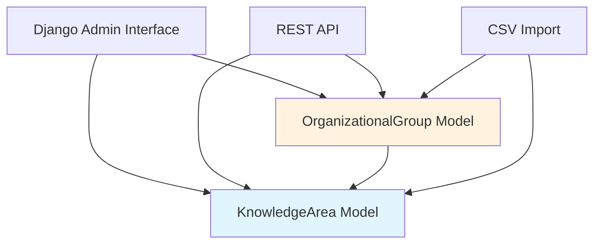
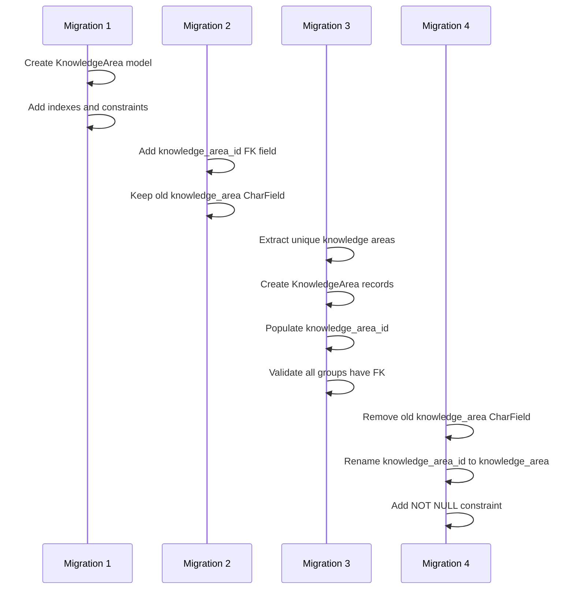

# Design Document: Knowledge Area Entity

## Overview

This design document outlines the implementation of a dedicated KnowledgeArea entity to replace the current CharField implementation in the OrganizationalGroup model. The current system stores knowledge_area as free-text, leading to data inconsistencies, duplicates, and management challenges. By introducing a separate KnowledgeArea model with proper foreign key relationships, the system will achieve better data integrity, standardization, and query performance.

### Design Goals

1. **Data Integrity**: Enforce standardized knowledge area values through database constraints
2. **Consistency**: Eliminate duplicate and variant spellings of knowledge areas
3. **Manageability**: Provide centralized management of knowledge areas through admin interface
4. **API Integration**: Expose knowledge areas as a first-class resource in the REST API
5. **Backward Compatibility**: Migrate existing data without loss or disruption
6. **Performance**: Optimize queries with proper indexing and select_related patterns

### Design Rationale

**Why a separate model?**
- CharField allows arbitrary text input, leading to "Computer Science", "computer science", "CS", "Comp Sci" all representing the same concept
- No centralized management or validation of valid knowledge areas
- Difficult to query and filter groups by knowledge area due to text variations
- Cannot track metadata about knowledge areas (description, creation date, etc.)

**Why PROTECT deletion behavior?**
- Prevents accidental deletion of knowledge areas that are in use
- Maintains referential integrity
- Forces administrators to reassign groups before deleting a knowledge area

## Architecture

### System Context



### Data Model Changes

```mermaid
classDiagram
    class KnowledgeArea {
        +Integer id
        +String name
        +String description
        +DateTime created_at
        +DateTime updated_at
        +group_count()
        +clean()
        +__str__()
    }
    
    class OrganizationalGroup {
        +Integer id
        +String name
        +String short_name
        +String url
        +String type
        -String knowledge_area [REMOVED]
        +ForeignKey knowledge_area [NEW]
        +ForeignKey campus
        +DateTime created_at
        +DateTime updated_at
    }
    
    OrganizationalGroup }o--|| KnowledgeArea : "belongs to"
    
    note for KnowledgeArea "New model with unique\ncase-insensitive name"
    note for OrganizationalGroup "CharField replaced with\nForeignKey to KnowledgeArea"
```


### Migration Strategy

The migration will be executed in multiple phases to ensure data safety and reversibility:



**Phase 1: Create KnowledgeArea Model**
- Create new model with all fields and constraints
- No impact on existing OrganizationalGroup data

**Phase 2: Add Foreign Key Field**
- Add nullable knowledge_area_id field to OrganizationalGroup
- Keep existing knowledge_area CharField temporarily
- Both fields coexist during migration

**Phase 3: Data Migration**
- Extract all unique knowledge_area values (case-insensitive)
- Create KnowledgeArea records for each unique value
- Map each OrganizationalGroup to appropriate KnowledgeArea
- Validate all groups have been mapped

**Phase 4: Finalize Migration**
- Remove old knowledge_area CharField
- Rename knowledge_area_id to knowledge_area
- Add NOT NULL constraint to knowledge_area FK
- Update indexes

## Components and Interfaces

### 1. KnowledgeArea Model

**Location**: `apps/organizational_group/models.py`

**Fields**:
- `id` (AutoField): Primary key
- `name` (CharField, max_length=200): Unique knowledge area name
- `description` (TextField, blank=True): Optional detailed description
- `created_at` (DateTimeField): Auto-populated creation timestamp
- `updated_at` (DateTimeField): Auto-updated modification timestamp

**Constraints**:
- Unique constraint on `name` (case-insensitive via clean method)
- Index on `name` for query performance

**Methods**:
- `clean()`: Validates name is not empty, enforces case-insensitive uniqueness
- `group_count()`: Returns count of associated OrganizationalGroups
- `__str__()`: Returns the name

**Meta Options**:
- `ordering = ['name']`: Alphabetical ordering
- `verbose_name = 'Knowledge Area'`
- `verbose_name_plural = 'Knowledge Areas'`

### 2. OrganizationalGroup Model Updates

**Location**: `apps/organizational_group/models.py`

**Field Changes**:
- **Remove**: `knowledge_area = models.CharField(max_length=200)`
- **Add**: `knowledge_area = models.ForeignKey('KnowledgeArea', on_delete=models.PROTECT, related_name='groups')`

**Relationship Details**:
- `on_delete=models.PROTECT`: Prevents deletion of KnowledgeArea if groups reference it
- `related_name='groups'`: Allows `knowledge_area.groups.all()` reverse queries
- Index automatically created on foreign key field

**Validation Updates**:
- Update `clean()` method to validate knowledge_area FK exists
- Remove CharField validation logic

### 3. KnowledgeArea Admin Interface

**Location**: `apps/organizational_group/admin.py`

**Configuration**:
```python
@admin.register(KnowledgeArea)
class KnowledgeAreaAdmin(admin.ModelAdmin):
    list_display = ['name', 'description_preview', 'group_count_display', 'created_at']
    list_filter = ['created_at', 'updated_at']
    search_fields = ['name', 'description']
    readonly_fields = ['id', 'created_at', 'updated_at', 'group_count_display']
    ordering = ['name']
```

**Features**:
- Search by name and description
- Filter by creation date
- Display group count with HTML formatting
- Prevent deletion if groups reference the knowledge area
- Autocomplete support for OrganizationalGroup admin

### 4. OrganizationalGroup Admin Updates

**Location**: `apps/organizational_group/admin.py`

**Changes**:
- Replace text input with autocomplete field for knowledge_area
- Add `autocomplete_fields = ['campus', 'knowledge_area']`
- Update `list_filter` to include 'knowledge_area'
- Update `search_fields` to include 'knowledge_area__name'
- Add `select_related('campus', 'knowledge_area')` in get_queryset()

**Display Method**:
```python
def knowledge_area_display(self, obj):
    if obj.knowledge_area:
        return format_html(
            '<strong>{}</strong>',
            obj.knowledge_area.name
        )
    return format_html('<span style="color: #999;">No knowledge area</span>')
```


### 5. KnowledgeArea API

**Location**: `apps/organizational_group/views.py` and `apps/organizational_group/serializers.py`

**Serializer Design**:
```python
class KnowledgeAreaSerializer(serializers.ModelSerializer):
    group_count = serializers.SerializerMethodField()
    
    class Meta:
        model = KnowledgeArea
        fields = ['id', 'name', 'description', 'group_count', 'created_at', 'updated_at']
        read_only_fields = ['id', 'created_at', 'updated_at', 'group_count']
```

**ViewSet Design**:
```python
class KnowledgeAreaViewSet(viewsets.ModelViewSet):
    queryset = KnowledgeArea.objects.all()
    serializer_class = KnowledgeAreaSerializer
    permission_classes = [IsAuthenticated]
    filter_backends = [DjangoFilterBackend, SearchFilter, OrderingFilter]
    filterset_fields = ['name']
    search_fields = ['name', 'description']
    ordering_fields = ['name', 'created_at']
    ordering = ['name']
    pagination_class = StandardResultsSetPagination
```

**Endpoints**:
- `GET /api/knowledge-areas/` - List all knowledge areas with pagination
- `POST /api/knowledge-areas/` - Create new knowledge area
- `GET /api/knowledge-areas/{id}/` - Retrieve knowledge area details
- `PUT /api/knowledge-areas/{id}/` - Update knowledge area
- `PATCH /api/knowledge-areas/{id}/` - Partial update
- `DELETE /api/knowledge-areas/{id}/` - Delete (only if no groups reference it)

**Query Optimization**:
- Annotate queryset with group count: `annotate(annotated_group_count=Count('groups'))`
- Use annotation in serializer for performance

### 6. OrganizationalGroup API Updates

**Location**: `apps/organizational_group/serializers.py`

**Serializer Changes**:

**Read Operations** (nested representation):
```python
class OrganizationalGroupSerializer(serializers.ModelSerializer):
    knowledge_area = KnowledgeAreaSerializer(read_only=True)
    # ... other fields
```

**Write Operations** (accept ID):
```python
class OrganizationalGroupCreateUpdateSerializer(OrganizationalGroupSerializer):
    knowledge_area_id = serializers.IntegerField(write_only=True, required=True)
    
    def validate_knowledge_area_id(self, value):
        try:
            KnowledgeArea.objects.get(pk=value)
        except KnowledgeArea.DoesNotExist:
            raise serializers.ValidationError(f"KnowledgeArea with ID {value} does not exist.")
        return value
```

**API Response Example**:
```json
{
  "id": 1,
  "name": "Research Group Alpha",
  "short_name": "RGA",
  "type": "research",
  "knowledge_area": {
    "id": 5,
    "name": "Computer Science",
    "description": "Computing and information technology research",
    "group_count": 12,
    "created_at": "2025-01-15T10:00:00Z",
    "updated_at": "2025-01-15T10:00:00Z"
  },
  "campus": { ... }
}
```

**ViewSet Updates**:
- Add `select_related('knowledge_area')` in get_queryset()
- Update filterset_fields: `['type', 'campus_id', 'knowledge_area_id']`
- Update search_fields: `['name', 'short_name', 'knowledge_area__name']`

### 7. CSV Import Integration

**Location**: CSV import handler (to be identified in codebase)

**Changes Required**:
1. **Lookup or Create Logic**:
   - For each row, extract knowledge_area value
   - Perform case-insensitive lookup: `KnowledgeArea.objects.filter(name__iexact=value).first()`
   - If not found, create new KnowledgeArea: `KnowledgeArea.objects.create(name=value.strip())`
   - Assign knowledge_area FK to OrganizationalGroup

2. **Error Handling**:
   - Validate knowledge_area value is not empty
   - Handle validation errors from KnowledgeArea.clean()
   - Report errors with row number and field name

3. **Transaction Safety**:
   - Wrap import in database transaction
   - Rollback on any validation error
   - Provide detailed error report

**Example Logic**:
```python
def import_organizational_group(row_data):
    knowledge_area_name = row_data.get('knowledge_area', '').strip()
    
    if not knowledge_area_name:
        raise ValidationError("Knowledge area is required")
    
    # Get or create KnowledgeArea (case-insensitive)
    knowledge_area, created = KnowledgeArea.objects.get_or_create(
        name__iexact=knowledge_area_name,
        defaults={'name': knowledge_area_name}
    )
    
    # Create OrganizationalGroup with FK
    group = OrganizationalGroup.objects.create(
        name=row_data['name'],
        knowledge_area=knowledge_area,
        # ... other fields
    )
```

## Data Models

### KnowledgeArea Model Schema

```sql
CREATE TABLE organizational_group_knowledgearea (
    id INTEGER PRIMARY KEY AUTOINCREMENT,
    name VARCHAR(200) NOT NULL,
    description TEXT,
    created_at DATETIME NOT NULL,
    updated_at DATETIME NOT NULL
);

CREATE UNIQUE INDEX idx_knowledgearea_name ON organizational_group_knowledgearea(name);
CREATE INDEX idx_knowledgearea_created_at ON organizational_group_knowledgearea(created_at);
```

### OrganizationalGroup Model Schema Changes

**Before**:
```sql
CREATE TABLE organizational_group_organizationalgroup (
    id INTEGER PRIMARY KEY,
    name VARCHAR(200),
    knowledge_area VARCHAR(200),  -- CharField
    campus_id INTEGER REFERENCES organizational_group_campus(id),
    -- ... other fields
);
```

**After**:
```sql
CREATE TABLE organizational_group_organizationalgroup (
    id INTEGER PRIMARY KEY,
    name VARCHAR(200),
    knowledge_area_id INTEGER NOT NULL REFERENCES organizational_group_knowledgearea(id) ON DELETE PROTECT,
    campus_id INTEGER REFERENCES organizational_group_campus(id),
    -- ... other fields
);

CREATE INDEX idx_org_group_knowledge_area ON organizational_group_organizationalgroup(knowledge_area_id);
```

### Data Migration Example

**Sample Data Before Migration**:
```
OrganizationalGroup:
  id=1, name="AI Lab", knowledge_area="Computer Science"
  id=2, name="ML Research", knowledge_area="computer science"
  id=3, name="Robotics Lab", knowledge_area="Computer Science"
  id=4, name="Bio Lab", knowledge_area="Biology"
```

**After Migration**:
```
KnowledgeArea:
  id=1, name="Computer Science"
  id=2, name="Biology"

OrganizationalGroup:
  id=1, name="AI Lab", knowledge_area_id=1
  id=2, name="ML Research", knowledge_area_id=1
  id=3, name="Robotics Lab", knowledge_area_id=1
  id=4, name="Bio Lab", knowledge_area_id=2
```

Note: "Computer Science" and "computer science" are consolidated into a single KnowledgeArea record.


## Error Handling

### Validation Errors

**KnowledgeArea Validation**:

1. **Empty Name Error**:
   - Trigger: Name is empty or only whitespace
   - Response: `ValidationError: "Knowledge area name cannot be empty"`
   - HTTP Status: 400 Bad Request

2. **Duplicate Name Error**:
   - Trigger: Case-insensitive name already exists
   - Response: `ValidationError: "Knowledge area with this name already exists"`
   - HTTP Status: 400 Bad Request
   - Implementation: Check in `clean()` method before save

3. **Name Too Long Error**:
   - Trigger: Name exceeds 200 characters
   - Response: `ValidationError: "Ensure this value has at most 200 characters"`
   - HTTP Status: 400 Bad Request

**OrganizationalGroup Validation**:

1. **Missing KnowledgeArea Error**:
   - Trigger: knowledge_area FK is null
   - Response: `ValidationError: "Knowledge area is required"`
   - HTTP Status: 400 Bad Request

2. **Invalid KnowledgeArea ID Error**:
   - Trigger: knowledge_area_id does not exist
   - Response: `ValidationError: "KnowledgeArea with ID {id} does not exist"`
   - HTTP Status: 400 Bad Request

### Deletion Errors

**Protected Deletion Error**:
- Trigger: Attempting to delete KnowledgeArea with associated groups
- Response:
  ```json
  {
    "error": {
      "code": "PROTECTED_DELETION",
      "message": "Cannot delete knowledge area with associated groups",
      "details": "This knowledge area is referenced by 5 organizational group(s). Reassign these groups before deletion."
    }
  }
  ```
- HTTP Status: 400 Bad Request
- Implementation: Django's PROTECT constraint raises ProtectedError

**Admin Interface Handling**:
- Display clear error message in admin
- Show count of associated groups
- Provide link to filter groups by this knowledge area

### Migration Errors

**Data Integrity Errors**:

1. **Unmapped Groups Error**:
   - Trigger: Groups without knowledge_area_id after migration
   - Response: Rollback migration, log error details
   - Prevention: Validate all groups mapped before finalizing

2. **Duplicate Detection Error**:
   - Trigger: Case-insensitive duplicates in source data
   - Response: Log warning, consolidate to single KnowledgeArea
   - Example: "Computer Science" and "COMPUTER SCIENCE" → "Computer Science"

### API Error Responses

**Standard Error Format**:
```json
{
  "error": {
    "code": "ERROR_CODE",
    "message": "Human-readable error message",
    "details": "Additional context or suggestions",
    "field_errors": {
      "field_name": ["Error message 1", "Error message 2"]
    }
  }
}
```

**Common Error Codes**:
- `VALIDATION_ERROR`: Field validation failed
- `NOT_FOUND`: Resource not found
- `PROTECTED_DELETION`: Cannot delete due to foreign key constraint
- `DUPLICATE_NAME`: Knowledge area name already exists
- `CREATION_FAILED`: Failed to create resource
- `UPDATE_FAILED`: Failed to update resource

## Testing Strategy

### Unit Tests

**KnowledgeArea Model Tests** (`test_knowledge_area_model.py`):

1. **Test Creation**:
   - Create KnowledgeArea with valid data
   - Verify fields are saved correctly
   - Verify timestamps are auto-populated

2. **Test Validation**:
   - Test empty name validation
   - Test case-insensitive uniqueness
   - Test name length validation
   - Test whitespace stripping

3. **Test Methods**:
   - Test `group_count()` returns correct count
   - Test `__str__()` returns name
   - Test `clean()` validation logic

4. **Test Constraints**:
   - Test unique constraint enforcement
   - Test case-insensitive duplicate prevention

**OrganizationalGroup Model Tests** (`test_organizational_group_model.py`):

1. **Test Foreign Key Relationship**:
   - Create group with valid knowledge_area FK
   - Verify relationship is established
   - Test reverse relationship (knowledge_area.groups)

2. **Test PROTECT Constraint**:
   - Create group with knowledge_area
   - Attempt to delete knowledge_area
   - Verify ProtectedError is raised

3. **Test Validation**:
   - Test missing knowledge_area validation
   - Test invalid knowledge_area_id validation

### Admin Interface Tests

**KnowledgeArea Admin Tests** (`test_knowledge_area_admin.py`):

1. **Test List View**:
   - Verify all columns display correctly
   - Test search functionality
   - Test filtering by creation date
   - Verify group count display

2. **Test Create/Edit**:
   - Create new knowledge area via admin
   - Edit existing knowledge area
   - Test validation error display

3. **Test Deletion**:
   - Delete knowledge area without groups (success)
   - Attempt to delete with groups (error message)

4. **Test Autocomplete**:
   - Verify search_fields enable autocomplete
   - Test autocomplete from OrganizationalGroup admin

**OrganizationalGroup Admin Tests** (`test_organizational_group_admin.py`):

1. **Test Autocomplete Field**:
   - Verify knowledge_area uses autocomplete widget
   - Test searching for knowledge areas
   - Test selecting knowledge area

2. **Test List View**:
   - Verify knowledge_area displays in list
   - Test filtering by knowledge_area
   - Test search by knowledge_area name

3. **Test Query Optimization**:
   - Verify select_related includes knowledge_area
   - Count database queries
   - Ensure no N+1 query issues


### API Tests

**KnowledgeArea API Tests** (`test_knowledge_area_api.py`):

1. **Test List Endpoint**:
   - GET /api/knowledge-areas/
   - Verify pagination
   - Test filtering by name
   - Test search functionality
   - Test ordering

2. **Test Create Endpoint**:
   - POST /api/knowledge-areas/ with valid data
   - Test validation errors (empty name, duplicate)
   - Verify response format

3. **Test Retrieve Endpoint**:
   - GET /api/knowledge-areas/{id}/
   - Verify all fields present
   - Verify group_count is accurate

4. **Test Update Endpoint**:
   - PUT/PATCH /api/knowledge-areas/{id}/
   - Test validation on update
   - Test duplicate name prevention

5. **Test Delete Endpoint**:
   - DELETE /api/knowledge-areas/{id}/ without groups (success)
   - DELETE with groups (error)
   - Verify error response format

6. **Test Authentication**:
   - Verify endpoints require authentication
   - Test with unauthenticated request

**OrganizationalGroup API Tests** (`test_organizational_group_api.py`):

1. **Test Nested Representation**:
   - GET /api/organizational-groups/{id}/
   - Verify knowledge_area is nested object
   - Verify all knowledge_area fields present

2. **Test Create with KnowledgeArea**:
   - POST with knowledge_area_id
   - Verify group created with correct FK
   - Test invalid knowledge_area_id error

3. **Test Update KnowledgeArea**:
   - PATCH to change knowledge_area_id
   - Verify FK updated correctly

4. **Test Filtering**:
   - Filter by knowledge_area_id
   - Verify correct groups returned

5. **Test Search**:
   - Search by knowledge_area name
   - Verify groups with matching knowledge areas returned

6. **Test Query Optimization**:
   - Verify select_related used
   - Count database queries
   - Ensure no N+1 issues

### Migration Tests

**Data Migration Tests** (`test_knowledge_area_migration.py`):

1. **Test Data Extraction**:
   - Create groups with various knowledge_area values
   - Run migration
   - Verify unique KnowledgeArea records created
   - Verify case-insensitive deduplication

2. **Test Data Mapping**:
   - Verify all groups have knowledge_area_id populated
   - Verify correct KnowledgeArea assigned to each group
   - Test with empty/null knowledge_area values

3. **Test Reversibility**:
   - Run migration forward
   - Run migration backward
   - Verify data restored to original state

4. **Test Edge Cases**:
   - Groups with whitespace in knowledge_area
   - Groups with very long knowledge_area names
   - Groups with special characters

### CSV Import Tests

**CSV Import Integration Tests** (`test_csv_import_knowledge_area.py`):

1. **Test Import with Existing KnowledgeArea**:
   - Create KnowledgeArea
   - Import CSV with matching name (case-insensitive)
   - Verify existing KnowledgeArea used

2. **Test Import with New KnowledgeArea**:
   - Import CSV with new knowledge_area value
   - Verify KnowledgeArea created automatically
   - Verify group assigned correctly

3. **Test Import Validation**:
   - Import with empty knowledge_area
   - Verify validation error reported
   - Verify transaction rolled back

4. **Test Batch Import**:
   - Import multiple groups with same knowledge_area
   - Verify single KnowledgeArea created
   - Verify all groups reference same KnowledgeArea

### Integration Tests

**End-to-End Tests** (`test_knowledge_area_e2e.py`):

1. **Test Complete Workflow**:
   - Create KnowledgeArea via API
   - Create OrganizationalGroup with knowledge_area_id
   - Retrieve group and verify nested knowledge_area
   - Update group's knowledge_area
   - Attempt to delete knowledge_area (should fail)
   - Delete group
   - Delete knowledge_area (should succeed)

2. **Test Admin Workflow**:
   - Create KnowledgeArea via admin
   - Create OrganizationalGroup via admin with autocomplete
   - Edit group and change knowledge_area
   - Attempt to delete knowledge_area via admin
   - Verify error message displayed

3. **Test CSV Import Workflow**:
   - Import CSV with mixed existing/new knowledge areas
   - Verify correct KnowledgeArea assignments
   - Verify data integrity

## Performance Considerations

### Database Optimization

1. **Indexes**:
   - Primary key index on KnowledgeArea.id (automatic)
   - Unique index on KnowledgeArea.name
   - Foreign key index on OrganizationalGroup.knowledge_area_id (automatic)
   - Index on KnowledgeArea.created_at for filtering

2. **Query Optimization**:
   - Use `select_related('knowledge_area')` when querying OrganizationalGroup
   - Use `prefetch_related('groups')` when querying KnowledgeArea with groups
   - Annotate group counts instead of calling group_count() in loops
   - Use `only()` or `defer()` for large result sets

3. **Query Examples**:
   ```python
   # Efficient: Single query with join
   groups = OrganizationalGroup.objects.select_related('knowledge_area', 'campus')
   
   # Efficient: Annotated count
   knowledge_areas = KnowledgeArea.objects.annotate(
       group_count=Count('groups')
   )
   
   # Inefficient: N+1 queries
   for group in OrganizationalGroup.objects.all():
       print(group.knowledge_area.name)  # Separate query each iteration
   ```

### API Performance

1. **Response Time Targets**:
   - List endpoints: < 100ms for 25 items
   - Detail endpoints: < 50ms
   - Create/Update: < 100ms
   - Delete: < 50ms

2. **Pagination**:
   - Default page size: 25 items
   - Maximum page size: 100 items
   - Use cursor pagination for large datasets

3. **Caching Strategy**:
   - Cache KnowledgeArea list (low change frequency)
   - Cache duration: 5 minutes
   - Invalidate on create/update/delete
   - Use Django's cache framework

### Admin Interface Performance

1. **List View Optimization**:
   - Limit list_per_page to 25
   - Use select_related for foreign keys
   - Use annotations for computed fields
   - Avoid calling methods in loops

2. **Autocomplete Performance**:
   - Index search_fields
   - Limit autocomplete results to 20 items
   - Use ILIKE queries for case-insensitive search

## Security Considerations

### Authentication and Authorization

1. **API Endpoints**:
   - All endpoints require authentication (IsAuthenticated)
   - Consider role-based permissions for create/update/delete
   - Read-only access for non-admin users

2. **Admin Interface**:
   - Requires staff user status
   - Consider custom permissions for KnowledgeArea management
   - Audit log for changes

### Input Validation

1. **SQL Injection Prevention**:
   - Use Django ORM (parameterized queries)
   - Never use raw SQL with user input
   - Validate all input through serializers/forms

2. **XSS Prevention**:
   - Django auto-escapes template output
   - Use format_html() for admin display methods
   - Validate and sanitize description field

3. **Data Integrity**:
   - Enforce NOT NULL on knowledge_area FK
   - Use PROTECT to prevent orphaned groups
   - Validate uniqueness at database and application level

### Rate Limiting

1. **API Rate Limits**:
   - Consider throttling for create/update/delete operations
   - Use DRF throttling classes
   - Different limits for authenticated vs anonymous users

## Deployment Considerations

### Migration Execution

1. **Pre-Deployment Checklist**:
   - Backup database before migration
   - Test migration on staging environment
   - Verify data integrity after migration
   - Document rollback procedure

2. **Migration Steps**:
   ```bash
   # 1. Backup database
   python manage.py dumpdata > backup.json
   
   # 2. Run migrations
   python manage.py migrate organizational_group
   
   # 3. Verify data
   python manage.py shell
   >>> from apps.organizational_group.models import KnowledgeArea, OrganizationalGroup
   >>> KnowledgeArea.objects.count()
   >>> OrganizationalGroup.objects.filter(knowledge_area__isnull=True).count()  # Should be 0
   
   # 4. Test API endpoints
   curl -H "Authorization: Bearer <token>" http://localhost:8000/api/knowledge-areas/
   ```

3. **Rollback Procedure**:
   ```bash
   # Rollback migrations
   python manage.py migrate organizational_group <previous_migration_number>
   
   # Restore from backup if needed
   python manage.py loaddata backup.json
   ```

### Monitoring

1. **Metrics to Track**:
   - KnowledgeArea creation rate
   - OrganizationalGroup creation/update rate
   - API response times
   - Database query counts
   - Error rates

2. **Alerts**:
   - High error rate on knowledge-area endpoints
   - Slow query performance (> 100ms)
   - Failed migrations
   - Protected deletion attempts

### Documentation Updates

1. **API Documentation**:
   - Update OpenAPI/Swagger schema
   - Add KnowledgeArea endpoint documentation
   - Update OrganizationalGroup schema
   - Provide migration guide for API consumers

2. **Admin Documentation**:
   - Update admin user guide
   - Document autocomplete usage
   - Explain knowledge area management

3. **Developer Documentation**:
   - Update model documentation
   - Document migration process
   - Provide code examples

## Future Enhancements

### Potential Improvements

1. **Hierarchical Knowledge Areas**:
   - Add parent_knowledge_area FK for subcategories
   - Example: "Computer Science" → "Artificial Intelligence"
   - Requires additional migration and UI updates

2. **Knowledge Area Metadata**:
   - Add fields: code, external_id, is_active
   - Support for knowledge area taxonomies
   - Integration with external classification systems

3. **Bulk Operations**:
   - Bulk reassign groups to different knowledge area
   - Merge duplicate knowledge areas
   - Admin actions for common operations

4. **Analytics**:
   - Track knowledge area popularity over time
   - Report on knowledge area distribution
   - Identify underutilized knowledge areas

5. **Internationalization**:
   - Translate knowledge area names
   - Support multiple languages
   - Use django-modeltranslation or similar

6. **Soft Delete**:
   - Add is_deleted flag instead of hard delete
   - Preserve historical data
   - Allow restoration of deleted knowledge areas

## Conclusion

This design provides a robust foundation for managing knowledge areas as first-class entities in the OneStep system. The migration strategy ensures data safety and reversibility, while the API and admin interfaces provide comprehensive management capabilities. Performance optimizations and proper error handling ensure the system remains responsive and reliable as it scales.

The implementation follows Django best practices and maintains consistency with the existing codebase architecture, particularly the Campus model which serves as a reference pattern for this feature.
