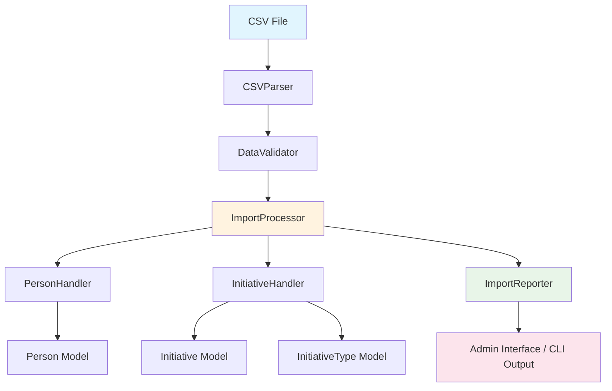
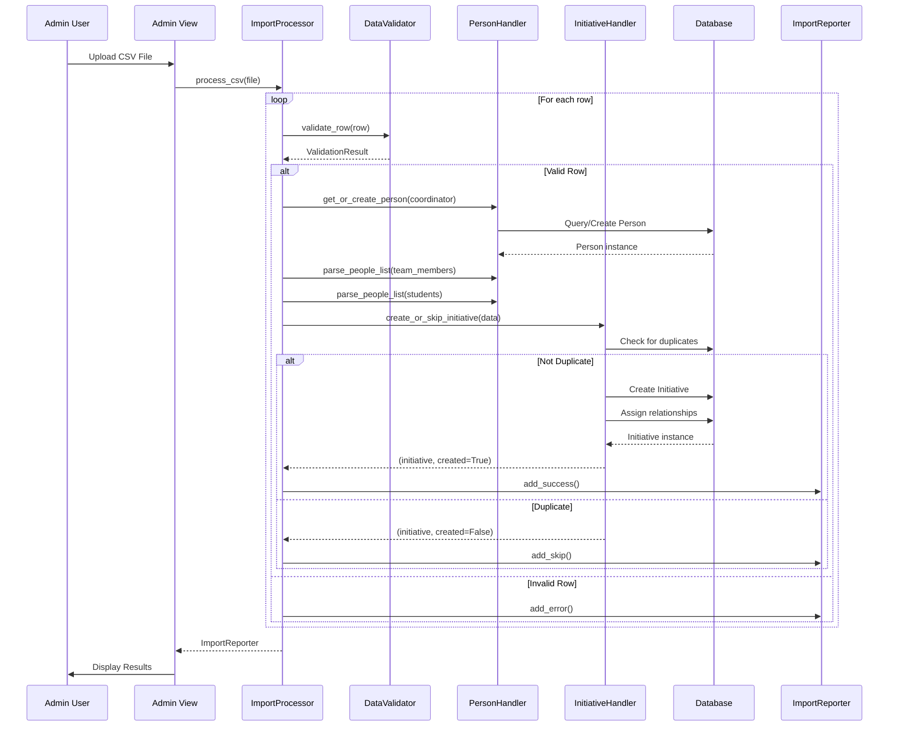

# Research Project Import Design Document

## Overview

This design document outlines the implementation of a CSV import feature for research projects in the OneStep system. The feature enables system administrators to bulk import research project data from CSV files through both Django management commands and the Django admin interface. Research projects are imported as Initiative entities with type "Research Project", along with their associated people (coordinators, team members, and students).

The design follows the existing CSV import architecture established in the organizational_group app, adapting it for Initiative entities while maintaining consistency with the system's patterns and conventions.

## Architecture

### High-Level Architecture



### Component Interaction Flow



## Components and Interfaces

### 1. CSV Parser (`initiatives/csv_import/parser.py`)

Reuses the existing `CSVParser` class from organizational_group with no modifications needed.

**Responsibilities:**
- Parse CSV files with UTF-8 encoding
- Handle both file paths and file-like objects
- Strip whitespace from column names and values
- Yield rows as dictionaries

**Interface:**
```python
class CSVParser:
    def parse_file(self, file_path) -> Iterator[Dict[str, str]]:
        """Parse CSV file and yield rows as dictionaries."""
```

### 2. Data Validator (`initiatives/csv_import/validator.py`)

**Responsibilities:**
- Validate required fields (Titulo, Coordenador, EmailCoordenador)
- Validate optional fields (Pesquisadores, Estudantes)
- Validate date formats (DD-MM-YY)
- Validate email addresses
- Validate date logic (end_date >= start_date)

**Interface:**
```python
class ValidationResult:
    def __init__(self, is_valid: bool, errors: List[str] = None):
        self.is_valid = is_valid
        self.errors = errors or []

class ResearchProjectValidator:
    def validate_row(self, row: Dict[str, str], row_number: int) -> ValidationResult:
        """Validate a single CSV row."""
    
    def validate_email(self, email: str) -> bool:
        """Validate email format."""
    
    def validate_date(self, date_str: str) -> bool:
        """Validate date format (DD-MM-YY)."""
    
    def parse_date(self, date_str: str) -> date:
        """Parse date string to date object."""
    
    def validate_date_range(self, start_date: str, end_date: str) -> bool:
        """Validate that end_date >= start_date."""
```

**Expected CSV Columns:**
- **Required:** Titulo, Inicio, Fim, Coordenador, EmailCoordenador
- **Optional:** Pesquisadores, Estudantes

**Date Format:** DD-MM-YY (e.g., "01-08-22" for August 1, 2022)

### 3. Person Handler (`initiatives/csv_import/person_handler.py`)

**Responsibilities:**
- Create or retrieve Person records
- Handle deduplication by email (case-insensitive)
- Handle deduplication by name for people without emails
- Generate placeholder emails for people without email addresses
- Parse semicolon-separated lists of names
- Normalize person names to Title Case

**Interface:**
```python
class PersonHandler:
    def get_or_create_person(self, name: str, email: str = None) -> Person:
        """
        Get or create a Person by email or name.
        
        Args:
            name: Person's full name
            email: Person's email (optional)
            
        Returns:
            Person: Existing or newly created Person instance
        """
    
    def parse_people_list(self, people_str: str) -> List[Person]:
        """
        Parse semicolon-separated list of names and create/retrieve Person records.
        
        Args:
            people_str: Semicolon-separated list of names
            
        Returns:
            List[Person]: List of Person instances
        """
    
    def generate_placeholder_email(self, name: str) -> str:
        """
        Generate placeholder email for person without email.
        
        Format: name.surname@noemail.local
        
        Args:
            name: Person's full name
            
        Returns:
            str: Generated placeholder email
        """
    
    def normalize_name(self, name: str) -> str:
        """
        Normalize person name to Title Case and clean whitespace.
        
        Args:
            name: Raw name string
            
        Returns:
            str: Normalized name
        """
```

**Deduplication Logic:**
1. **With Email:** Search by email (case-insensitive), reuse if exists
2. **Without Email:** Search by normalized name (case-insensitive), reuse if exists
3. **New Person:** Create with placeholder email if no email provided

**Placeholder Email Format:** `firstname.lastname@noemail.local`
- Example: "João Silva" → "joao.silva@noemail.local"
- Handle special characters and accents appropriately

### 4. Initiative Handler (`initiatives/csv_import/initiative_handler.py`)

**Responsibilities:**
- Create Initiative entities with type "Research Project"
- Detect duplicate initiatives (same name + coordinator)
- Assign coordinator relationship
- Assign team_members relationship
- Assign students relationship
- Normalize initiative names to Title Case

**Interface:**
```python
class InitiativeHandler:
    def __init__(self):
        self.research_project_type = None
    
    def get_research_project_type(self) -> InitiativeType:
        """
        Get or create the "Research Project" initiative type.
        
        Returns:
            InitiativeType: Research Project type instance
        """
    
    def create_or_skip_initiative(
        self,
        name: str,
        start_date: date,
        end_date: date,
        coordinator: Person,
        team_members: List[Person] = None,
        students: List[Person] = None
    ) -> Tuple[Initiative, bool]:
        """
        Create initiative or skip if duplicate exists.
        
        Args:
            name: Initiative name
            start_date: Start date
            end_date: End date
            coordinator: Coordinator Person
            team_members: List of team member Person instances
            students: List of student Person instances
            
        Returns:
            Tuple[Initiative, bool]: (initiative, created)
                - initiative: Initiative instance (existing or new)
                - created: True if new, False if duplicate
        """
    
    def is_duplicate(self, name: str, coordinator: Person) -> bool:
        """
        Check if initiative with same name and coordinator exists.
        
        Args:
            name: Initiative name (normalized)
            coordinator: Coordinator Person
            
        Returns:
            bool: True if duplicate exists
        """
    
    def normalize_name(self, name: str) -> str:
        """
        Normalize initiative name to Title Case.
        
        Args:
            name: Raw name string
            
        Returns:
            str: Normalized name
        """
```

**Duplicate Detection:**
- Compare normalized name (case-insensitive, whitespace-normalized)
- Compare coordinator (same Person instance)
- If both match, consider it a duplicate and skip

### 5. Import Processor (`initiatives/csv_import/processor.py`)

**Responsibilities:**
- Orchestrate the entire import process
- Coordinate between validator, person handler, and initiative handler
- Manage database transactions (one per row)
- Handle errors and rollback on failure
- Track statistics via ImportReporter

**Interface:**
```python
class ResearchProjectImportProcessor:
    def __init__(self):
        self.parser = CSVParser()
        self.validator = ResearchProjectValidator()
        self.person_handler = PersonHandler()
        self.initiative_handler = InitiativeHandler()
        self.reporter = ImportReporter()
    
    def process_csv(self, file_path) -> ImportReporter:
        """
        Process entire CSV file.
        
        Args:
            file_path: Path to CSV file or file-like object
            
        Returns:
            ImportReporter: Reporter with statistics and errors
        """
    
    def process_row(self, row: Dict[str, str], row_number: int):
        """
        Process a single CSV row within a transaction.
        
        Args:
            row: Dictionary of column values
            row_number: Row number for error reporting
        """
```

**Transaction Management:**
- Each row processed in its own transaction
- On error: rollback transaction, log error, continue to next row
- On success: commit transaction, increment success counter
- On duplicate: skip row, log as skipped, continue to next row

### 6. Import Reporter (`initiatives/csv_import/reporter.py`)

Reuses the existing `ImportReporter` class from organizational_group with no modifications needed.

**Responsibilities:**
- Track import statistics (total, success, skipped, errors)
- Store error messages with row numbers
- Provide summary report

**Interface:**
```python
class ImportReporter:
    def __init__(self):
        self.total_rows = 0
        self.success_count = 0
        self.skip_count = 0
        self.error_count = 0
        self.errors = []  # List of (row_number, error_message, row_data)
        self.skipped = []  # List of (row_number, name, reason)
    
    def add_success(self, row_number: int, name: str):
        """Record successful import."""
    
    def add_skip(self, row_number: int, name: str, reason: str):
        """Record skipped row."""
    
    def add_error(self, row_number: int, error: str, row_data: Dict = None):
        """Record error."""
    
    def set_total_rows(self, count: int):
        """Set total row count."""
    
    def get_summary(self) -> str:
        """Get formatted summary report."""
```

### 7. Django Management Command (`initiatives/management/commands/import_research_projects.py`)

**Responsibilities:**
- Provide CLI interface for CSV import
- Accept file path as argument
- Display import results and statistics
- Return appropriate exit codes

**Interface:**
```python
class Command(BaseCommand):
    help = 'Import research projects from CSV file'
    
    def add_arguments(self, parser):
        parser.add_argument(
            'csv_file',
            type=str,
            help='Path to CSV file containing research project data'
        )
    
    def handle(self, *args, **options):
        """Execute the import command."""
```

**Usage:**
```bash
python manage.py import_research_projects path/to/research_projects.csv
```

### 8. Django Admin Integration (`initiatives/admin.py`)

**Responsibilities:**
- Add "Import Research Projects from CSV" button to Initiative changelist
- Provide file upload form with format documentation
- Display import results with success/warning/error messages
- Limit error display to first 10 errors

**Admin Customization:**
```python
class InitiativeAdmin(admin.ModelAdmin):
    change_list_template = 'admin/initiatives/initiative/change_list.html'
    
    def get_urls(self):
        """Add custom URL for CSV import."""
    
    def import_csv_view(self, request):
        """Handle CSV file upload and import."""
```

**Template:** `initiatives/templates/admin/initiatives/initiative/change_list.html`
- Extends default changelist template
- Adds "Import Research Projects from CSV" button
- Links to import form view

**Template:** `initiatives/templates/admin/initiatives/initiative/import_csv.html`
- File upload form
- CSV format documentation table
- Example values for each column

## Data Models

### Initiative Model (Existing)

No changes required to the Initiative model. The import will use existing fields:

```python
class Initiative(TimestampedModel):
    name = models.CharField(max_length=200)
    description = models.TextField(blank=True)
    type = models.ForeignKey(InitiativeType, on_delete=models.PROTECT)
    start_date = models.DateField(null=True, blank=True)
    end_date = models.DateField(null=True, blank=True)
    coordinator = models.ForeignKey('people.Person', on_delete=models.PROTECT, related_name='coordinated_initiatives')
    team_members = models.ManyToManyField('people.Person', blank=True, related_name='team_initiatives')
    students = models.ManyToManyField('people.Person', blank=True, related_name='student_initiatives')
```

### Person Model (Existing)

No changes required to the Person model:

```python
class Person(TimestampedModel):
    name = models.CharField(max_length=200)
    email = models.EmailField(unique=True)
```

### InitiativeType Model (Existing)

Will use existing model to create/retrieve "Research Project" type:

```python
class InitiativeType(TimestampedModel):
    name = models.CharField(max_length=50, unique=True)
    code = models.CharField(max_length=20, unique=True)
    description = models.TextField(blank=True)
    is_active = models.BooleanField(default=True)
```

**Research Project Type:**
- name: "Research Project"
- code: "research_project"
- description: "Research projects imported from CSV"
- is_active: True

## Error Handling

### Validation Errors

**Row-Level Validation:**
- Missing required fields (Titulo, Coordenador, EmailCoordenador)
- Invalid date format
- Invalid email format
- End date before start date

**Error Handling Strategy:**
- Log error with row number and specific message
- Skip row and continue processing
- Include row data in error report for debugging

### Database Errors

**Transaction Management:**
- Wrap each row in a database transaction
- On ValidationError: rollback, log error, continue
- On IntegrityError: rollback, log error, continue
- On unexpected Exception: rollback, log error, continue

**Error Recovery:**
- Failed rows do not affect subsequent rows
- Partial imports are supported
- Detailed error log for manual correction

### Duplicate Detection

**Duplicate Criteria:**
- Same normalized name (case-insensitive, whitespace-normalized)
- Same coordinator (Person instance)

**Duplicate Handling:**
- Skip row without error
- Log as "skipped" with reason
- Include in skip count in summary

### Email Conflicts

**Scenario:** Person with same email but different name exists

**Handling:**
- Reuse existing Person (email is unique identifier)
- Log warning if name differs significantly
- Continue processing

### Person Deduplication Edge Cases

**Scenario:** Multiple people with same name but no email

**Handling:**
- First occurrence creates Person with placeholder email
- Subsequent occurrences reuse the same Person
- Placeholder email format ensures uniqueness: `firstname.lastname@noemail.local`
- If name collision occurs, append number: `firstname.lastname.2@noemail.local`

## Testing Strategy

### Unit Tests

**Test Coverage:**

1. **Validator Tests** (`test_validator.py`)
   - Valid row with all fields
   - Valid row with only required fields
   - Missing required fields
   - Invalid date formats
   - Invalid email formats
   - End date before start date
   - Empty semicolon-separated lists

2. **Person Handler Tests** (`test_person_handler.py`)
   - Create person with email
   - Create person without email (placeholder generation)
   - Deduplicate by email (case-insensitive)
   - Deduplicate by name (case-insensitive)
   - Parse semicolon-separated list
   - Handle empty names in list
   - Name normalization (Title Case)
   - Placeholder email uniqueness

3. **Initiative Handler Tests** (`test_initiative_handler.py`)
   - Create initiative with all relationships
   - Create initiative with only coordinator
   - Duplicate detection (same name + coordinator)
   - Non-duplicate (same name, different coordinator)
   - Non-duplicate (different name, same coordinator)
   - Name normalization (Title Case)
   - Research Project type creation

4. **Import Processor Tests** (`test_processor.py`)
   - Process valid CSV file
   - Process CSV with errors
   - Process CSV with duplicates
   - Transaction rollback on error
   - Statistics tracking
   - Row-by-row processing

### Integration Tests

**Test Scenarios:**

1. **End-to-End Import** (`test_integration.py`)
   - Import complete CSV file
   - Verify all Initiatives created
   - Verify all People created
   - Verify all relationships assigned
   - Verify statistics accuracy

2. **Admin Interface** (`test_admin.py`)
   - Access import form
   - Upload CSV file
   - View import results
   - Error message display
   - Success message display

3. **Management Command** (`test_command.py`)
   - Execute command with valid file
   - Execute command with invalid file
   - Verify console output
   - Verify exit codes

### Test Data

**Sample CSV Files:**
- `valid_research_projects.csv` - All valid data
- `invalid_dates.csv` - Invalid date formats
- `missing_fields.csv` - Missing required fields
- `duplicates.csv` - Duplicate initiatives
- `mixed_results.csv` - Mix of valid, invalid, and duplicates

## Design Decisions and Rationales

### 1. Reuse Existing CSV Import Architecture

**Decision:** Adapt the organizational_group CSV import architecture for initiatives

**Rationale:**
- Proven pattern already in use
- Consistent code structure across the application
- Reduces learning curve for developers
- Leverages existing components (CSVParser, ImportReporter)

### 2. Person Deduplication Strategy

**Decision:** Deduplicate by email first, then by name for people without emails

**Rationale:**
- Email is unique identifier in Person model
- Coordinators always have emails (required field)
- Team members and students may not have emails
- Name-based deduplication prevents duplicate Person records
- Placeholder emails maintain data integrity

### 3. Placeholder Email Format

**Decision:** Use `firstname.lastname@noemail.local` format

**Rationale:**
- Clearly identifies placeholder emails
- `.local` TLD is reserved and won't conflict with real domains
- Maintains email uniqueness constraint
- Easy to identify and filter in queries
- Human-readable format

### 4. Transaction Per Row

**Decision:** Wrap each row import in its own transaction

**Rationale:**
- Isolates errors to individual rows
- Allows partial imports to succeed
- Prevents cascading failures
- Simplifies error recovery
- Aligns with existing organizational_group pattern

### 5. Duplicate Detection Criteria

**Decision:** Consider duplicate if name + coordinator match

**Rationale:**
- Same coordinator unlikely to have two projects with identical names
- Prevents accidental re-imports
- Allows different coordinators to have projects with same name
- Simple and effective heuristic

### 6. Text Normalization (Title Case)

**Decision:** Normalize all names to Title Case

**Rationale:**
- Consistent data presentation
- Improves readability
- Matches existing organizational_group pattern
- Handles inconsistent CSV data formatting

### 7. Date Format (DD-MM-YY)

**Decision:** Support DD-MM-YY format as specified in requirements

**Rationale:**
- Matches format in example CSV file
- Common format in Brazilian systems
- Explicit format reduces ambiguity
- Can be extended to support multiple formats if needed

### 8. Optional Test Tasks

**Decision:** Mark test-related tasks as optional in implementation plan

**Rationale:**
- Allows faster MVP delivery
- Core functionality can be validated manually
- Tests can be added incrementally
- Focuses on business value first

### 9. Admin Interface Integration

**Decision:** Provide both CLI and admin interface for import

**Rationale:**
- CLI for automation and scripting
- Admin interface for non-technical users
- Consistent with organizational_group import
- Provides flexibility in usage

### 10. Error Reporting Limit

**Decision:** Display first 10 errors in admin interface

**Rationale:**
- Prevents overwhelming the user
- Provides enough information for debugging
- Indicates total error count
- Encourages fixing errors in batches

## Performance Considerations

### Database Queries

**Optimization Strategies:**
- Use `get_or_create()` for Person lookups (single query)
- Use `select_related()` for Initiative queries with coordinator
- Use `prefetch_related()` for many-to-many relationships
- Cache InitiativeType lookup (single query per import)

**Expected Query Count Per Row:**
- 1 query: Get/create coordinator Person
- N queries: Get/create team member Persons (N = number of team members)
- M queries: Get/create student Persons (M = number of students)
- 1 query: Check for duplicate Initiative
- 1 query: Create Initiative
- 2 queries: Assign team_members and students relationships

**Total:** ~5 + N + M queries per row

### Memory Usage

**Considerations:**
- CSV parsed row-by-row (streaming)
- No full file loading into memory
- Transaction per row limits memory growth
- ImportReporter stores error details (bounded by error count)

**Memory Footprint:** O(errors + skipped) - proportional to problem rows, not total rows

### Transaction Overhead

**Trade-offs:**
- Transaction per row: Higher overhead, better isolation
- Single transaction: Lower overhead, all-or-nothing import

**Decision:** Transaction per row for better error handling and partial imports

### Scalability

**Expected Performance:**
- Small files (<100 rows): <5 seconds
- Medium files (100-1000 rows): <30 seconds
- Large files (1000+ rows): ~30-60 seconds

**Bottlenecks:**
- Database queries (primary bottleneck)
- Person deduplication lookups
- Transaction commits

**Future Optimizations:**
- Batch person lookups
- Cache person lookups within import session
- Use bulk_create for relationships where possible

## Security Considerations

### File Upload Validation

**Validations:**
- File extension check (.csv only)
- File size limit (configurable, default 10MB)
- MIME type validation
- Malicious content scanning (if available)

### SQL Injection Prevention

**Protections:**
- Django ORM used exclusively (parameterized queries)
- No raw SQL queries
- Input validation before database operations

### Access Control

**Permissions:**
- Admin interface: Requires staff status and appropriate permissions
- Management command: Requires file system access
- Initiative creation: Follows existing permission model

### Data Validation

**Security Measures:**
- Email validation prevents injection
- URL validation (if added in future)
- Text normalization prevents malicious input
- Transaction isolation prevents partial corruption

## Future Enhancements

### Potential Improvements

1. **Batch Import Optimization**
   - Bulk person lookups
   - Bulk relationship creation
   - Reduced transaction overhead

2. **Additional CSV Formats**
   - Support multiple date formats
   - Support different column names
   - Configurable column mapping

3. **Import Preview**
   - Dry-run mode
   - Preview changes before commit
   - Validation-only mode

4. **Enhanced Duplicate Detection**
   - Fuzzy name matching
   - Similarity scoring
   - User confirmation for near-duplicates

5. **Import History**
   - Track import sessions
   - Store import metadata
   - Audit trail for imports

6. **Async Processing**
   - Background job for large files
   - Progress tracking
   - Email notification on completion

7. **Data Enrichment**
   - Auto-populate description from external sources
   - Link to organizational groups
   - Infer relationships from data

8. **Export Functionality**
   - Export initiatives to CSV
   - Round-trip import/export
   - Template generation

## Dependencies

### Python Packages

- **Django**: Core framework (existing)
- **csv**: Standard library for CSV parsing (existing)
- **datetime**: Date parsing and validation (existing)

### Django Apps

- **initiatives**: Target app for import functionality
- **people**: Person model dependency
- **core**: Base models and utilities

### External Dependencies

None - all functionality uses Django and Python standard library

## Migration Strategy

### Database Migrations

No database migrations required - uses existing models.

### Data Migration

If "Research Project" InitiativeType doesn't exist:
- Created automatically on first import
- Can be pre-created via data migration or admin interface

### Deployment Steps

1. Deploy code changes
2. Run existing migrations (if any)
3. Verify "Research Project" InitiativeType exists
4. Test import with sample CSV file
5. Document import process for administrators

## Monitoring and Logging

### Logging Strategy

**Log Levels:**
- INFO: Import started, import completed, statistics
- WARNING: Skipped rows, duplicate detection
- ERROR: Validation errors, database errors, unexpected exceptions

**Log Format:**
```
[timestamp] [level] [component] Row X: message
```

**Example Logs:**
```
2024-01-15 10:30:00 INFO ImportProcessor: Starting import of research_projects.csv
2024-01-15 10:30:01 WARNING InitiativeHandler: Row 5: Duplicate initiative skipped - "Project Name"
2024-01-15 10:30:02 ERROR Validator: Row 12: Invalid date format - "32-13-22"
2024-01-15 10:30:05 INFO ImportProcessor: Import completed - 45 success, 3 skipped, 2 errors
```

### Metrics

**Track:**
- Total imports executed
- Success rate (%)
- Average processing time
- Error frequency by type
- Duplicate detection rate

### Monitoring

**Admin Dashboard:**
- Recent import history
- Success/failure statistics
- Common error patterns
- Processing time trends

## Documentation

### User Documentation

**Admin Guide:**
- How to access import feature
- CSV format requirements
- Column descriptions and examples
- Troubleshooting common errors
- Best practices for data preparation

**Developer Guide:**
- Architecture overview
- Component responsibilities
- Extension points
- Testing guidelines
- Debugging tips

### Code Documentation

**Docstrings:**
- All classes and methods documented
- Parameter descriptions
- Return value descriptions
- Exception documentation
- Usage examples

**Inline Comments:**
- Complex logic explained
- Business rules documented
- Edge cases noted
- TODO items marked

## Appendix

### CSV Format Specification

**Required Columns:**
- `Titulo`: Initiative name (string, max 200 chars)
- `Inicio`: Start date (DD-MM-YY format)
- `Fim`: End date (DD-MM-YY format)
- `Coordenador`: Coordinator full name (string, max 200 chars)
- `EmailCoordenador`: Coordinator email (valid email format)

**Optional Columns:**
- `Pesquisadores`: Semicolon-separated list of team member names
- `Estudantes`: Semicolon-separated list of student names

**Example CSV:**
```csv
Titulo,Inicio,Fim,Coordenador,EmailCoordenador,Pesquisadores,Estudantes
"Machine Learning Research",01-08-22,31-12-26,"João Silva","joao.silva@ifes.edu.br","Maria Santos; Pedro Costa","Ana Oliveira; Carlos Souza"
"Data Science Project",15-03-23,30-06-25,"Maria Santos","maria.santos@ifes.edu.br","João Silva","Lucas Pereira"
```

### Error Message Reference

**Validation Errors:**
- `E001`: Titulo (name) is required
- `E002`: Coordenador (coordinator name) is required
- `E003`: EmailCoordenador (coordinator email) is required
- `E004`: Invalid date format - expected DD-MM-YY
- `E005`: Invalid email format
- `E006`: End date must be after or equal to start date

**Database Errors:**
- `E101`: Failed to create Person record
- `E102`: Failed to create Initiative record
- `E103`: Failed to assign relationships
- `E104`: Transaction rollback due to error

**System Errors:**
- `E201`: Failed to read CSV file
- `E202`: Invalid CSV format
- `E203`: Unexpected error during processing

### Glossary

- **Initiative**: Core entity representing programs, projects, or events
- **Research Project**: Type of Initiative imported from CSV
- **Person**: Individual who can coordinate or participate in initiatives
- **Coordinator**: Person responsible for leading the initiative
- **Team Member**: Researcher participating in the initiative (Pesquisadores)
- **Student**: Student participating in the initiative (Estudantes)
- **CSV**: Comma-Separated Values file format
- **Deduplication**: Process of identifying and merging duplicate records
- **Placeholder Email**: Generated email for people without real email addresses
- **Title Case**: Capitalization style where first letter of each word is uppercase
